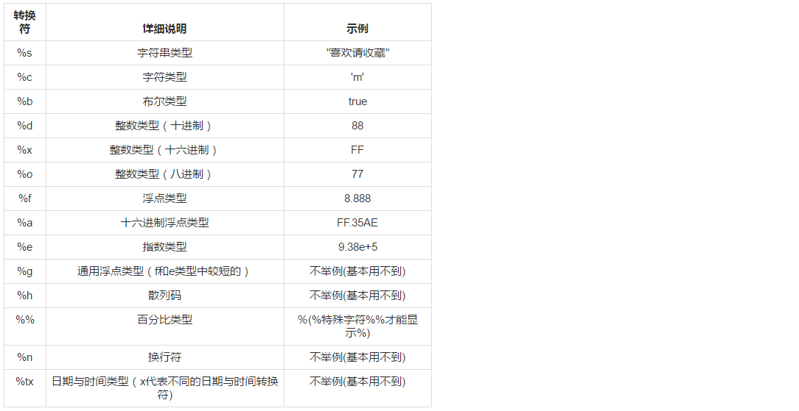
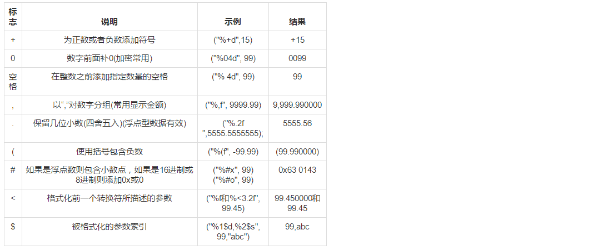
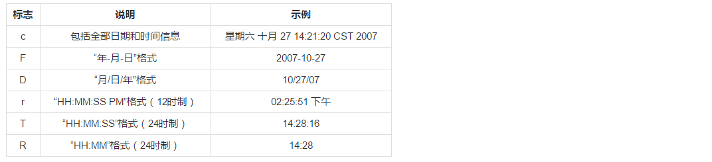
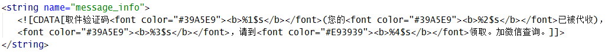
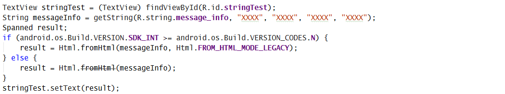
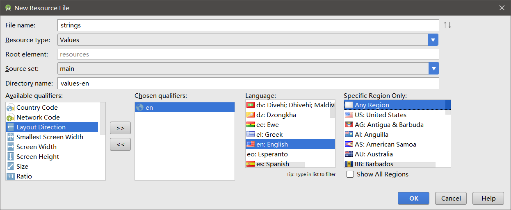

# 基础用法

```java
// String资源定义
<string name="stringTest">买1台Mac笔记本</string>

// 使用String资源
getString(R.string.stringTest);
```

<!-- more -->

# 添加参数

上面的买1台Mac笔记本中，数量被写死了，如果要在程序你将数量写成动态的，就会这样去写

```java
// 硬编码的方式不能国际化
String stringTest = "买" + count + "台Mac笔记本";
textView.setText(stringTest);


// 定义两个string字符串资源然后去拼接，虽然可以国际化，但是太繁琐
<string name="stringTest1">买</string>
<string name="stringTest2">台Mac笔记本</string>

String stringTest = getString(stringTest1) + count + getString(stringTest2);
textView.setTest(stringTest);


// 推荐在string资源中添加参数下：
<string name="stringTest">买%1$s台%2$s笔记本</string>
String stringTest = getString(getString(R.string.stringTest), "2", "惠普");
```

# 转换符





```java
String str = null;
str = String.format("Hi, %s", "hello");
System.out.println(str);
str = String.format("Hi, %s %s %s", "你好","hello","world");
System.out.println(str);
System.out.printf("字母c的大写是：%c %n", 'C');
System.out.printf("布尔结果是：%b %n", "小超".equal("帅哥"));
System.out.printf("100的一半是：%d %n", 100/2);
System.out.printf("100的16进制数是：%x %n", 100);
System.out.printf("100的8进制数是：%o %n", 100);
System.out.printf("50元的书打8.5折扣是：%f 元%n", 50*0.85);
System.out.printf("上面价格的16进制数是：%a %n", 50*0.85);
System.out.printf("上面价格的指数表示：%e %n", 50*0.85);
System.out.printf("上面价格的指数和浮点数结果的长度较短的是：%g %n", 50*0.85);
System.out.printf("上面的折扣是%d%% %n", 85);
System.out.printf("字母A的散列码是：%h %n", 'A');
```

```text
输出的结果如下：
Hi, 你好
Hi, 你好 hello world
字母c的大写是：C
布尔的结果是：false
100的一半是：50
100的16进制数是：64
100的8进制数是：144
50元的书打8.5折扣是：42.500000 元
上面价格的16进制数是：0x1.54p5
上面价格的指数表示：4.250000e+01
上面价格的指数和浮点数结果的长度较短的是：42.5000
上面的折扣是85%
字母A的散列码是：41
```

和时间先相关的的转换符：



```java
Date date=new Date();
//c 的使用
System.out.printf("全部日期和时间信息：%tc%n",date);
//f 的使用
System.out.printf("年-月-日格式：%tF%n",date);
//d 的使用
System.out.printf("月/日/年格式：%tD%n",date);
//r 的使用
System.out.printf("HH:MM:SS PM格式（12时制）：%tr%n",date);
//t 的使用
System.out.printf("HH:MM:SS格式（24时制）：%tT%n",date);
//R 的使用
System.out.printf("HH:MM格式（24时制）：%tR",date);
```

```text
输出的结果如下：
全部日期和时间信息：星期三 九月 21 22:43:36 CST 2016
年-月-日格式：2016-09-21
月/日/年格式：16/10/21
HH:MM:SS PM格式（12时制）：10:43:36 下午
HH:MM:SS格式（24时制）：22:43:36
HH:MM格式（24时制）：22:43
```

# 带数量判定的字符串

在翻译成英语后，发现问题来了，如果我想表示买了多台 Kindle，但在英语语法中多台 Kindle 需要用复数形式 Kindles，这要如何做呢？Android 为这种情形提供了 Plurals 方法。

```xml
<!-- 英文 -->
<plurals name="buy_kindle">
    <item quantity="one">I want to buy a Kindle</item>
    <item quantity="other">I want to buy some Kindles</item>
</plurals>


<!-- 中文 -->
<plurals name="buy_kindle">
    <item quantity="one">我想买一台<xliff:g id="Kindle">Kindle</xliff:g></item>   
    <item quantity="other">我想买几台<xliff:g id="Kindle">Kindle</xliff:g></item>
</plurals>
```

获得该 plurals 方法如下，第二参数传入 quantity，系统会根据 quantity 来选择对应的显示，该方法后也可以加入参数：

```java
getResources().getQuantityString(R.plurals.buy_kindle, 2);
```

# 特殊字符

有些字符是没有办法在strings.xml里面直接写的，比如"<"，">"，但可以用它对应的ASCII码来替代进行显示，比如要表达：我想买一台Kindle<$100>，则可以使用一下方法。

```xml
<item quantity="one">我想买一台<xliff:g id="Kindle">Kindle&#060$100&#062</xliff:g></item>
```

# 改变字符串部分字符的大小和颜色


上图所示的效果如果使用 TextView 直接实现就会很复杂和繁琐，可能需要多个 TextView 拼接显示。可以利用 Html.fromHtml() 的方法可以改变字体的颜色，其中也有一些属性还可以设置，比如字体等，类似于H5的功能。但是要注意，只支持以下几个标签：

* <b\>：粗体
* <i\>：斜体
* <u\>：下划线

 实现上面的效果，首先定义String资源，如下图所示：



然后在代码中使用，如下图所示：



# 使用字符串数组

```xml
<!-- 字符串数组定义 -->
<resources>
    <string-array name="planets_array">
        <item>Mercury</item>
        <item>Venus</item>
        <item>Earth</item>
        <item>Mars</item>
    </string-array>
</resources>
```

```java
// 使用方法
Resources res = getResources();
String[] planets = res.getStringArray(R.array.planets_array);
```

# 国际化

右键res文件夹，添加一个资源文件夹，会对应的生成国际化语言需要的文件夹，里面也有相同的string资源文件，在里面创建相应的字符串资源，在系统语言为其他语言时就会自动使用这个资源，如下图所示选择：



使用的方法和上面介绍的一样，有一点需要注意，如果字符串资源有字符不需要翻译，可以用下面的方法处理，这样我们把资源文件给他人或者使用Google Play自动翻译服务时，对方就知道该部分无需翻译。

```xml
<!-- 使用 <xliff:g> 标签之前需要加入命名控件 -->
<resources xmlns:xliff="urn:oasis:names:tc:xliff:document:1.2">
<string name="buy_kindle">我想买%s台<xliff:g id="Kindle">Kindle</xliff:g></string>
```