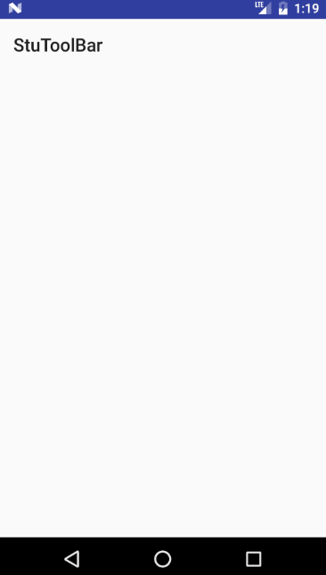
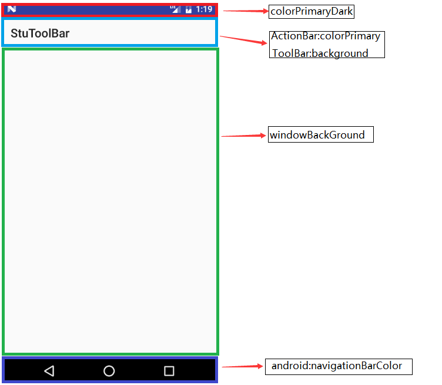
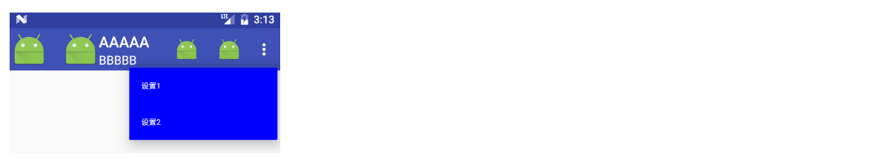

ToolBar 是用来取代 ActionBar 的控件，在 material design 中也称之为 App bar，ActionBar 过去最多使用的两个套件就是 ActionBarSherlock 以及在support library v7 里面的 AppCompat。官方在某些程度上认为 ActionBar 限制了 android app 的开发与设计，而后推出了 ToolBar，在 material design 中也做了对应的名称 App bar。

# 基础使用

调整 res/values/styles.xml 的内容，因为需要使用 ToolBar，并且由于 ToolBar 是用于替代 ActionBar 的，需要将 style 里面的 windowActionBar 设置为 false，android:windowNoTitle 设置为 true。

```xml
<style name="AppTheme" parent="Theme.AppCompat.Light.DarkActionBar">
   <item name="colorPrimary">@color/colorPrimary</item>
   <item name="colorPrimaryDark">@color/colorPrimaryDark</item>
   <item name="colorAccent">@color/colorAccent</item>
   <item name="windowActionBar">false</item>
   <item name="android:windowNoTitle">true</item>
</style\>
```

<!-- more -->

或者直接让 AppTheme 继承 Theme.AppCompat.Light.NoActionBar。

```xml
<style name="AppTheme" parent="Theme.AppCompat.Light.NoActionBar">
    <item name="colorPrimary">@color/colorPrimary</item>
    <item name="colorPrimaryDark">@color/colorPrimaryDark</item>
    <item name="colorAccent">@color/colorAccent</item>
    <item name="android:windowNoTitle">true</item>
</style>
```

同时将 Android5.0 的 style 也调整下，在 res/values-v21/styles.xml 里面让 AppTheme 的 parent 继承和上面的一致。

```xml
<style name="AppTheme" parent="Theme.AppCompat.Light.DarkActionBar">
    <item name="android:windowNoTitle">true</item>
</style>
```

接着在页面布局文件中添加如下的布局，注意布局使用 support library v7 中的 ToolBar 控件，否则只能在 Android 5.0 以上使用这个控件。

```xml
<?xml version="1.0" encoding="utf-8"?>
<layout xmlns:android="http://schemas.android.com/apk/res/android"
    xmlns:tools="http://schemas.android.com/tools"
    tools:context="com.lupw.stutoolbar.MainActivity">
    <data/>
    <RelativeLayout
        android:id="@+id/activity_main"
        android:layout_width="match_parent"
        android:layout_height="match_parent">
        <android.support.v7.widget.Toolbar
            android:id="@+id/toolBar"
            android:layout_width="match_parent"
            android:layout_height="?attr/actionBarSize">
        </android.support.v7.widget.Toolbar>
    </RelativeLayout>
</layout>
```

最后在 Activity 的代码中使用 setSupportActionBar 将 ActionBar 替代掉就可以使用 ToolBar 了。

```java
public class MainActivity extends AppCompatActivity {
    @Override
    protected void onCreate(Bundle savedInstanceState) {
        super.onCreate(savedInstanceState);
        ActivityMainBinding binding = DataBindingUtil.setContentView(this, R.layout.activity_main);

        // 用setSupportActionBar将ActionBar替换为ToolBar
        setSupportActionBar(binding.toolBar);
 }
}
```

结果展示如下：



# 自定义颜色

在第上面一节中，虽然使用了 ToolBar，但是 ToolBar 确是白色的，看下面一个图



图中颜色的区域被分成了四个区域：

1. colorPrimaryDark (状态栏底色)：在风格 (styles) 或是主题 (themes) 里进行设定;
2. App bar 底色：这个设定分为二，若你的 android app 仍是使用 actionbar ，则直接在风格 (styles) 或是主题 (themes) 里进行设定 colorPrimary 参数即可，可若是采用 toolbar 的话，则要在界面 (layout) 里面设定 toolbar 控件的 background 属性;
3. navigationBarColor (导航栏底色)：仅能在 API v21 也就是 Android 5.0 以后的版本中使用， 因此要将之设定在 res/values-v21/styles.xml 里面;
4. windowBackground，Activity的背景色，在styles或者在themes中设定。

# ToolBar 中常用的元素

如上图所示，ToolBar 常用的元素在这里，配置的 Java 代码如下 (这些属性是可以在 xml 布局文件中区配置的，但是使用的命名空间不是 android 而是自定义命名空间 toolbar，例如 toolbar:subtitle, toolbar:titleTextColor)。

```java
protected void onCreate(Bundle savedInstanceState) {
    super.onCreate(savedInstanceState);
        binding = DataBindingUtil.setContentView(this, R.layout.activity_main);

        // 用setSupportActionBar将ActionBar替换为ToolBar
        setSupportActionBar(binding.toolBar);

        // setNavigationIcon需要设定在setSupportActionBar之后才有用
        binding.toolBar.setNavigationIcon(R.mipmap.ic_launcher);
        binding.toolBar.setLogo(R.mipmap.ic_launcher);
        binding.toolBar.setTitle("AAAAA");
        binding.toolBar.setSubtitle("BBBBB");

        // 设置菜单的监听
        binding.toolBar.setOnMenuItemClickListener(onMenuItemClick);
}
```

我们可以发现，命名是设置了 Titie 的值为 "AAAAA"，但是 ToolBar 显示的不是 "AAAAA"，因为 setTitle 在 Activity 的 onCreate 方法里面需要setSupportActionBar 之前调用，如果想在 setSupportActionBar 之后调用，就只能在 onResume 里面调用了，更正过的代码如下。

```java
protected void onCreate(Bundle savedInstanceState) {
    super.onCreate(savedInstanceState);
    binding = DataBindingUtil.setContentView(this, R.layout.activity\_main);
    binding.toolBar.setTitle("AAAAA");

    // 用setSupportActionBar将ActionBar替换为ToolBar
    setSupportActionBar(binding.toolBar);

    // setNavigationIcon需要设定在setSupportActionBar之后才有用
    binding.toolBar.setNavigationIcon(R.mipmap.ic\_launcher);
    binding.toolBar.setLogo(R.mipmap.ic\_launcher);
    binding.toolBar.setSubtitle("BBBBB");

    // 设置菜单的监听
    binding.toolBar.setOnMenuItemClickListener(onMenuItemClick);
}
```

# ToolBar 使用菜单

ToolBar 也可以使用菜单，首先需要在 res/menu 文件下创建一个 menu 菜单，内容如下：

```xml
<?xml version="1.0" encoding="utf-8"?>
<menu xmlns:android="http://schemas.android.com/apk/res/android"
      xmlns:app="http://schemas.android.com/apk/res-auto"
      xmlns:tools="http://schemas.android.com/tools"
      tools:context=".MainActivity">

    <item android:id="@+id/action_edit"
          android:title="编辑"
          android:orderInCategory="80"
          android:icon="@mipmap/ic_launcher"
          app:showAsAction="ifRoom" />

    <item android:id="@+id/action_share"
          android:title="分享"
          android:orderInCategory="90"
          android:icon="@mipmap/ic_launcher"
          app:showAsAction="ifRoom" />

    <item android:id="@+id/action_settings1"
          android:title="设置1"
          android:orderInCategory="100"
          app:showAsAction="never"/>

    <item android:id="@+id/action_settings2"
          android:title="设置2"
          android:orderInCategory="100"
          app:showAsAction="never"/>
</menu>
```

接着在 Activity 中加载并使用这个菜单布局：

```java
// 将菜单加载
@Override
public boolean onCreateOptionsMenu(Menu menu) {
    getMenuInflater().inflate(R.menu.menu_main, menu);
    return true;
}

// 菜单的监听方法
private Toolbar.OnMenuItemClickListener onMenuItemClick = new Toolbar.OnMenuItemClickListener() {
    @Override
    public boolean onMenuItemClick(MenuItem menuItem) {
        String msg = "";
        switch (menuItem.getItemId()) {
            case R.id.action_edit:
                msg += "Click edit";
                break;
            case R.id.action_share:
                msg += "Click share";
                break;
            case R.id.action_settings1:
                msg += "Click setting1";
                break;
            case R.id.action_settings2:
                msg += "Click setting2";
                break;
            default:
                break;
        }

        if(!msg.equals("")) {
            Toast.makeText(MainActivity.this, msg, Toast.LENGTH_SHORT).show();
        }
        return true;
    }
};
```

**关于 app:showAsAction 属性的值 ifRoom 表示有空间就显示，没有就不显示 (以三个点显示)，never 表示从不显示，always 表示一致显示，但是如果屏幕空间不够则无法显示**。

# 其他样式修改

(1) ToolBar 使用菜单时，app:showAsAction="never" 时，会显示成三个点，这三个点的颜色如何改变？
(2) 点击这三个点，会弹出一个 popup menu，他的颜色样式如何改变？
(3) 如何修改 ToolBar popup menu 弹出的位置？
(4) 如何修改 ToolBar 中标题和副标题的颜色？
(5) 如何使用系统自带的 homeAsUp 返回功能、更改颜色、更改图标和标题居中？

## 修改ToolBar右上角三个点的颜色

```xml
<!--导航栏上的子标题颜色，也可以更改右上角三个点的颜色-->
<item name="android:textColorSecondary">@android:color/white</item>
```

## 修改popup menu的颜色样式

首先需要修改 overlay 的样式，在 res/value/styles.xml 文件下：

```xml
<style name="PopupMenu" parent="ThemeOverlay.AppCompat.Light" >
    <!--菜单背景色-->
    <item name="android:colorBackground">#0000ff</item>
    <item name="android:textColor">#ffffff</item>
    <item name="android:textSize">10sp</item>
</style>
```

然后在ToolBar中使用：

```xml
<android.support.v7.widget.Toolbar
    android:id="@+id/toolBar"
    android:layout_width="match_parent"
    android:layout_height="?attr/actionBarSize"
    android:background="?attr/colorPrimary"
    toolbar:popupTheme="@style/PopupMenu">
</android.support.v7.widget.Toolbar>
```

## 修改ToolBar popup menu的位置

默认 menu 的位置明显是比较高，可以修改样式，让 menu 的位置子 ToolBar 的下面：



修改的代码如下：

```xml
<resources>
    <!-- Base application theme. -->
    <style name="AppTheme" parent="Theme.AppCompat.Light.NoActionBar">
        <item name="colorPrimary">@color/colorPrimary</item>
        <item name="colorPrimaryDark">@color/colorPrimaryDark</item>
        <item name="colorAccent">@color/colorAccent</item>
        <!--导航栏上的主标题颜色-->
        <item name="android:textColorPrimary">@android:color/white</item>
        <!--导航栏上的子标题颜色-->
        <item name="android:textColorSecondary">@android:color/white</item>
        <!--新增一个item，用于控制menu-->
        <item name="actionOverflowMenuStyle">@style/OverflowMenuStyle</item>
    </style>

    <style name="PopupMenu" parent="ThemeOverlay.AppCompat.Light" >
        <!--菜单背景色-->
        <item name="android:colorBackground">#0000ff</item>
        <item name="android:textColor">#ffffff</item>
        <item name="android:textSize">10sp</item>
    </style>

    <style name="OverflowMenuStyle" parent="Widget.AppCompat.Light.PopupMenu.Overflow">
        <!--把该属性改为false即可使menu位置位于toolbar之下-->
        <item name="overlapAnchor">false</item>
    </style>
</resources>
```

## 修改 Title 和 Subtitle 的颜色

可以在res/value/styles中添加以下代码修改：

```xml
<!--导航栏上的主标题颜色-->
<item name="android:textColorPrimary">@android:color/white</item>
<!--导航栏上的子标题颜色-->
<item name="android:textColorSecondary">@android:color/white</item>
```

使用上面这种方法会影响整个项目，不仅仅时影响到 ToolBar 的字体颜色，还会影响到其他地方的字体颜色，因此不建议使用这种方法来修改字体，而是使用系统提供的 setTitleTextColor 和 setSubTitleTextColor 方法来修改。

## 标题居中

布局文件如下，就可以让标题居中：

```xml
<android.support.v7.widget.Toolbar
    android:id="@+id/toolbar"
    android:layout_width="match_parent"
    android:layout_height="60dp">
    <TextView
        android:id="@+id/textTitle"
        android:layout_width="wrap_content"
        android:layout_height="wrap_content"
        android:layout_gravity="center"
        android:textSize="@dimen/header_title_size"
        android:textStyle="bold"
        android:textColor="@color/colorWhite"
        android:maxLines="1" />
</android.support.v7.widget.Toolbar>
```

使用代码：

```java
private void initSupportActionBar() {
    setSupportActionBar(binding.toolbar);
    ActionBar actionBar = getSupportActionBar();
    if (actionBar != null){
        actionBar.setDisplayHomeAsUpEnabled(true);
        actionBar.setDisplayShowTitleEnabled(false);
    }

    binding.textTitle.setText(noticeTitle);
}
```

## homeAsUp 功能

在二级界面等 Activity 中，通过如下设置可以在 Toolbar 左边显示一个返回按钮：

```java
getSupportActionBar().setDisplayHomeAsUpEnabled(true);
```

然后通过 android.R.id.home 监听返回按钮的点击事件，比如可以返回上级 Activity 中：

```java
@Override public boolean onOptionsItemSelected(MenuItem item) {
    switch (item.getItemId()) {
        case android.R.id.home:
            finish();
            break;
    }
    return super.onOptionsItemSelected(item);
}
```

当然，也可以通过为Toolbar设置导航图标的点击事件来达到这个监听效果：

```java
mToolbarTb.setNavigationOnClickListener(new View.OnClickListener() {
    @Override
    public void onClick(View v) {
        finish();
    }
});
```

## 更改默认颜色

先在 res/value/style.xml 和 res/value-v21/style.xml 中添加一个 style 样式：

```xml
<style name="toolbarTheme" parent="@style/ThemeOverlay.AppCompat.Dark.ActionBar">
    <item name="colorControlNormal">@color/colorWhite</item>
</style>
```

在之前 ToolBar 布局上添加一个 AppBarLayout 布局，并使用这个样式：

```xml
<android.support.design.widget.AppBarLayout
    android:id="@+id/maHeader"
    android:layout_width="match_parent"
    android:layout_height="wrap_content"
    android:background="@color/colorPrimary"
    android:theme="@style/toolbarTheme">

    <android.support.v7.widget.Toolbar
        android:id="@+id/toolbar"
        android:layout_width="match_parent"
        android:layout_height="wrap_content">
        <TextView
            android:id="@+id/textTitle"
            android:layout_width="wrap_content"
            android:layout_height="wrap_content"
            android:layout_gravity="center"
            android:textSize="@dimen/header_title_size"
            android:textStyle="bold"
            android:textColor="@color/colorWhite"
            android:maxLines="1" />
    </android.support.v7.widget.Toolbar>
</android.support.design.widget.AppBarLayout>
```

## 替换系统原生的返回按钮图标

在更改默认颜色的 style 中添加一个 item：

```xml
<item name="android:homeAsUpIndicator">@drawable/web_detail_back</item>
```

然后在 ToolBar 中引用这个样式即可：

```xml
app:navigationIcon="@drawable/web_detail_back"
```

## 改变原生返回键图标的大小

请参考 `http://www.jianshu.com/p/6244687137d2`

# 参考资料

`http://www.jianshu.com/p/6244687137d2`
`https://gold.xitu.io/entry/575be1b45bbb500053db7893`