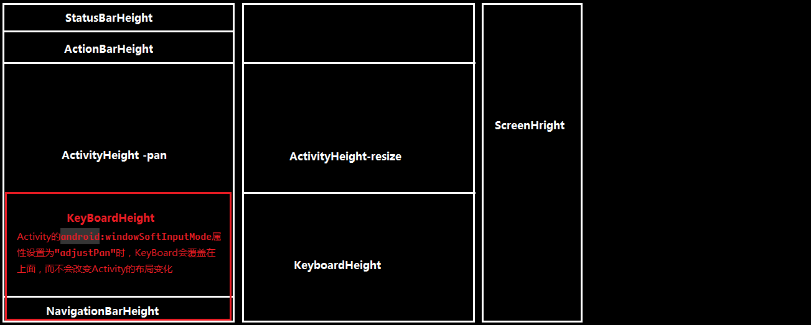
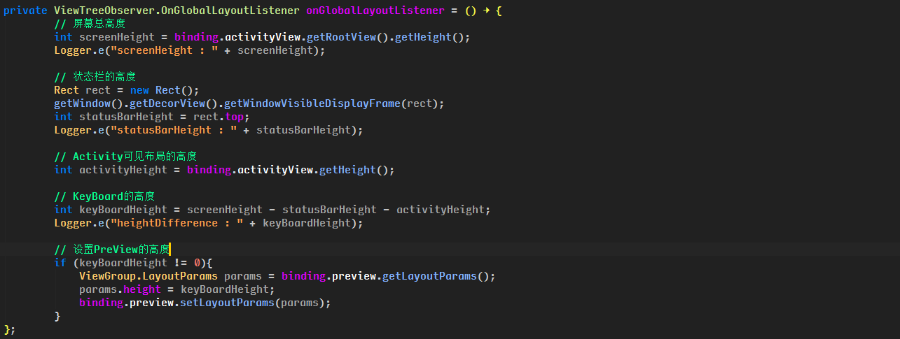

# 软键盘弹出时和屏幕各部分尺寸



<!-- more -->

```java
 // ScreenHeight的高度
 int screenHeight = binding.activityView.getRootView().getHeight();
 Log.e("软键盘：", String.format("screen height %d px", screenHeight));

 int activityHeight = binding.activityView.getHeight();
 Log.e("软键盘：", String.format("activity height %d px", activityHeight));

 // StatusBarHeight的高度
 Rect rect = new Rect();
 getWindow().getDecorView().getWindowVisibleDisplayFrame(rect);
 int statusBarHeight = rect.top;
 Log.e("软键盘：", String.format(" status bar height %d px", statusBarHeight));

 // ActionBarHeight，这个高度是从Attribute中获取的，因此即使布局中没有使用ActionBar也会右值
 // 在计算KeyBoard的高度时，要根据是否使用了ActionBar来计算
 TypedValue tv = new TypedValue();
 getTheme().resolveAttribute(R.attr.actionBarSize, tv, true);
 int actionBarHeight = TypedValue.complexToDimensionPixelSize(tv.data, getResources().getDisplayMetrics());
 Log.e("软键盘：", String.format(" action bar height %d px", actionBarHeight));

 // NavigationBarHeight，底部的Bar，和ActionBar一样，计算KeyBoard的高度时，要根据是否使用了ActionBar来计算
 Resources resources = getResources();
 int navigationBarHeight = resources.getDimensionPixelSize(resources.getIdentifier("navigation_bar_height", "dimen", "android"));
 Log.e("软键盘：", String.format("navigation bar height %d px", navigationBarHeight));

 // Activity的高度
 int activityHeight = mActivityChatRoom.getHeight();
 Log.e("软键盘：", String.format(" activity height %d px", activityHeight));

 // 计算高度，注意根据ActionBar和NavigationBar的实际使用情况来计算
 keyboardHeight = screenHeight - activityHeight - statusBarHeight - actionBarHeight - navigationBarHeight;

 // 根据KeyBoard的高度去设置其他布局的高度
 ViewGroup.LayoutParams params = otherView.getLayoutParams();
 params.height = keyboardHeight;
 otherView.setLayoutParams(params);

 // 及时移除监听
 if (Build.VERSION.SDK_INT >= Build.VERSION_CODES.JELLY_BEAN) {
    binding.activityView.getViewTreeObserver().removeOnGlobalLayoutListener(this);
 }else {
    binding.activityView.getViewTreeObserver().removeGlobalOnLayoutListener(this);
 }
```

