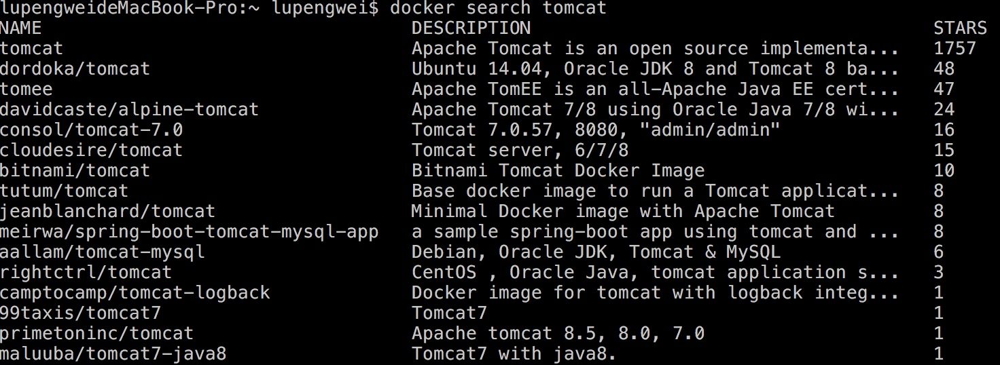
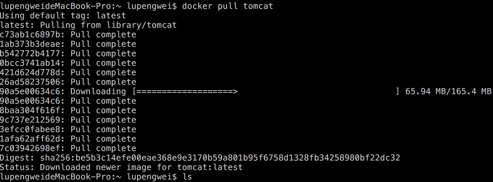
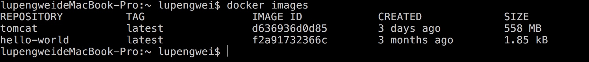
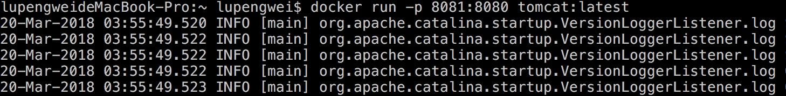
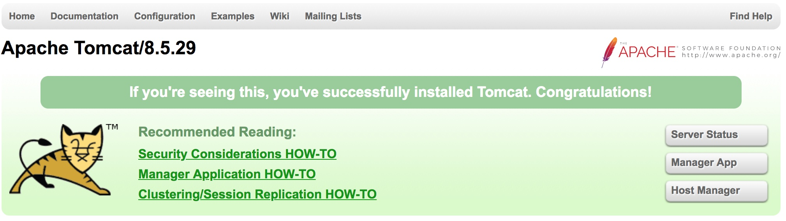

# 在 Docker Hub 中搜索 Tomcat 镜像

```shell
docker search tomcat
```



<!-- more -->

# 开始安装

```shell
docker pull tomcat
```



# 查看安装的镜像

```shell
docker images
```



# 运行 Tomcat

```shell
docker run -d -p 8081:8080 tomcat:latest (①：latest 是这个镜像的 tag 名称 ②：-d 参数可以其在后台运行)
```



其中 -p 8081:8080 表示指定端口号，并且将 8080 端口号映射到 8081 端口，启动成功后访问 `http://localhost:8081/` 就可看官方的测试页面，如下图：

