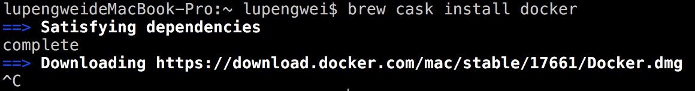
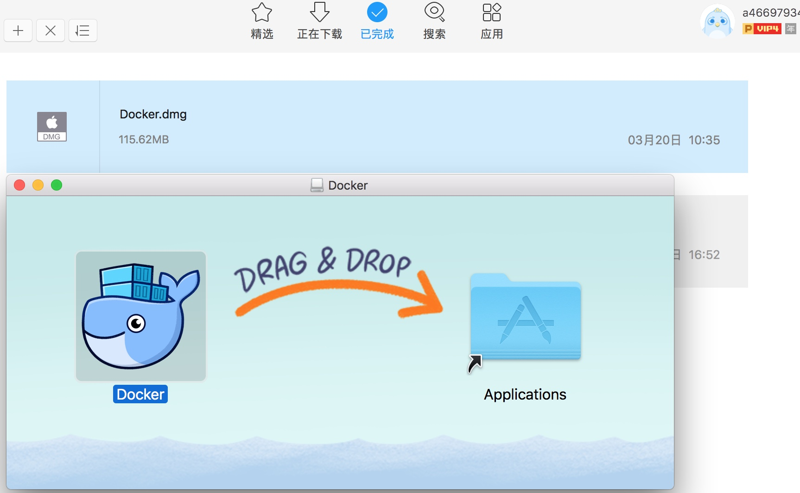
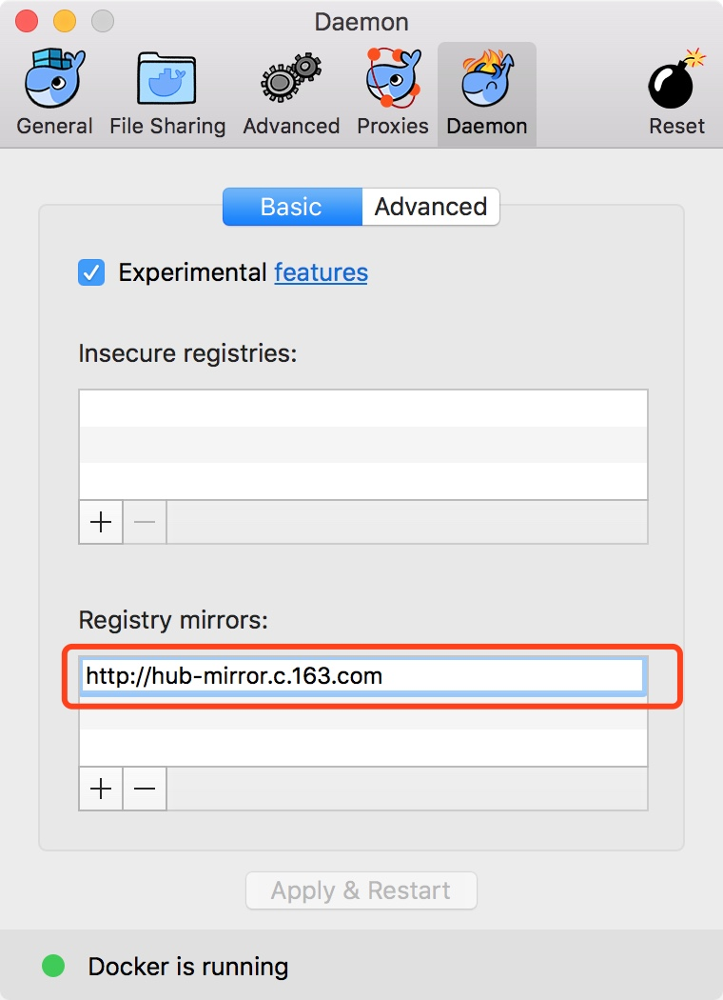
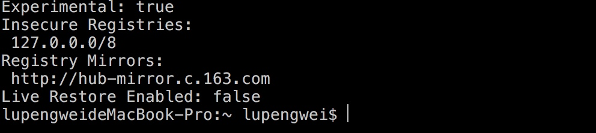

# Mac 上使用 HomeBrew Cask 安装

安装指令：`brew cask install docker`

<!-- more -->

下载太慢，我直接复制到迅雷直接下载下来了

# 检测 Docker 安装的版本

docker --version

# 更改镜像源

使用国内的网络拉取官方默认的镜像会很慢，可以配置国内的镜像源，这里配置网易的镜像地址：`http://hub-mirror.c.163.com` 
关于国内镜像源的选择参考：`https://ieevee.com/tech/2016/09/28/docker-mirror.html`

配置好后重新启动 Docker 即可，使用 docker info 可以查看是否配置镜像源成功:

# 参考资料

* [http://www.runoob.com/docker/macos-docker-install.html](http://www.runoob.com/docker/macos-docker-install.html)
