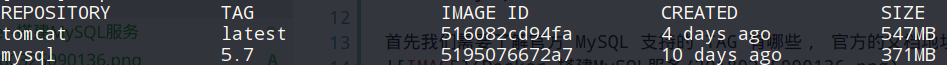
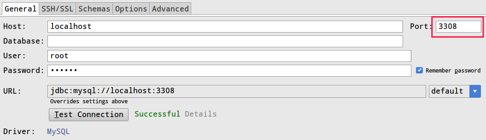

本文主要介绍如何使用 Docker 搭建 MySQL 服务。

# 搭建步骤

## 了解 MySQL 在容器中支持的 TAG

首先我们需要了解官方 MySQL 支持的 TAG 有哪些， 官方的文档地址为: `https://hub.docker.com/_/mysql/`，支持的 TAG 如下如所示。
<!-- more -->


## 拉取 MySQL 镜像

这里我使用的 tag 为 5.7，根据需要选取即可。

```　shell
sudo docker mysql:5.7
```

拉取完成后使用 docker images 指令就可以看到刚才拉取的 MySQL 镜像了。

``` shell
sudo docker images
```



## 启动和关闭 MySQL 容器

### 创建并启动 MySQL 容器

``` shell
sudo docker run --name mysql_msg -e MYSQL_ROOT_PASSWORD=123456 -p 3308:3306 -d mysql:5.7
```

参数说明:

1. --name: 为创建的容器命名，可以启动多个 MySQL 容器，只需要容器名称和端口号不同即可;
2. -e: 配置信息，这里设置使用 root 用户的登录密码;
3. -p: 端口号的映射关系，左边的为映射后的端口号，连接时使用，这里我使用的是 3308;
4. -d: 在后台运行;
5. mysql:5.7，运行的镜像的名称和 TAG;

### 启动已创建的 MySQL 容器

首先使用 docker ps -a 指令查看已经创建的容器， -a 表示只查看当前正在运行和停止运行的容器，不加只查看正常运行的容器。

``` shell
// 通过容器名启动
sudo docker ps -a

// 通过容器名启动
sudo docker start mysql_msg

// 通过容器 ID 关闭
sudo docker start f04c702f6568

```

### 关闭 MySQL 容器

``` shell
// 通过容器名关闭
sudo docker stop mysql_msg

// 通过容器 ID 关闭
sudo docker stop f04c702f6568
```

### 删除 MySQL 容器

``` shell
// 通过容器 ID 删除
sudo docker rm f04c702f6568
```

### 测试连接

测试就简单了，使用指令或者使用图形界面工具连接以下就好了，我就使用 DataGrip 进行连接测试，填写好配置后，点击 Test Connection，可以看点测试成功的提示，直接看截图吧。


## 修改 MySQL 容器的配置文件

可以使用进入指定容器修改配置文件的方法，然后重新启动容器使配置文件生效。

``` shell
// 进入容器的命令行模式
sudo docker exec -it mysql_msg /usr/bin/bash

// 修改配置文件
vim /etc/mysql/my.cnf

// 重启 MySQL 容器
sudo docker restart mysql_msg
```