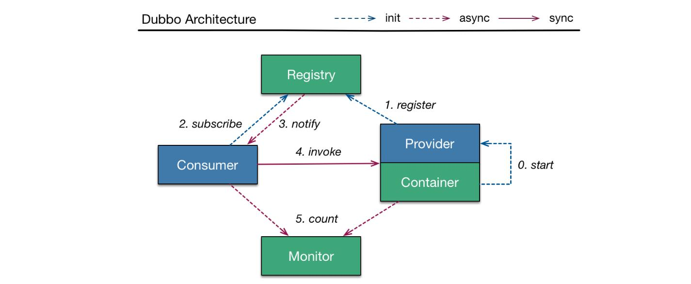

在了解 Dubbo 之前，先了解下 RPC 的概念，RPC (Remote Procedure Call) 即远程过程调用，是一种计算机协议，该协议允许运行于一台计算机的程序调用另一台计算机的子程序。几个例子说明，两台服务器 A、B，分别部署不同的应用 a、b，当 A 服务器想要调用 B 服务器上应用 b 提供的函数或方法的时候，由于不在一个内存空间，不能直接调用，但是通过 RPC 可以完成这种远程服务调用。

# Dubbo

Dubbo 是一款分布式服务框架，是一个高性能和透明化的 RPC 远程服务调用方案以及SOA服务治理方案。

# Dubbo 架构

<!-- more -->

**节点角色说明**：

* Provider: 远程服务提供方。
* Consumer: 调用远程服务的服务消费方。
* Registry: 服务注册与发现的注册中心。
* Monitor: 统计服务的调用次数和调用时间的监控中心。
* Container：服务运行容器。

**调用流程**：

0：服务容器负责加载，启动，运行服务提供者。
1：服务提供者在启动时，向注册中心注册自己提供的服务。
2：服务消费者在启动时，向注册中心订阅自己所需的服务。
3：注册中心返回服务提供者地址列表给消费者，如果有变更，注册中心将基于长连接推送变更数据给消费者。
4：服务消费者，从提供者地址列表中，基于软负载均衡算法，选一台提供者进行调用，如果调用失败，再选另一台调用。
5：服务消费者和提供者，在内存中累计调用次数和调用时间，定时每分钟发送一次统计数据到监控中心。

**注册中心**：

随着应用系统的复杂性，服务的数量和类型会越来越多，无论是对于服务提供方之后的服务发布和服务消费方的服务消费都是不便于管理的，因此需要将服务统一管理起来。服务注册中心可以通过特定协议来完成服务对外的统一，Dubbo 支持以下几种类型的注册中心可供选择：

* Zookeeper 注册中心
* Multicast 注册中心
* Redis 注册中心
* Simple 注册中心

# 参考资料

Dubbo 用户手册：`http://dubbo.apache.org/books/dubbo-user-book/preface/architecture.html`
