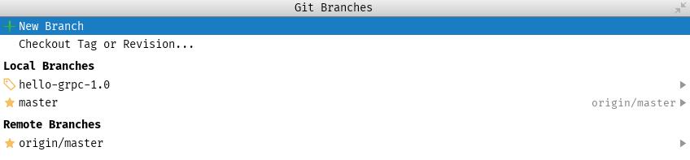
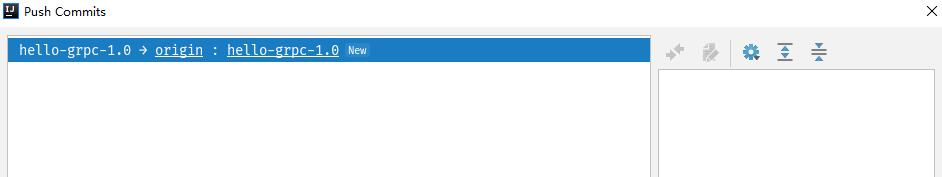
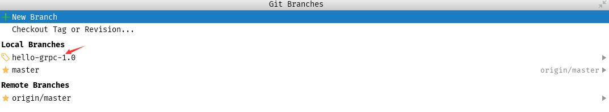
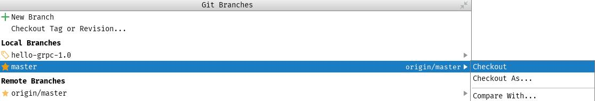
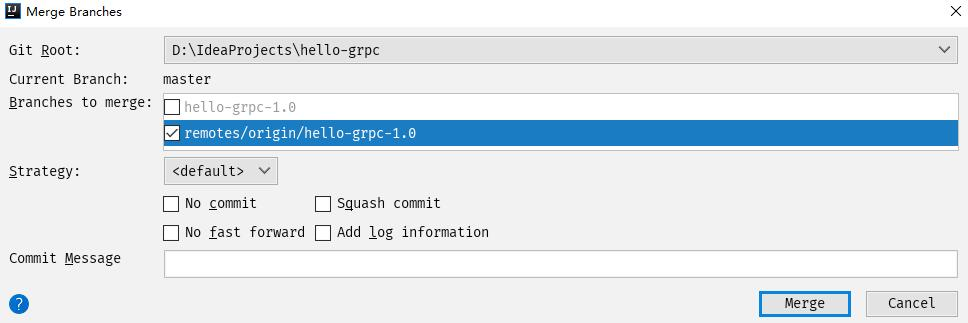
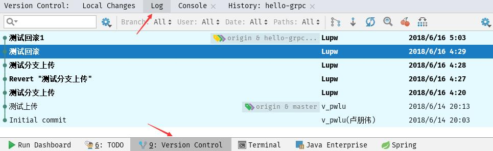
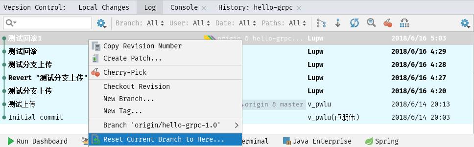

# 创建分支

分别点击菜单栏的 VCS -> Git -> Branches 选项，如下图所示：

点击 New Branch 选项，输入分支的名字点击确定即可创建分支，创建完成后一般自动切换到分支工作空间，可以在 IDEA 的状态栏查看当前分支的工作空间，如下图所示：

<!-- more -->

这个时候还只是本地创建了分支，这个分支只是自己本地仓库可见，因此需要将分支提交到远程仓库中，依次点击菜单栏的 VCS -> Git -> Push 后，点击 Push 即可发布到远程仓库，其他人就可以获取这个分支了，操作如下图所示：

# 切换分支

分别点击菜单栏的 VCS -> Git -> Branches 选项，或者点击如下图所示的位置

打开后如下图所示：

在 Local Branches 栏下的分支版本前面标记为书签标记的是当前工作空间使用的分支，前面是星星标记的是可切换的分支，点击可切换的分支，选择 Checkout 选项即可切换分支，如下图所示：

**注：在切换分支之前最好能将本地修改的文件先提交上去**

# 合并分支

依次选择 VCS -> Git -> Merge Changes，在弹出的对话框中选择需要进行合并的版本，如下图所示：

选择一个分支合并到当前工作空间使用的分支里面，这里既可以将本地仓库的分支合并到当前分支，也可以将远程仓库的分支合并到当前分支。

# 回滚

点击 IDEA 底部的 Version Control，定位到 Log 项，如下图所示：

然后在需要回滚的版本上右键，选择 Reset Current Branch To Here 选项，如下图所示：

这个时候项目已经回退并提交到本地仓库了，接下来只要 VCS -> Git -> Push，然后选择强制发布就可以发布到远程仓库，选择强制发布时为了解决版本冲突，**但是强制发布但是会抹掉回退版本之前的锁提交的所有版本记录** 。