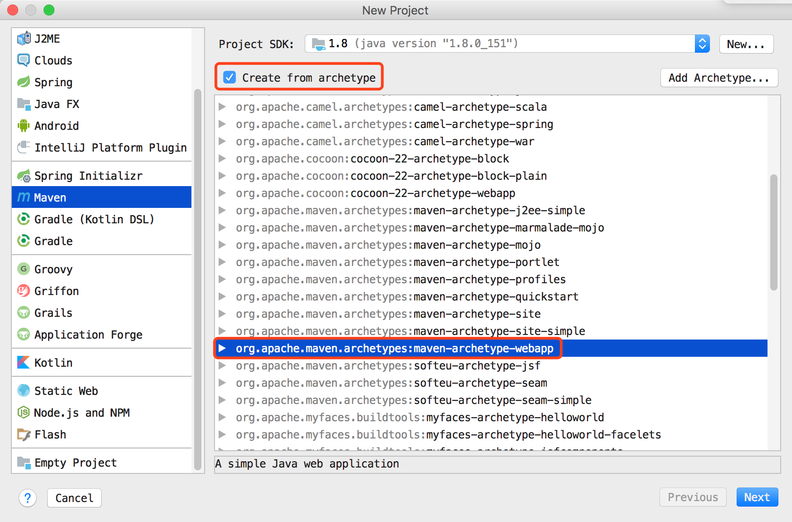
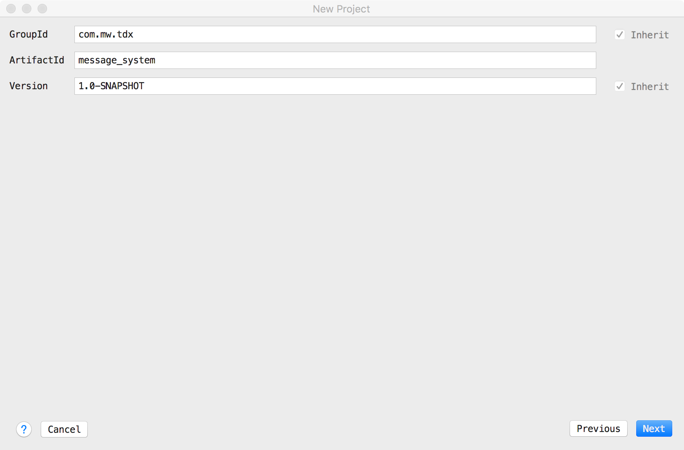
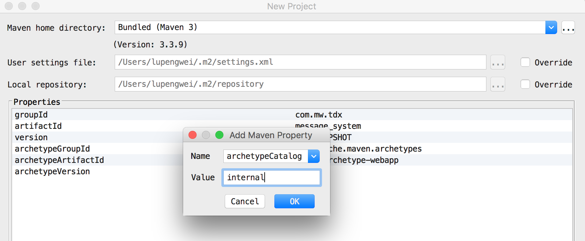
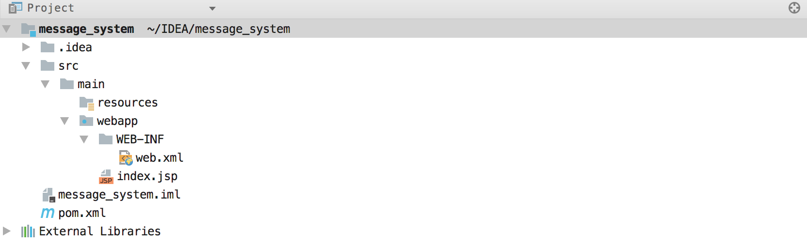
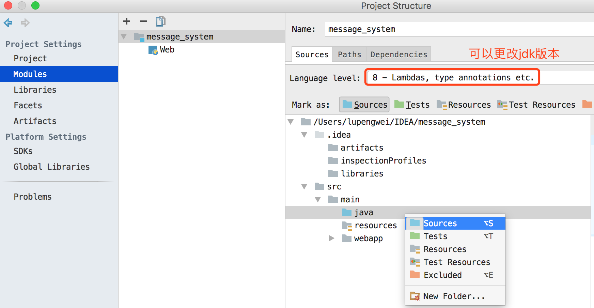
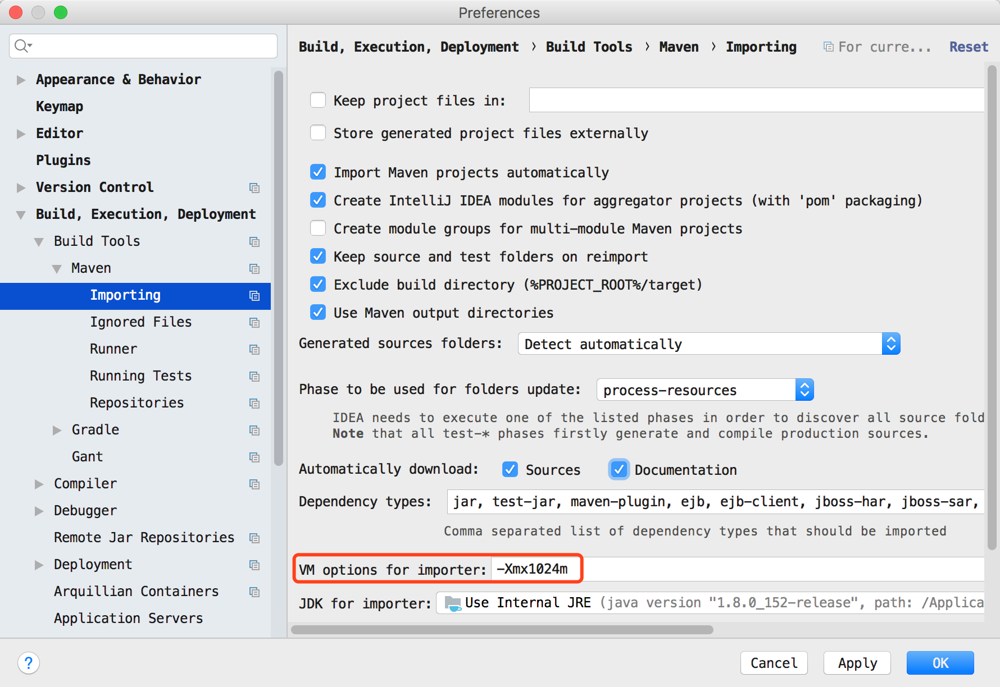

# 创建项目

在 IDEA 里面使用 maven 构建 JavaWeb 项目，首先选择创建新项目，选择使用 maven 的方式构建项目，具体操作步骤见下图:

<!-- more -->

# 填写项目信息

这一步添加一个参数，这里在Properties中添加一个参数`archetypeCatalog=internal`，不加这个参数，在maven生成骨架的时候将会非常慢，有时候会直接卡住，archetypeCatalog表示插件使用的archetype元数据，不加这个参数时默认为remote，local，即中央仓库archetype元数据，由于中央仓库的archetype太多了，所以导致很慢，指定internal来表示仅使用内部元数据。

 建立好的目录结构如下图:

# 建立存放源代码的 java 目录

如下图所示，在main下面建立一个java目录，然后右键选择设置为源代码文件夹，也可以创建测试目录，右键选择一个目录后，将目录设置成测试目录即可。

通过上面的步骤就可以创建一个使用 Maven 构建的 Javaweb 项目了。

# 遇见的问题

在第一步开始创建新项目的时候，选择 Maven 方式构建项目，右边一直显示 loading archetype list...，按照如下图所示的方式，将 VM options for importer 的值更改成 -Xmx1024m 即可。

