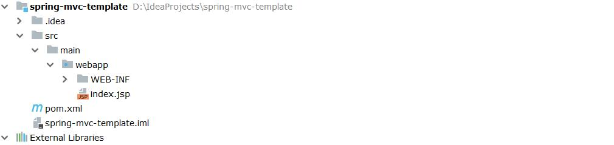
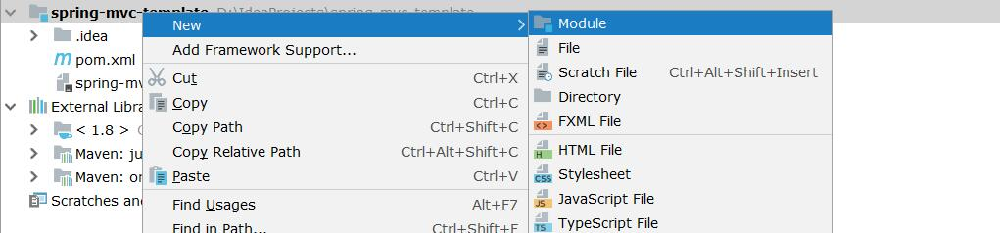
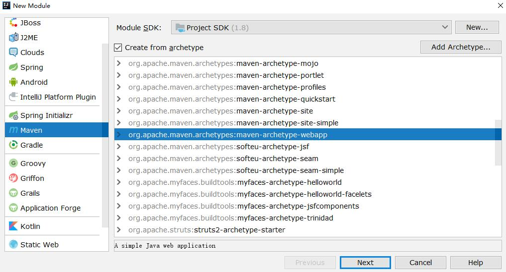
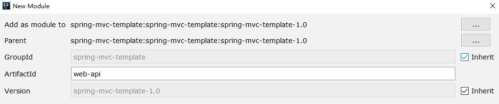
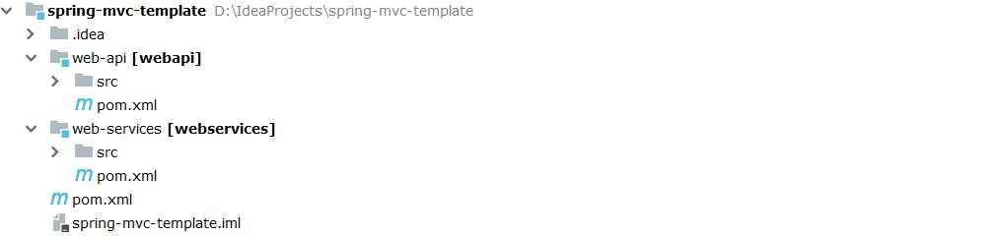

# 创建项目

参考笔记：`Maven 创建 JavaWeb 项目`，创建好的项目的目录结构如下：



<!-- more -->

创建好的项目下的 pom.xml 文件将作为 parent 项目的依赖配置文件，的内容主要如下：

```xml
<?xml version="1.0" encoding="UTF-8"?>
<project xmlns="http://maven.apache.org/POM/4.0.0" xmlns:xsi="http://www.w3.org/2001/XMLSchema-instance"
         xsi:schemaLocation="http://maven.apache.org/POM/4.0.0 http://maven.apache.org/xsd/maven-4.0.0.xsd">
    <modelVersion>4.0.0</modelVersion>

    <groupId>spring-mvc-template</groupId>
    <artifactId>spring-mvc-template</artifactId>
    <version>spring-mvc-template-1.0</version>
    <packaging>war</packaging>
    <name>spring-mvc-template Maven Webapp</name>

    <properties>
        <project.build.sourceEncoding>UTF-8</project.build.sourceEncoding>
        <maven.compiler.source>1.7</maven.compiler.source>
        <maven.compiler.target>1.7</maven.compiler.target>
    </properties>

    <dependencies>
        <dependency>
            <groupId>junit</groupId>
            <artifactId>junit</artifactId>
            <version>4.11</version>
            <scope>test</scope>
        </dependency>
    </dependencies>

    <build>
        <finalName>spring-mvc-template</finalName>
    </build>
</project>
```

# 添加模块

接着可以删掉 src 目录，删除之后，右键项目文件，创建一个名字为 web-api 的 module，创建步骤如下图所示：







创建好后，再使用相同的方法添加一个 web-service 模块，添加好的项目目录结构如下图所示：



parent 项目的依赖文件会有一些变化，第一个是多了 module 模块的信息，第二个是 packaging 的值由 war 变为了 pom，如下所示：

```xml
<modules>
    <module>web-api</module>
    <module>web-services</module>
</modules>
<packaging>pom</packaging>
```

而子模块中的依赖文件多了 parent 项目的配置信息

```xml
<?xml version="1.0" encoding="UTF-8"?>
<project xmlns="http://maven.apache.org/POM/4.0.0" xmlns:xsi="http://www.w3.org/2001/XMLSchema-instance"
         xsi:schemaLocation="http://maven.apache.org/POM/4.0.0 http://maven.apache.org/xsd/maven-4.0.0.xsd">
    <parent>
        <artifactId>spring-mvc-template</artifactId>
        <groupId>spring-mvc-template</groupId>
        <version>spring-mvc-template-1.0</version>
    </parent>

    <modelVersion>4.0.0</modelVersion>
    <artifactId>web-services</artifactId>
    <packaging>war</packaging>
    <name>web-services Maven Webapp</name>

    <properties>
        <project.build.sourceEncoding>UTF-8</project.build.sourceEncoding>
        <maven.compiler.source>1.7</maven.compiler.source>
        <maven.compiler.target>1.7</maven.compiler.target>
    </properties>

    <dependencies>

    </dependencies>

    <build>
        <finalName>web-services</finalName>
    </build>
</project>
```

这样在打包子模块的时候就可以自动将依赖的父项目的依赖包给打包进去。

# 模块之间的依赖

如果上面的模块 web-api 依赖于 web-services 模块，需要在子模块中添加依赖模块的信息，首先需要在被依赖的子项目的 pom 文件中添加 version 属性。

```xml
<artifactId>web-services</artifactId>
<version>1.0</version>
```

然后在需要依赖的模块中添加依赖，其中 groupId 和 parent 项目的项目相同。

```xml
<dependencies>
    <dependency>
        <groupId>spring-mvc-template</groupId>
        <artifactId>web-services</artifactId>
        <version>1.0<version/>
    </dependency>
</dependencies>
```