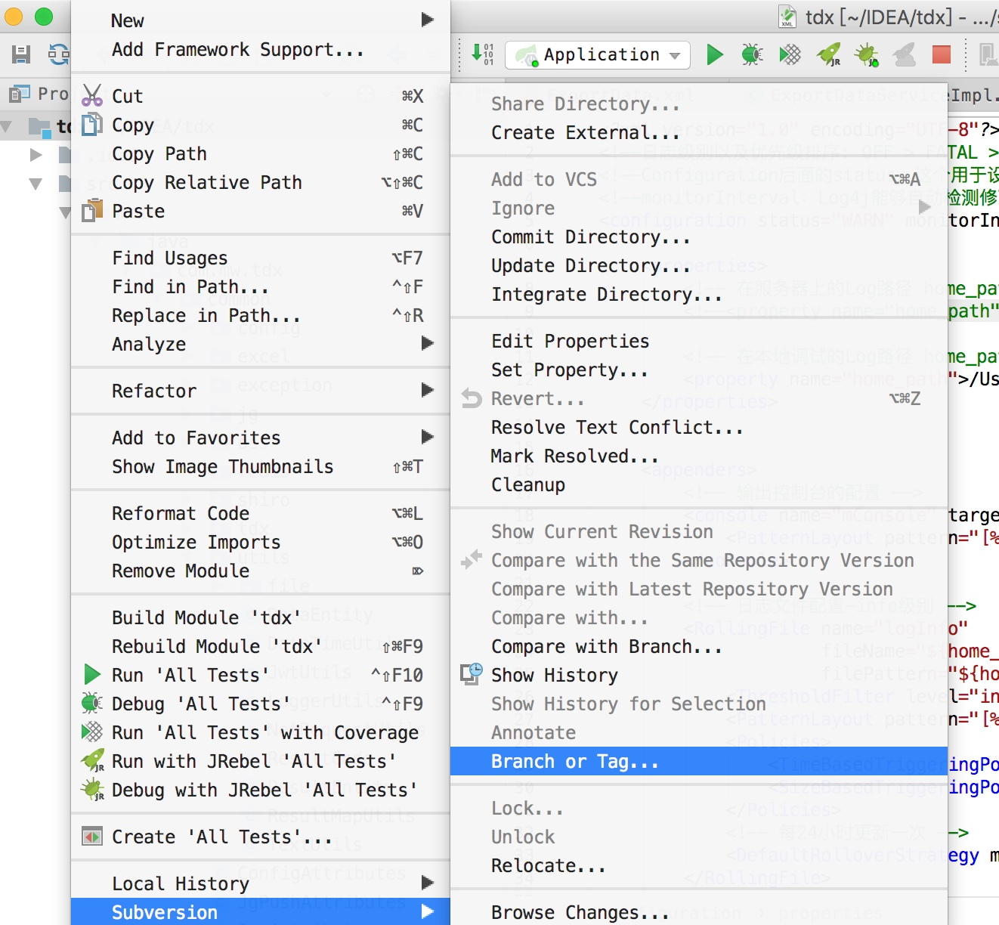
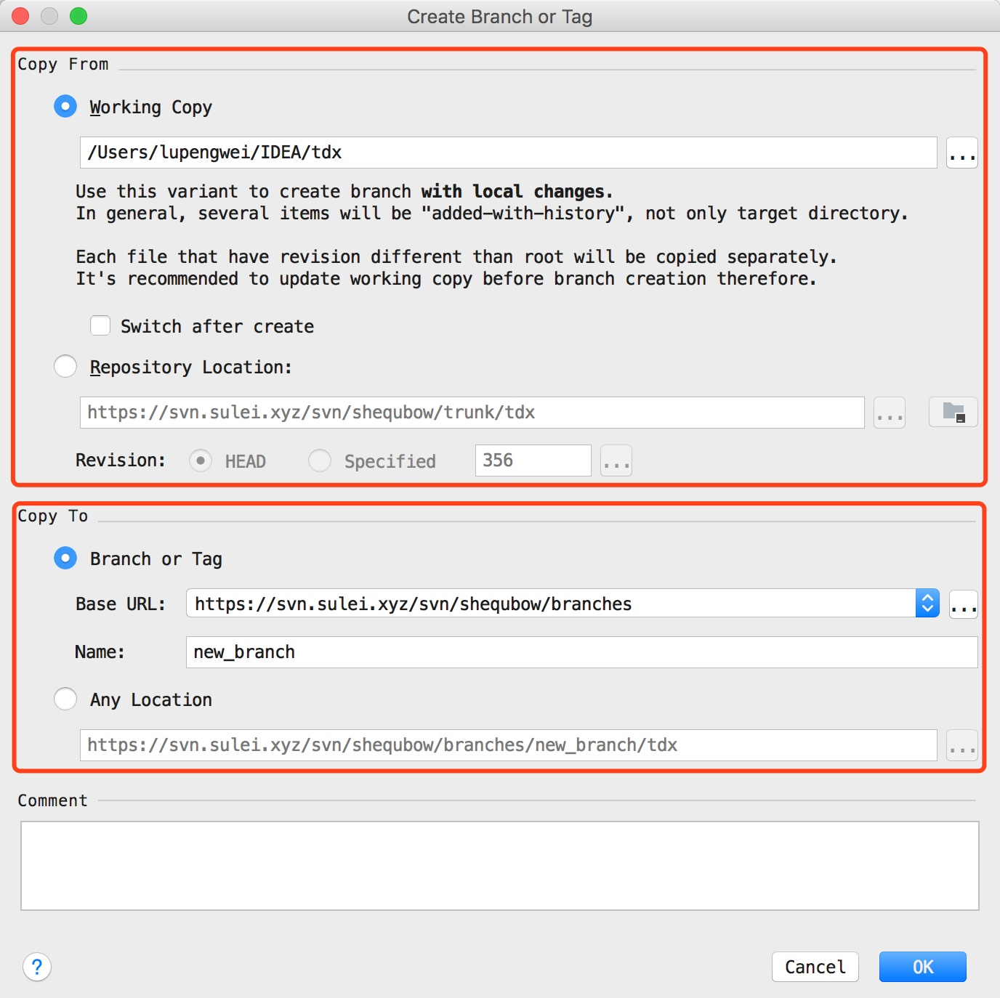
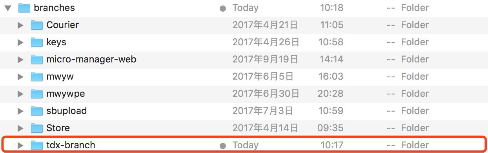
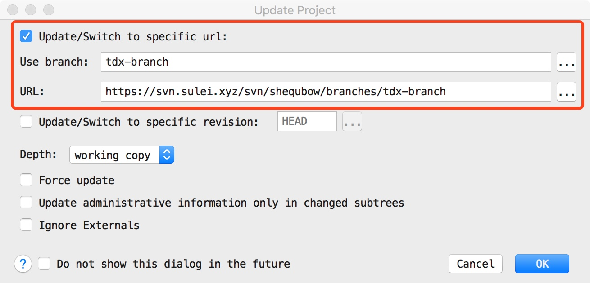
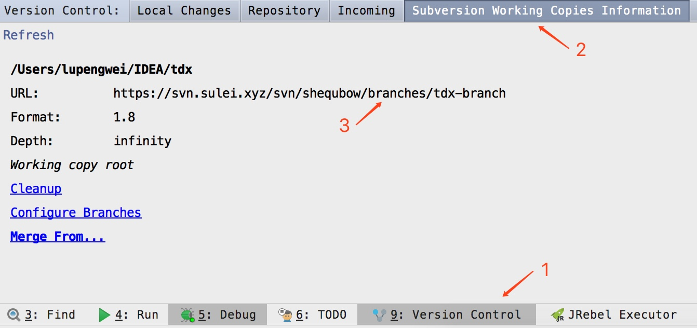
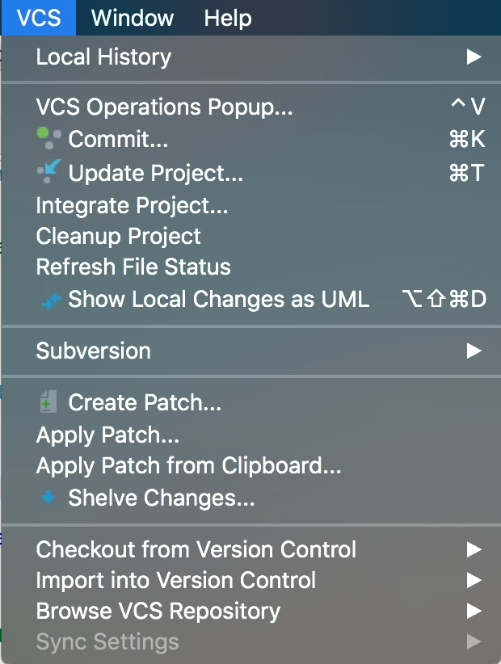
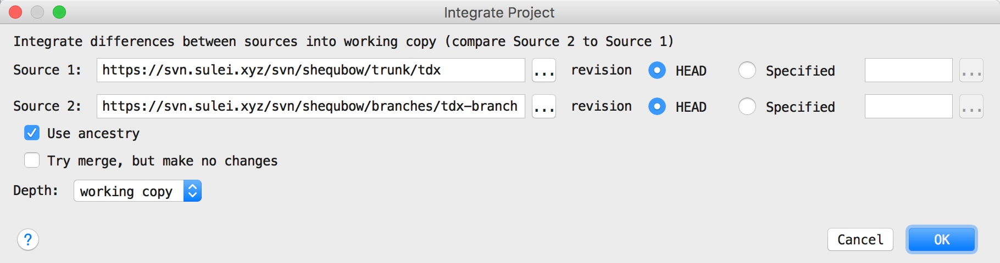

# 创建分支

## 打开菜单

右键单击项目文件，选择如图所示的以下菜单选项：

<!-- more -->

## 选择分支文件的初始代码和分支的位置

这里分成两个大的部分，Copy From 和 Copy To，Copy From 用于设置分支初始源码的 URL，其中 Working Copy 表示分支的初始源码来自本地，Repository Copy 表示分支源码来自一个 SVN 仓库，这里一般默认的是 SVN 上的 URL。Copy To 表示分支创建的 URL 路径，其中 Branch or Tag 分成 Base URL 和 Name (分支名称) 两个部分，合在一起就是分支的路径，Any Location 则是直接指定分支的 URL。

## 创建分支

在第二步中，分支初始源码选择 Repository Copy，使用当前项目在 SVN 中的源码作为分支初始源码，填写分支名字为 tdx-branch，点击确定后，刷新 Cornerstone (一款 Mac 下的 SVN 客户端)，就可以看见创建的分支文件了，如图所示：

# 切换分支

**注意：切换分支前一定记得先提交**，在 VCS 菜单中，选择更新项目，如图所示：

勾选 Update/Switch to specific url 选项，选择分支文件，注意 URL 不要弄错了，然后点击确认就可以切换分支了。

# 查看当前使用的分支

点击底部状态栏 Version Control -> Subversion Working Copies Information，如下图所示：

# 合并分支

首先，菜单栏中依次选择 VCS -> Integtate Project，如下图所示：

然后，选择需要合并的主干项目 URL(对应 Sourc 1) 和分支项目 URL (对应 Source 2)，如下图所示：

分支合并到主干：切换到主干 -> 合并分支操作 -> Source 1 填主干项目 URL，Source 2 填分支项目 URL
主干同步到分支：切换到分支 -> 合并分支操作 -> Sorceu 1 填分支项目 URL，Source 2 填主干项目 URL