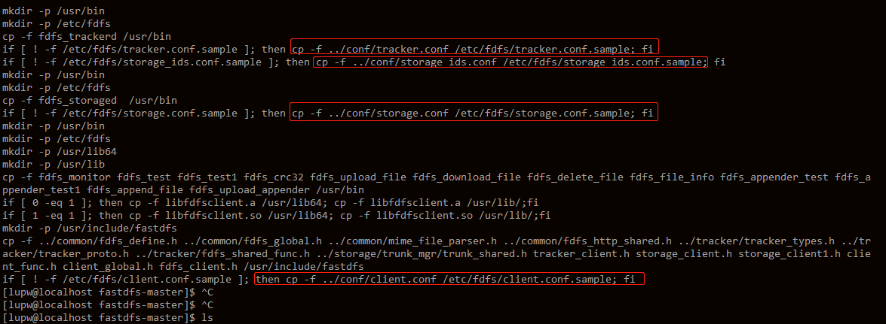
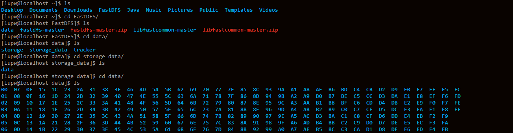

# FastDFS 安装

## 下载FastDFS源码

下载 FastDFS 源码, `https://github.com/happyfish100/fastdfs`

## 安装unzip工具

解压 zip 文件需要安装 unzip 工具, 没有安装的可以使用 `yum -y install unzip zip` 指令安装, 执行 yum 的时候出现 `another app is currently holding the yum lock;waiting for it to exit` 错误, 出现原因和解决方法见 `https://blog.csdn.net/mal327/article/details/6442253`

## 安装gcc工具

编译 FastDFS 源码, 由于 FastDFS 由 C 语言编写, 所以需要安装 gcc 编译器, `yum -y install gcc-c++`

<!-- more -->

## 编译和安装libfatscommon

FastDFS 依赖 libfatscommon, 先安装 libfatscommon, 下载地址 `https://github.com/happyfish100/fastdfs`, 下载好后分别解压, 编译, 安即可

```shell
# 编译
[lupw@localhost libfastcommon-master]$ sudo ./make.sh

# 安装
[lupw@localhost libfastcommon-master]$ ./make.sh install
mkdir -p /usr/lib64
mkdir -p /usr/lib
mkdir -p /usr/include/fastcommon
mkdir: cannot create directory ‘/usr/include/fastcommon’: Permission denied
make: *** [install] Error 1
[lupw@localhost libfastcommon-master]$ sudo ./make.sh install
[sudo] password for lupw: 
mkdir -p /usr/lib64
mkdir -p /usr/lib
mkdir -p /usr/include/fastcommon
install -m 755 libfastcommon.so /usr/lib64
install -m 644 common_define.h hash.h chain.h logger.h base64.h shared_func.h pthread_func.h ini_file_reader.h _os_define.h sockopt.h sched_thread.h http_func.h md5.h local_ip_func.h avl_tree.h ioevent.h ioevent_loop.h fast_task_queue.h fast_timer.h process_ctrl.h fast_mblock.h connection_pool.h fast_mpool.h fast_allocator.h fast_buffer.h skiplist.h multi_skiplist.h flat_skiplist.h skiplist_common.h system_info.h fast_blocked_queue.h php7_ext_wrapper.h id_generator.h char_converter.h char_convert_loader.h common_blocked_queue.h multi_socket_client.h skiplist_set.h fc_list.h json_parser.h /usr/include/fastcommon
if [ ! -e /usr/lib/libfastcommon.so ]; then ln -s /usr/lib64/libfastcommon.so /usr/lib/libfastcommon.so; fi
[lupw@localhost libfastcommon-master]$ 
```

## 编译和安装FastDFS

```shell
# 编译
[lupw@localhost fastdfs-master]$ sudo ./make.sh

# 安装
[lupw@localhost fastdfs-master]$ sudo ./make.sh install
mkdir -p /usr/bin
mkdir -p /etc/fdfs
cp -f fdfs_trackerd /usr/bin
if [ ! -f /etc/fdfs/tracker.conf.sample ]; then cp -f ../conf/tracker.conf /etc/fdfs/tracker.conf.sample; fi
if [ ! -f /etc/fdfs/storage_ids.conf.sample ]; then cp -f ../conf/storage_ids.conf /etc/fdfs/storage_ids.conf.sample; fi
mkdir -p /usr/bin
mkdir -p /etc/fdfs
cp -f fdfs_storaged  /usr/bin
if [ ! -f /etc/fdfs/storage.conf.sample ]; then cp -f ../conf/storage.conf /etc/fdfs/storage.conf.sample; fi
mkdir -p /usr/bin
mkdir -p /etc/fdfs
mkdir -p /usr/lib64
mkdir -p /usr/lib
cp -f fdfs_monitor fdfs_test fdfs_test1 fdfs_crc32 fdfs_upload_file fdfs_download_file fdfs_delete_file fdfs_file_info fdfs_appender_test fdfs_appender_test1 fdfs_append_file fdfs_upload_appender /usr/bin
if [ 0 -eq 1 ]; then cp -f libfdfsclient.a /usr/lib64; cp -f libfdfsclient.a /usr/lib/;fi
if [ 1 -eq 1 ]; then cp -f libfdfsclient.so /usr/lib64; cp -f libfdfsclient.so /usr/lib/;fi
mkdir -p /usr/include/fastdfs
cp -f ../common/fdfs_define.h ../common/fdfs_global.h ../common/mime_file_parser.h ../common/fdfs_http_shared.h ../tracker/tracker_types.h ../tracker/tracker_proto.h ../tracker/fdfs_shared_func.h ../storage/trunk_mgr/trunk_shared.h tracker_client.h storage_client.h storage_client1.h client_func.h client_global.h fdfs_client.h /usr/include/fastdfs
if [ ! -f /etc/fdfs/client.conf.sample ]; then cp -f ../conf/client.conf /etc/fdfs/client.conf.sample; fi
```

# FastDFS配置和启动

tracker 要在 storage 之前启动, 先配置和启动 tracker 后再配置和启动 storage

## 修改Tracker配置文件

在安装 FastDFS 后, 可以看到输出的日志里面将 FastDFS 中的 conf 目录下的一些配置文件复制到了 /etc/fdfs 目录下, 如下图所示:



这些文件都带有了 .sample 后缀, 这是作者给的示例配置文件, 这里我们复制这些文件:

```shell
[lupw@localhost fdfs]$ sudo cp client.conf.sample client.conf
[lupw@localhost fdfs]$ sudo cp storage.conf.sample storage.conf
[lupw@localhost fdfs]$ sudo cp storage_ids.conf.sample storage_ids.conf
[lupw@localhost fdfs]$ sudo cp tracker.conf.sample tracker.conf
```

编辑 tracker.conf 文件, 这里简单配置一下, 主要配置 tracker 的数据日志路径 (网上有文章称这里指向的路径都必须要已经存在? 我没有试过) 和 HTTP 请求端口

```ini
# 设置 tracker 的数据文件和日志目录
base_path=/home/lupw/FastDFS/data/tracker

# 设置 http 端口号, 默认为 8080, 因为 tomcat 在使用, 这里我改动一下
http.server_port=88
```

## 启动Tracker

修改好 Tracker 的配置文件后, 使用以下指令启动:

```shell
# 启动
# /usr/bin/fdfs_trackerd /etc/fdfs/tracker.conf start
[lupw@localhost ~]$ sudo service fdfs_trackerd start
Starting fdfs_trackerd (via systemctl):                    [  OK  ]

# 查询是否启动
[lupw@localhost ~]$ sudo netstat -unltp|grep fdfs
tcp        0      0 0.0.0.0:22122           0.0.0.0:*               LISTEN      21812/fdfs_trackerd

# 停止
[lupw@localhost ~]$ sudo service fdfs_trackerd stop
Stopping fdfs_trackerd (via systemctl):                    [  OK  ]
```

启动成功后, 可以在 `/home/lupw/FastDFS/data/tracker` 看到生成了 data 和 logs 目录, data 目录下有一个 fdfs_trackered.pid 记载了当前 tracker 启动时占用的 pid

## 配置Storage

编辑 `/etc/fdfs/storage.config` 配置文件, 这里主要配置 storage 的数据日志路径, HTTP 的请求端口和实际存放文件的路径 (网上有文章称这里指向的路径都必须要已经存在? 我没有试过)

```ini
# group name, 根据实际情况修改
group_name=group1  

# 设置 storage 的端口号, 默认是 23000, 同一个组的 storage 端口号必须一致
port=23000

# 设置 storage 数据文件和日志目录
base_path=/home/lupw/FastDFS/data/storage

# 存储路径个数，需要和 store_path 个数匹配
store_path_count=1

# 实际文件存储路径
store_path0=/home/lupw/FastDFS/data/storage_data

#tracker 服务器的 IP地址和端口号
tracker_server=192.168.80.131:22122

# 设置 HTTP 端口号, 默认是 8888
http.server_port=8888
```

## 启动Storage

```shell
# 启动
[sudo] password for lupw:
Starting fdfs_storaged (via systemctl):                    [  OK  ]

# 查看是否启动
[lupw@localhost ~]$ sudo netstat -unltp|grep fdfs
tcp        0      0 0.0.0.0:22122           0.0.0.0:*               LISTEN      29126/fdfs_trackerd 
tcp        0      0 0.0.0.0:23000           0.0.0.0:*               LISTEN      80085/fdfs_storaged

# 关闭
[lupw@localhost ~]$ sudo service fdfs_storaged stop
Stopping fdfs_storaged (via systemctl):                    [  OK  ]
```

启动成功后会看到 `/home/lupw/FastDFS/data/storage` 路径下看到生成的 data 和 logs 目录, `/home/lupw/FastDFS/data/storage_data` 路径下看到存放文件的路径, 如下图:



## 查看torage服务器是否已经登记到tracker服务器

```txt
[lupw@localhost data]$ sudo /usr/bin/fdfs_monitor /etc/fdfs/storage.conf
[sudo] password for lupw: 
[2018-09-29 00:09:42] DEBUG - base_path=/home/lupw/FastDFS/data/storage, connect_timeout=10, network_timeout=60, tracker_server_count=1, anti_steal_token=0, anti_steal_secret_key length=0, use_connection_pool=0, g_connection_pool_max_idle_time=3600s, use_storage_id=0, storage server id count: 0

server_count=1, server_index=0
tracker server is 192.168.80.131:22122
group count: 1
Group 1:
group name = group1
disk total space = 46907 MB
disk free space = 41576 MB
trunk free space = 0 MB
storage server count = 1
active server count = 1
storage server port = 23000
storage HTTP port = 8888
store path count = 1
subdir count per path = 256
current write server index = 0
current trunk file id = 0
        Storage 1:
                id = 192.168.80.131
                ip_addr = 192.168.80.131  ACTIVE
                http domain = 
                version = 5.12
                join time = 2018-09-28 23:59:21
                // 其他信息
```

ip_addr = 192.168.80.131  ACTIVE 表示已经成功登记到 traeker 服务器了

## 开机启动

在 `/etc/rc.d/rc.local` 分别依次添加 `service fdfs_trackered start` 和 `service fdfs_storaged start` 即可

# 上传测试

使用 fdfs_upload_file 指令测试上传需设置客户端的配置文件, 编辑 `/etc/fdfs/client.conf` 文件, 主要修改的配置如下:

```ini
# tracker 服务器文件路径
base_path=/home/lupw/FastDFS/data/tracker

# tracker 服务器 IP 地址和端口号
tracker_server=192.168.80.131:22122

# tracker 服务器的 HTTP 端口号, 必须和 tracker 的配置文件中的对应起来
http.tracker_server_port=88
```

配置完成后就可以使用如下指令测试了:

```shell
[lupw@localhost TempFile]$ /usr/bin/fdfs_upload_
fdfs_upload_appender  fdfs_upload_file

[lupw@localhost TempFile]$ /usr/bin/fdfs_upload_file /etc/fdfs/client.conf note.txt 
group1/M00/00/00/wKhQg1uvNcuAX0PhAAAADQOSefQ788.txt
```