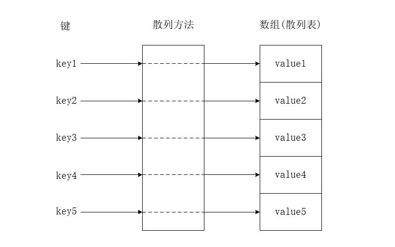
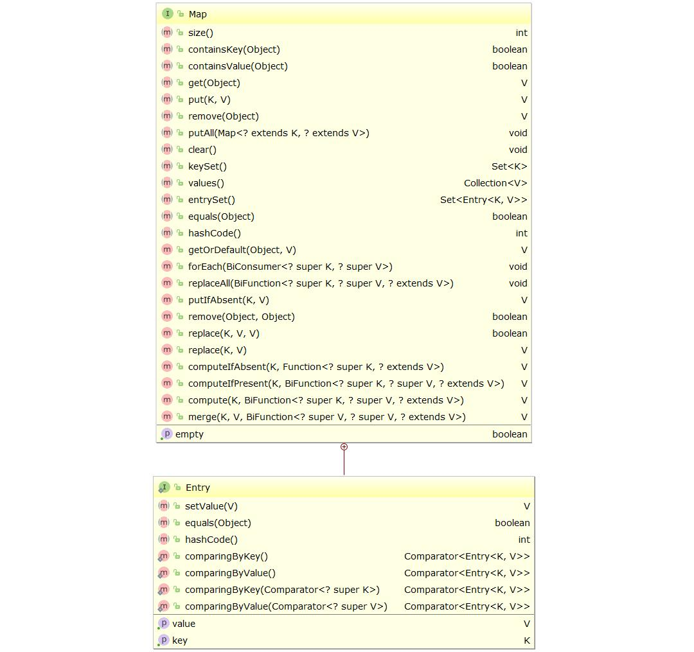

HashMap 是 Java 中一种重要的数据结构，由数组加链表组成 (数组和链表是 Java 中的基础数据结构)，HashMap 是 Map 接口的非同步实现，HashMap 同时也是基于哈希算法实现的。为了方便后面深入的理解 HashMap，首先需要了解的是哈希表和 Java 中的 Map 接口的基础知识。

# 哈希表

## 什么是哈希表

HashTable (哈希表) 同时也称为散列表 (以 下全部翻译 Hash 为散列的意思)，是一种根据键直接访问存储在内存中值的数据结构。若关键字为 k，则其值存放在 f(k) 的存储位置上，不需要通过额外的比较就可以直接取得所查记录，通常称这个对应关系为散列函数，按这个思想建立的表为散列表，即哈希表。

<!-- more -->



## 冲突

散列表获取和存储一个数据是通过散列函数来计算数据散列希表中存放的位置 (即散列地址)，任何一个散列函数在代入关键字并通过散列函数计算后，得到的散列地址是相同的，这种现象称之为冲突。

## 均匀散列函数

对于关键字集合中的任一个关键字，经散列函数映象到的散列地址集合中任何一个散列地址的概率是相等的，则称此类散列函数为均匀散列函数（Uniform Hash function），让使关键字经过散列函数得到一个“随机的地址”，可以减少冲突。

## 常用散列函数

### 直接定址法

取某个线性函数的值为散列地址，hash(k) = f(k)

### 数字分析法

如果散列表中可能出现的关键字都是事先知道的，则可取关键字的若干数位组成散列地址，类似一个大的枚举值。

### 平方取中法

取关键字平方后的中间几位为散列地址，取的位数可以根据表长或者实际情况来决定。

### 折叠法

将关键字分割成位数相同的几部分（最后一部分的位数可以不同），然后取这几部分的叠加和（舍去进位）作为哈希地址。

### 随机数法

f(x) 生成一个伪随机数作为散列地址。

### 取余求模法

取关键字被某个不大于散列表表长 m 的数 p 除后所得的余数为散列地址，不仅可以对关键字直接取模，也可在折叠法、平方取中法等运算之后取模，对于模值得选择很重要，选择不好，容易产生冲突

## 冲突处理方案

### 开放定址法

开放定址法就是一旦发生了冲突，就去寻找下一个空的散列地址，只要散列表足够大，空的散列地址总能找到，并将记录存入。

### 单独链表法

将散列到同一个存储位置的所有元素保存在一个链表中，这是 Java 中 HashMap 采取的方法。

### 再散列

在上次散列计算发生冲突时，利用该次冲突的散列函数地址产生新的散列函数地址，直到冲突不再发生，这种方法可以完美的解决冲突，但增加了计算时间。

### 公共溢出区

将哈希表分为基本表和溢出表两部分，发生冲突的元素都放入溢出表中。

## 哈希表的装填因子

散列表的装填因子定义为： 填入表中的元素个数 / 散列表的长度

由于表长是定值， 装填因子与“填入表中的元素个数”成正比，所以， 装填因子越大，表明填入表中的元素越多，产生冲突的可能性就越大；反之， 装填因子越小，标明填入表中的元素越少，产生冲突的可能性就越小。实际上，散列表的平均查找长度是装填因子的函数，只是不同处理冲突的方法有不同的函数。

对于开放定址法，荷载因子是特别重要因素，应严格限制在 0.7-0.8 以下。超过 0.8，查表时的 CPU 缓存不命中 (cache missing) 按照指数曲线上升。因此，一些采用开放定址法的 hash 库，如 Java 的系统库限制了荷载因子为0.75，超过此值将 resize 为原来长度两倍的散列表，并且重新调用 hash 方法。

# Map 接口

Map 接口的里面的方法如下图所示：



Map 接口是一个定义了键值映射的对象，一个 Map 对象可以包含多个键，每个键值最多映射一个值，Map 接口里面定义了一些方法，实现 Map 的接口的子类需要实现这些接口。

## Map 接口部分方法

Map 接口里面的方法如上 UML 图所示，这里记录部分接口的含义。

### size()

size() 方法返回 Map 对象里面映射的键值对的数量，这个方法需要注意的地方是当所保存的键值对数量超过 Integer.MAX_VALUE 时，返回 Integer.MAX_VALUE 的值。

```java
/**
 * Returns the number of key-value mappings in this map.  If the
 * map contains more than <tt>Integer.MAX_VALUE</tt> elements, returns
 * <tt>Integer.MAX_VALUE</tt>.
 *
 * @return the number of key-value mappings in this map
 */
int size();
```

### values()

Collection<V\> values() 方法和 Set<K\> keySet() 返回的值不同，keySet() 方法返回的是键的一个 Set<V\> 的集合，不允许出现重复的值，values() 方法返回 Collection<V\> 集合，Java 中的集合对象都是这个接口类的子类或者间接子类，因此如果强行转换成其子类类型，就会导致类型转换异常。

values() 方法错误的使用方式示例代码：

```java
public class Main {
    public static void main(String[] args) {
        HashMap<String, String> map = new HashMap<>();
        map.put("1", "1");
        map.put("2", "2");
        map.put("3", "3");
        List<String> values = (ArrayList<String>) map.values();
        values.forEach(System.out::println);
    }
}
```

出现类型转换异常：

```text
Exception in thread "main" java.lang.ClassCastException: 
java.util.HashMap$Values cannot be cast to java.util.ArrayList at com.lupw.spring.map.Main.main(Main.java:16)
```

向下转型的时候出现了类型转换错误，正确的使用方式是集合的构造方法中通常可以传递一个 Collection<? extends E> 类型的对象来实例化一个集合，例如 ArrayList 就有一个这样的构造方法：

```java
public ArrayList(Collection<? extends E> c) {
    elementData = c.toArray();
    size = elementData.length;
    // c.toArray might (incorrectly) not return Object[] (see 6260652)
    if (elementData.getClass() != Object[].class)
        elementData = Arrays.copyOf(elementData, size, Object[].class);
}
```

正确使用 values() 方法的示例代码如下：

```java
public class Main {
    public static void main(String[] args) {
        HashMap<String, String> map = new HashMap<>();
        map.put("1", "1");
        map.put("2", "2");
        map.put("3", "3");
        List<String> values = new ArrayList<>(map.values());
        values.forEach(System.out::println);
    }
}
```

### remove(Object key)

移除 Map 对象中键为 key 的映射关系，如果 key 存在，返回 对应的 value 值，如果不存在 key 则返回 null。

### forEach(BiConsumer<? super K, ? super V> action)

这是 JDK 1.8 中新增的用于循环遍历 Map 的方法，参数接受一个 Lambda 表达式，在没有这个方法时，对 Map 的遍历可以借助 Set<K\> keySet() 方法获取所有键的集合后，再对键进行循环遍历获取对应的值，或者使用迭代器来实现，也可以使用遍历 Map.Entry 集合的方式实现，详见`Java-Map遍历的方式和性能测试`一文。

```java
HashMap<String, String> map = new HashMap<>();
map.put("1", "1");
map.put("2", "2");
map.put("3", "3");
map.forEach((k, v) -> System.out.println("key : " + k + ", value : " + v));
```

### replaceAll(BiFunction<? super K, ? super V, ? extends V> function)

这是 JDK 1.8 中新增替换值得方法，首先了解下 replaceAll() 的源码，如下：

```java
default void replaceAll(BiFunction<? super K, ? super V, ? extends V> function) {
    Objects.requireNonNull(function);
    for (Map.Entry<K, V> entry : entrySet()) {
        // 遍历 Map.Entry 的集合，获取 key 和 value
        K k;
        V v;
        try {
            k = entry.getKey();
            v = entry.getValue();
        } catch(IllegalStateException ise) {
            throw new ConcurrentModificationException(ise);
        }

        // 获取 Lambda 表达式的返回的值
        v = function.apply(k, v);

        try {
            // 将返回的值作为新的值设置
            entry.setValue(v);
        } catch(IllegalStateException ise) {
            throw new ConcurrentModificationException(ise);
        }
    }
}
```

了解到 replaceAll() 获取 Lambda 表达式的返回的值作为新的值替代旧的值后，我们就知道这个方法时如何使用的了，使用示例如下：

```java
HashMap<String, String> map = new HashMap<>();
map.put("1", "1");
map.put("2", "2");
map.put("3", "3");
// 将所有的值替换成字符串“1”
map.replaceAll((k, v) -> {return "1";});
map.forEach((k, v) -> System.out.println("key : " + k + ", value : " + v));
```

### getOrDefault()

这是 JDK 1.8 中新增的方法，如果指定的 key 存在，则返回该 key 对应的 value，如果不存在，则返回指定的值。

### putIfAbsent(K key, V value)

这是 JDK 1.8 中新增的方法，如果 key 映射的的 value 不存在，则将这个 key 的值设置为 value，否则返回 key 当前所映射的 value，putIfAbsent() 方法的源码如下：

```java
default V putIfAbsent(K key, V value) {
    V v = get(key);
    if (v == null) {
        v = put(key, value);
    }
    return v;
}
```

### remove(Object key, Object value)

这是 JDK 1.8 中新增的方法，如果 key 映射的的 value 和参数传递的 value 相等则返回 true，不相等或者 key 不存在否则返回 false，其源码如下：

```java
default boolean remove(Object key, Object value) {
    Object curValue = get(key);
    if (!Objects.equals(curValue, value) || (curValue == null && !containsKey(key))) {
        return false;
    }
    remove(key);
    return true;
}
```

### computeIfAbsent(K key, Function<? super K, ? extends V> mappingFunction)

这是 JDK 1.8 中新增的方法，如果 key 不存在，保存这个 key， key 可以参与计算生成一个新的值，并且返回这个新的值， 如果 key 存在，则直接返回对应 key 的值。

```java
HashMap<String, String> map = new HashMap<>();
map.computeIfAbsent("1", key -> "re0" + key);
System.out.println(map.toString());

map.computeIfAbsent("1", key -> "re1" + key);
System.out.println(map.toString());

map.computeIfAbsent("1", key -> "re2" + key);
System.out.println(map.toString());
```

输出结果：

```text
// key 不存在时调用 computeIfAbsent () 返回新生成的值
{1=re01}

// key 存在时调用 computeIfAbsent () 返回该 key 对应的值
{1=re01}

{1=re01}
```

### computeIfPresent(K key, BiFunction<? super K, ? super V, ? extends V> remappingFunction)

这是 JDK 1.8 中新增的方法，如果 key 存在，修改 key 对应的值，key 和 value 都可以参与新值得计算，并且返回这个新的值，如果不存在直接返回 null，注意，如果这里的 Lambda 表达式返回的值设置为 null，则表示删除这个 key。

```java
HashMap<String, String> map = new HashMap<>();
System.out.println(map.computeIfPresent("1", (key, value) -> "re0" + key));
System.out.println(map.toString());

map.put("1", "1");
System.out.println(map.computeIfPresent("1", (key, value) -> "re1" + key));
System.out.println(map.toString());

System.out.println(map.computeIfPresent("1", (key, value) -> "re2" + key));
System.out.println(map.toString());
```

输出结果：

```text
// key 不存在的时候调用 computeIfPresent() 方法返回值为 null
null
{}
re11
{1=re11}
re21
{1=re21}
```

### compute(K key, BiFunction<? super K, ? super V, ? extends V> remappingFunction)

这是 JDK 1.8 中新增的方法，compute() 方法是 computeIfAbsent() 方法和 computeIfPresent() 方法的结合体，如果 key 不存在则新增，key 存在则修改，调用该方法同时会返回新增后或者修改后的这个 key 对应的值。

### merge(K key, V value, BiFunction<? super V, ? super V, ? extends V> remappingFunction)

这是 JDK 1.8 中新增的方法，可以使用新的 value 和旧的 value  取计算生成新的值，如果 key 不存在，则新存入这个 key 和新生成的 value，如果 key 存在，则修改这个 key 对应的值，并直接返回新计算生成的值。

```java
HashMap<String, String> map = new HashMap<>();
System.out.println(map);

map.merge("1", "Hello ",(oldValue, newValue) -> oldValue + newValue);
System.out.println(map);

map.merge("1", "HaHa",(oldValue, newValue) -> oldValue + newValue);
System.out.println(map);
```

输出结果：

```text
{}
{1=Hello}
{1=Hello HaHa}
```

## Map.Entry 类

Map 接口里面还有一个内部接口类 Entry，这个类就是 key-value 关系的映射类。里面维护了两个字段 key 和 value，在 JDK 1.8 之前只定义了 getKey()，getValue()，setValue()，hashCode() 和 equals() 几个常见的方法，在 JDK 1.8 后又添加了几个排序的静态方法，分别是 comparingByKey()，comparingByValue()，comparingByKey(Comparator<? super K> cmp) 和 comparingByValue(Comparator<? super V> cmp) 四个方法，源码如下：

```java
public static <K extends Comparable<? super K>, V> Comparator<Map.Entry<K,V>> comparingByKey() {
    return (Comparator<Map.Entry<K, V>> & Serializable)
        (c1, c2) -> c1.getKey().compareTo(c2.getKey());
}

public static <K, V extends Comparable<? super V>> Comparator<Map.Entry<K,V>> comparingByValue() {
    return (Comparator<Map.Entry<K, V>> & Serializable)
        (c1, c2) -> c1.getValue().compareTo(c2.getValue());
}

public static <K, V> Comparator<Map.Entry<K, V>> comparingByKey(Comparator<? super K> cmp) {
    Objects.requireNonNull(cmp);
    return (Comparator<Map.Entry<K, V>> & Serializable)
        (c1, c2) -> cmp.compare(c1.getKey(), c2.getKey());
}

public static <K, V> Comparator<Map.Entry<K, V>> comparingByValue(Comparator<? super V> cmp) {
    Objects.requireNonNull(cmp);
    return (Comparator<Map.Entry<K, V>> & Serializable)
        (c1, c2) -> cmp.compare(c1.getValue(), c2.getValue());
}
```

# 参考资料

* JDK 1.8 Map 接口源码
* 维基百科-散列表：`https://zh.wikipedia.org/wiki/%E5%93%88%E5%B8%8C%E8%A1%A8`
* 百度百科-散列方法：`https://baike.baidu.com/item/hash/390310`
* 重新认识 HashMap：`https://tech.meituan.com/java-hashmap.html`
* Java 中的 HashMap：`https://blog.csdn.net/u010297957/article/details/51974340`