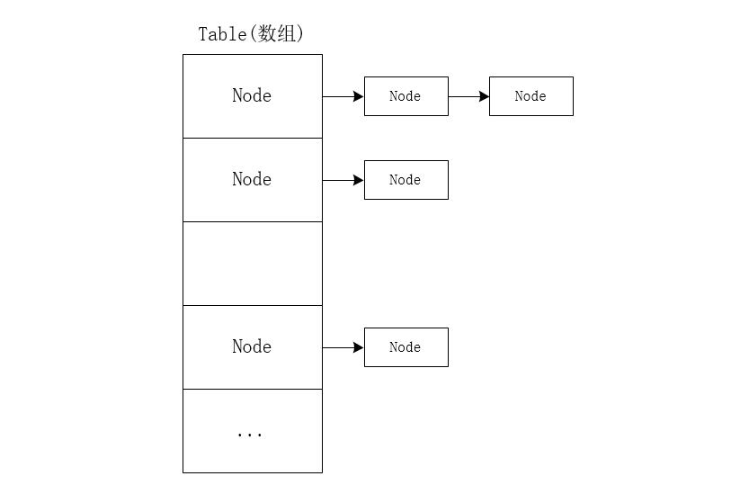

HashMap 是 Java 中一种重要的结构，在上一篇笔记中已经了解了什么是哈希表和 Map 接口，HashMap 是基于 Hash 表的设计实现的，也同时实现了 Map 接口，这篇笔记继续深入的了解 HashMap 从源码上具体是如何实现的。

# HashMap 的结构

HashMap 组成的结构是 数组 + 链表 + 红黑树 (JDK 1.8 添加的，链表长度大于 8 的时候转换成红黑树) 实现的，这个数组即哈希表，为了解决冲突采用了单独列表法来实现的，其结构的框架图如下：



<!-- more -->

既然 HashMap 是基于哈希表的数据结构设计的，从源码的角度了解下 HashMap 时如何实现哈希表、哈希函数的。

# HashMap 的哈希表

HashMap 里面有维护一个哈希表，称之为哈希桶数组， HashMap 中的哈希桶数组的定义如下：

```java
/**
 * The table, initialized on first use, and resized as
 * necessary. When allocated, length is always a power of two.
 * (We also tolerate length zero in some operations to allow
 * bootstrapping mechanics that are currently not needed.)
 */
transient Node<K,V>[] table;
```

它的的初始长度 (16) 和扩容后的长度总是为 2 的倍数，这个数组存储的类型是一个 Node<K, V> 映射类型：

```java
// Node 实现了 Map 接口里面的 Entry 映射类
static class Node<K,V> implements Map.Entry<K,V> {
    // 存储经过散列函数计算后的数组下标
    final int hash;
    final K key;
    V value;
    // 存储下一个节点的引用
    Node<K,V> next;

    Node(int hash, K key, V value, Node<K,V> next) {
        this.hash = hash;
        this.key = key;
        this.value = value;
        this.next = next;
    }

    public final K getKey()        { return key; }
    public final V getValue()      { return value; }
    public final String toString() { return key + "=" + value; }

    public final int hashCode() {
        return Objects.hashCode(key) ^ Objects.hashCode(value);
    }

    public final V setValue(V newValue) {
        V oldValue = value;
        value = newValue;
        return oldValue;
    }

    public final boolean equals(Object o) {
        if (o == this) return true;
        if (o instanceof Map.Entry) {
            Map.Entry<?, ?> e = (Map.Entry<?, ?>) o;
            if (Objects.equals(key, e.getKey()) && Objects.equals(value, e.getValue()))
                return true;
        }
        return false;
    }
}
```

可以看出 Node 实现了 Map 接口里面的 Entry 映射类，其成员变量比 Map.Entry 类多了一个 int 类型的 hash 字段和 Node<K, V> 类型的 next 字段，hash 存的是通过散列函数计算后得到的值再取模后的数组的下标值，next 用于存储链表下一个存储的值的引用 (地址)，HashMap 在实现的不仅仅是哈希表存储的是 Node 类型的值，用于解决冲突的链表也是存储的 Node 类型的值。

# HashMap 的哈希函数

HashMap 中的求 hash 值的函数的实现如下所示：

```java
// 返回 hash 值
static final int hash(Object key) {
    int h;
    // 键的 hashCode() 值的高 16 位 和低 16 位或计算
    return (key == null) ? 0 : (h = key.hashCode()) ^ (h >>> 16);
}
```

计算出 hash 值后，再使用当前表的长度计算出散列地址，即哈希桶数组的下标值，计算方式如下：

```java
// 这段代码在 putVal() 方法中找到的
// hash 是 hash() 方法计算出来的值，n 为当前表的长度，
// 为了提高运算的效率，没有直接使用 % 而是使用 & 的计算符号取模
(n - 1) & hash
```

这两步的计算一起组成了 HashMap 对哈希函数的实现，在 `https://tech.meituan.com/java-hashmap.html` 一文的`确定哈希桶数组索引位置`小结中有个图示的例子，可以加深了解。

# HashMap 保存值

HashMap 保存值调用的是 put() 方法，最终调用的是 putVal() 方法，这两个方法的源码如下：

```java
// put() 方法
public V put(K key, V value) {
    // 这里调用了 hash() 方法计算 hash 值
    return putVal(hash(key), key, value, false, true);
}

// putVal() 方法
/**
     * Implements Map.put and related methods
     *
     * @param hash 键的 hash 值
     * @param key 键
     * @param value 键所映射的值
     * @param onlyIfAbsent 如果为 true, 如果这个 key 存在，不会替换已有的值
     * @param evict if false, the table is in creation mode.
     * @return 返回新存入的值，如果存入值失败返回 null
     */
final V putVal(int hash, K key, V value, boolean onlyIfAbsent, boolean evict) {
    Node<K,V>[] tab;
    Node<K,V> p;
    int n, i;
    // 如果哈希桶数组不存在或者长度为 0，对数组进行扩容，并将扩容后的长度赋值给 n，
    // 同时保存扩容后的引用保存在 tab
    if ((tab = table) == null || (n = tab.length) == 0) n = (tab = resize()).length;

    // 获取哈希桶数组对应下标的值是否为 null，如果为空，创建一个 Node 对象的示例并将值保存在哈希桶数组中
    if ((p = tab[i = (n - 1) & hash]) == null) {
        tab[i] = newNode(hash, key, value, null);
    } else {
        Node<K,V> e;
        K k;
        // 要保存映射的 key 已经存在，将直接保存到
        if (p.hash == hash && ((k = p.key) == key || (key != null && key.equals(k)))) {
            e = p;
        } else if (p instanceof TreeNode) {
            // 如果是红黑树类型，将要保存的映射插入红黑树
            e = ((TreeNode<K,V>) p).putTreeVal(this, tab, hash, key, value);
        } else {
            for (int binCount = 0; ; ++binCount) {
                // 循环遍历，找到链表的最后一个元素
                if ((e = p.next) == null) {
                    p.next = newNode(hash, key, value, null);
                    // 比较链表的元素是否超过 8 个，如果超过 8 个，转换成红黑树
                    if (binCount >= TREEIFY_THRESHOLD - 1)
                        // 将哈希桶数组转换成红黑树，通过遍历实现
                        treeifyBin(tab, hash);
                    break;
                }
                // 存入的映射的 key 已经存在于列表，不对列表做任何改变
                if (e.hash == hash && ((k = e.key) == key || (key != null && key.equals(k)))) {
                    break;
                }
                p = e;
            }
        }

        if (e != null) {
            V oldValue = e.value;
            if (!onlyIfAbsent || oldValue == null) {
                e.value = value;
            }
            // LinkedHashMap 中这个方法才会生效，HashMap 中这个方法函数体是空的
            afterNodeAccess(e);
            return oldValue;
        }
    }
    ++modCount;
    // size 是 HashMap 中维护的一个字段，记录当前 Map 中已经保存的数据的大小
    // threshold 是 HashMap 中维护的一个字段，记录当前 HashMap 的大小
    // 如果 HashMAp 中当前数据大小大于 HasnMap 的大小，需要进行扩容
    if (++size > threshold) resize();
    // LinkedHashMap 中这个方法才会生效，HashMap 中这个方法函数体是空的
    afterNodeInsertion(evict);
    return null;
}
```

# HashMap 获取值

HashMap 获取值主要调用的 get() 方法，如果 key 存在返回，最终调用的是 getNode() 方法：

```java
public V get(Object key) {
    Node<K,V> e;
    return (e = getNode(hash(key), key)) == null ? null : e.value;
}

final Node<K,V> getNode(int hash, Object key) {
    Node<K,V>[] tab;
    Node<K,V> first, e;
    int n; K k;
    // first = tab[(n - 1) & hash] 找到相同 hash 值的链表的第一个节点，如果没有直接返回 null
    if ((tab = table) != null && (n = tab.length) > 0 && (first = tab[(n - 1) & hash]) != null) {
        // 第一个节点的 key 的 hash 值相同和 key 的值相同，直接返回值
        if (first.hash == hash && ((k = first.key) == key || (key != null && key.equals(k))))
            return first;
        if ((e = first.next) != null) {
            // 如果该节点是红黑树类型，获取红黑树对应 key 的值
            if (first instanceof TreeNode)
                return ((TreeNode<K,V>)first).getTreeNode(hash, key);
            do {
                // 循环遍历链表查找值，条件是 hash 值和 key 都相同
                if (e.hash == hash && ((k = e.key) == key || (key != null && key.equals(k))))
                    return e;
            } while ((e = e.next) != null);
        }
    }
    return null;
}
```

# 参考资料

* JDK 1.8 HashMap 源码
* 重新认识HashMap：`https://tech.meituan.com/java-hashmap.html`