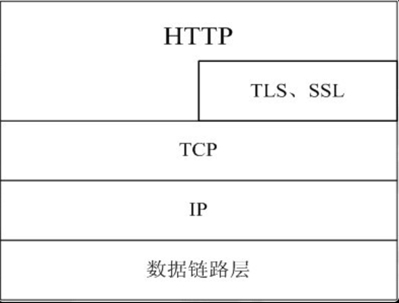

HTTP 协议即超文本传输协议，是互联网上应用最广泛的一种协议，是TCP/IP协议的一个应用层协议，用于定义WEB浏览器和WEB服务器之间交换数据的过程。

# HTTP 在 TCP/IP 协议中的位置

如下图所示，要求自己能画出这个协议图

 

* HTTP 协议通常在 TCP 协议之上，有时候也承载于 TSL、SSL 之上，即我们通常说的 HTTPS，默认 HTTP 的端口号为 80，HTTP S的端口号为 443。
* HTTP 请求时一种无状态的请求，服务器在响应客户端后，链接就会断开，可以在请求头中添加 Connection:keep-alive，在请求数据后任然保持链接，浏览器可以通过相同的链接发送请求，可以节省建立链接花费的时间，也可以节约网络带宽。

<!-- more -->

# HTTP 请求

一个完整的http请求经历两个过程：客户端发送请求到服务器、服务器响应客户端

## 客户端发送请求到服务器

客户端到服务器请求包含请求的URL、请求头和可选的请求体三个部分：

* 请求的地址(URL)：例如 `https://www.baidu.com`，可以通过 ? 和 & 追加一系列的键值对参数，一般情况下 URL 的长度不能超过 2048 个字符，即两个字节，超过限制可能导致服务器不能识别;
* 请求头(Reauest Header)：请求头也是一些键值对，通常是 W3C 定义的标准 Http 请求头的名称，这里面包含了一些元数据信息，例如 User-Agent 会告诉服务器这个请求是来自于哪一个服务器，除了这些也可以自定义自己的请求头元数据;
* 请求体(Requset Body)：URL 的长度有限制，如果发送的数据量大，可以将数据放在请求体重，get 请求不支持请求体，只有 post 请求才能设置请求体，请求体能放任意的字节流，一般客户端是不会对请求体进行大小设置，一般在服务器上进行限制，这也是很有必要的。

## 服务器响应客户端

服务器响应客户端包含响应头和响应体两个部分:

* 响应头(Response Header)：响应头也是一些键值对，和请求类似，包含了 W3C 定义的一些标准响应头，也可以定义自己的响应头元数据;
* 响应体(Response Body)：响应体包含了服务器需要返回个客户端的数据，客户端浏览器默认也是没有对返回的大小做限制的，可以人为的限制。

# GET 和 POST 区别

 HTTP定义了与服务器交互的不同的方法，分别有 GET，POST，PUT 和 DELETE，对应着查，改，增，删四个动作，GET 一般用于获取信息，POST 一般用于更新资源信息，所以理论上 GET 请求是不会产生副作用，他不会对服务器上的数据和资源造成影响，然而实际上只有 GET 和 POST 使用最多，并且都被用于增删改查操作。

 (1) GET 方法请求没有请求体，最多提交的数据 (数据指的是 URL 长度) 是 2048 个字符 (不一定，有的只有 1K，有的有 8K)，实际上，URL 不存在参数上限的问题，HTTP 协议规范中没有对 URL 长度进行限制，这个限制取决于浏览器和服务器对他的支持，POST 也没有参数的限制，POST 请求主要起参数限制作用的式服务器程序的支持 (例如IIS6.0，微软为了安全考虑，POST 请求最大数据量为 200K，但是这些默认值都是可以更改的);
 (2) POST 的安全性比 GET 的要高，使用 GET 请求参数会被浏览器缓存而 POST 不会;
 (3) POST 的参数在请求体中，GET 的参数直接拼接在 URL 中;
 (4) GET 和 POST 本质上都是 TCP 链接，由于 HTTP 规范的规定和浏览器/服务器上的限制导致在应用过程中变现的不同，在请求的时候 GET 产生一个 TC P数据包，POS T产生两个数据包，GET 请求会把 Hrader 和 Data 一起发送出去，服务器返回 200，而 POST 请求会将 Header 先发送出去，服务器响应返回状态吗 100 后再将数据发送出去，服务器在返回 200，但是并不是每个 POST 请求会发送两次包，火狐浏览器就只发送一次。

# 状态码

常见的有 200，400，404，500，504 等

## 1XX:信息

| 状态码 | 说明 |
| --- | --- |
| 100 Continue | 服务器仅接收到部分请求，但是一旦服务器并没有拒绝该请求，客户端应该继续发送其余的请求 |
| 101 Switching Protocols | 服务器转换协议：服务器将遵从客户的请求转换到另外一种协议 |

## 2XX:成功

| 状态码 | 说明 |
| --- | --- |
| 200 OK | 请求成功（其后是对GET和POST请求的应答文档。） |
| 201 Created | 请求被创建完成，同时新的资源被创建 |
| 202 Accepted | 供处理的请求已被接受，但是处理未完成 |
| 203 Non-authoritative Information | 文档已经正常地返回，但一些应答头可能不正确，因为使用的是文档的拷贝 |
| 204 No Content | 没有新文档，浏览器应该继续显示原来的文档，如果用户定期地刷新页面，而Servlet可以确定用户文档足够新，这个状态代码是很有用的 |
| 205 Reset Content | 没有新文档，但浏览器应该重置它所显示的内容，用来强制浏览器清除表单输入内容 |
| 206 Partial Content | 客户发送了一个带有Range头的GET请求，服务器完成了它 |

## 3XX:重定向

| 状态码 | 说明 |
| --- | --- |
| 300 Multiple Choices |多重选择，链接列表，用户可以选择某链接到达目的地，最多允许五个地址 |
| 301 Moved Permanently | 所请求的页面已经转移至新的 url |
| 302 Found | 所请求的页面已经临时转移至新的 url |
| 303 See Other | 所请求的页面可在别的 url 下被找到 |
| 304 Not Modified | 未按预期修改文档。客户端有缓冲的文档并发出了一个条件性的请求（一般是提供 If-Modified-Since 头表示客户只想比指定日期更新的文档）。服务器告诉客户，原来缓冲的文档还可以继续使用。 |
| 305 Use Proxy | 客户请求的文档应该通过 Location 头所指明的代理服务器提取 |
| 306 Unused | 此代码被用于前一版本。目前已不再使用，但是代码依然被保留 |
| 307 Temporary Redirect | 被请求的页面已经临时移至新的 url |
| --- | --- |

## 4XX:客户端错误

| 状态码 | 说明 |
| --- | --- |
| 400 Bad Request | 服务器未能理解请求 |
| 401 Unauthorized | 被请求的页面需要用户名和密码 |
| 401.1 | 登录失败 |
| 401.2 | 服务器配置导致登录失败 |
| 401.3 | 由于 ACL 对资源的限制而未获得授权 |
| 401.4 | 筛选器授权失败 |
| 401.5 | ISAPI/CGI 应用程序授权失败 |
| 401.7 | 访问被 Web 服务器上的 URL 授权策略拒绝。这个错误代码为 IIS 6.0 所专用 |
| 402 Payment Required | 此代码尚无法使用 |
| 403 Forbidden | 对被请求页面的访问被禁止 |
| 403.1 | 执行访问被禁止 |
| 403.2 | 读访问被禁止 |
| 403.3 | 写访问被禁止 |
| 403.4 | 要求 SSL |
| 403.5 | 要求 SSL 128 |
| 403.6 | IP 地址被拒绝 |
| 403.7 | 要求客户端证书 |
| 403.8 | 站点访问被拒绝 |
| 403.9 | 用户数过多 |
| 403.10 | 配置无效 |
| 403.11 | 密码更改 |
| 403.12 | 拒绝访问映射表 |
| 403.13 | 客户端证书被吊销 |
| 403.14 | 拒绝目录列表 |
| 403.15 | 超出客户端访问许可 |
| 403.16 | 客户端证书不受信任或无效 |
| 403.17 | 客户端证书已过期或尚未生效 |
| 403.18 | 在当前的应用程序池中不能执行所请求的 URL。这个错误代码为 IIS 6.0 所专用 |
| 403.19 | 不能为这个应用程序池中的客户端执行 CGI。这个错误代码为 IIS 6.0 所专用 |
| 403.20 | Passport 登录失败。这个错误代码为 IIS 6.0 所专用 |
| 404 Not Found | 服务器无法找到被请求的页面 |
| 404.0 | (无) – 没有找到文件或目录 |
| 404.1 | 无法在所请求的端口上访问 Web 站点 |
| 404.2 | Web 服务扩展锁定策略阻止本请求 |
| 404.3 | MIME 映射策略阻止本请求 |
| 405 Method Not Allowed | 请求中指定的方法不被允许 |
| 406 Not Acceptable | 服务器生成的响应无法被客户端所接受 |
| 407 Proxy Authentication Required | 用户必须首先使用代理服务器进行验证，这样请求才会被处理 |
| 408 Request Timeout | 请求超出了服务器的等待时间 |
| 409 Conflict | 由于冲突，请求无法被完成 |
| 410 Gone | 被请求的页面不可用 |
| 411 Length Required "Content-Length" | 未被定义。如果无此内容，服务器不会接受请求 |
| 412 Precondition Failed | 请求中的前提条件被服务器评估为失败 |
| 413 Request Entity Too Large | 由于所请求的实体的太大，服务器不会接受请求 |
| 414 Request-url Too Long | 由于 URL 太长，服务器不会接受请求, 当 post 请求被转换为带有很长的查询信息的 get 请求时，就会发生这种情况 |
| 415 Unsupported Media Type | 由于媒介类型不被支持，服务器不会接受请求 |
| 416 Requested Range Not Satisfiable | 服务器不能满足客户在请求中指定的 Range 头 |
| 417 Expectation Failed | 执行失败 |
| 423 | 锁定的错误 |

## 5XX:服务器错误

| 状态码 | 说明 |
| --- | --- |
| 500 Internal Server Error | 服务器遇到不可预知的情况，请求未完成 |
| 500.12 | 应用程序正忙于在 Web 服务器上重新启动 |
| 500.13 | Web 服务器太忙 |
| 500.15 | 不允许直接请求 Global.asa |
| 500.16 | UNC 授权凭据不正确。这个错误代码为 IIS 6.0 所专用 |
| 500.18 | URL 授权存储不能打开。这个错误代码为 IIS 6.0 所专用 |
| 500.100 | 内部 ASP 错误 |
| 501 Not Implemented | 请求未完成。服务器不支持所请求的功能 |
| 502 Bad Gateway | 请求未完成。服务器从上游服务器收到一个无效的响应 |
| 502.1 | CGI 应用程序超时 |
| 502.2 | CGI 应用程序出错 |
| 503 Service Unavailable | 请求未完成，服务器临时过载或宕机 |
| 504 Gateway Timeout | 网关超时 |
| 505 HTTP Version Not Supported | 服务器不支持请求中指明的HTTP协议版本 |