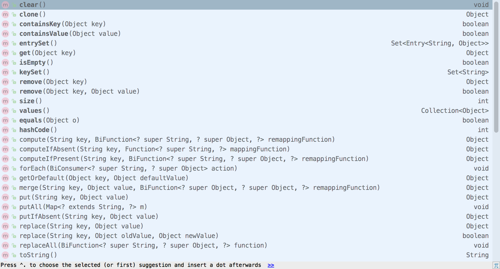

# Java 8 中 Map 的方法

今天使用 HashMap 的时候发现在 Java 8 中多了一些方法, 于是查找资料了解下这些方法的使用方式, 首先看看在 Java 8 中 HashMap 有哪些方法, 再来了解这些方法是如何使用的, 截图如下:



<!-- more -->

之前经常使用的方法这里就不再举例说明了, 主要介绍 Java 8 中新增的方法

# Object remove(Object key, Object value)

之前的 remove 方法只接受一个 key 值, 移除指定 key 和 value, 并返回指定被移除的 value 值, 如果这个 key 和 value 不存在, 则返回 null, 源码如下:

```java
public V remove(Object key) {
    Node<K,V> e;
    return (e = removeNode(hash(key), key, null, false, true)) == null ? null : e.value;
}
```

Java 8 新增的 remove 方法接收一个 key 和一个 value 两个值, 如果指定 key 的 value 和入参的 value 值相等, 则删除这个元素

# V computeIfAbsent(K key, Function<? super K, ? extends V> mappingFunction)

如果指定的 key 不存在, 接受一个 Function 接口类型的 Lambda 表达式 (参数为 key) 计算一个新的值设置到这个 key 中, 并返回这个新被设置的值, 新的值如果为 null, 则不会被设置, 使用实例如下:

```java
default V computeIfAbsent(K key, Function<? super K, ? extends V> mappingFunction) {
    Objects.requireNonNull(mappingFunction);
    V v;
    if ((v = get(key)) == null) {
        V newValue;
        if ((newValue = mappingFunction.apply(key)) != null) {
            put(key, newValue);
            return newValue;
        }
    }
    return v;
}
```

使用方法如下:

```java
map.computeIfAbsent("key", key -> key + "1");
```

# V computeIfPresent(K key, BiFunction<? super K, ? super V, ? extends V> remappingFunction)

如果指定的 key 存在, 则根据旧的 key 和 value 计算新的值 newValue, 如果 newValue 不为 null, 则设置 key 新的值为 newValue, 如果 newValue 为null, 则删除该 key 的值，该方法的源码如下:

```java
// 这是 Map 里面默认的实现方法
default V computeIfPresent(K key, BiFunction<? super K, ? super V, ? extends V> remappingFunction) {
    Objects.requireNonNull(remappingFunction);
    V oldValue;
    if ((oldValue = get(key)) != null) {
        V newValue = remappingFunction.apply(key, oldValue);
        if (newValue != null) {
            put(key, newValue);
            return newValue;
        } else {
            remove(key);
            return null;
        }
    } else {
        return null;
    }
}

// 这是 HashMap 里面实现的方法
public V computeIfPresent(K key, BiFunction<? super K, ? super V, ? extends V> remappingFunction) {
    if (remappingFunction == null)
        throw new NullPointerException();
    Node<K,V> e; V oldValue;
    int hash = hash(key);
    if ((e = getNode(hash, key)) != null &&
        (oldValue = e.value) != null) {
        V v = remappingFunction.apply(key, oldValue);
        // 新的值不为, 设置 key 的值为新计算出来的值 v
        if (v != null) {
            e.value = v;
            afterNodeAccess(e);
            return v;
        } else {
            // 新计算的值为 null, 就移除这个 key 和 value
            removeNode(hash, key, null, false, true);
        }
    }
    return null;
}
```

调用方法如下:

```java
map.computeIfPresent("key", (key, value) -> key + value);
```

# V compute(K key, BiFunction<? super K, ? super V, ? extends V> remappingFunction)

使用 key 和 旧的 value 计算出一个新的 value, 如果这个新的 value 不为 null, 无论这个 key 在 Map 中是否存在, 使用新的 value 设置或者替代掉旧的 value, 并返回这个新的 value 值, 如果这个新的 value 为 null, 此时如果 key 在 Map 中存在, 则删除这个 key, 如果 key 在 Map 中不存在, 则不做任何操作, Map 中的源码如下所示:

```java
default V compute(K key, BiFunction<? super K, ? super V, ? extends V> remappingFunction) {
    Objects.requireNonNull(remappingFunction);
    V oldValue = get(key);
    V newValue = remappingFunction.apply(key, oldValue);

    if (newValue == null) {
        if (oldValue != null || containsKey(key)) {
            // 计算出来新的值为 null, 并且该 key 存在, 就删除掉这个 key 和 value, 并返回 null
            remove(key);
            return null;
        } else {
            // 计算出来新的值为 null, 但是 key 不存在, 直接返回 null
            return null;
        }
    } else {
        // 如果计算出来的新值不为 null, 替换掉旧的值
        put(key, newValue);
        return newValue;
    }
}
```

使用方法如下:

```java
map.compute("key", (key, value) -> key + value + 1);
```

# forEach(BiConsumer<? super K, ? super V> action)

循环遍历对 Map 进行操作, 如果之前使用过 Java 8 Stream API 中的 forEach 方法, 应该会很熟悉, 可以在使用迭代器的情况下快速简洁的遍历 Map, 使用方法如下所示:

```java
map.forEach((key, value) -> {
    System.out.println("key = " + key + ", value = " + value);
});
```

# V getOrDefault(Object key, V defaultValue)

如果指定的 key 在 Map 中存在, 则返回 key 对应的 value 值, 如果不存在则返回指定的 defaultValue 值, 在 Map 中定义的方法如下所示:

```java
default V getOrDefault(Object key, V defaultValue) {
    V v;
    return (((v = get(key)) != null) || containsKey(key)) ? v: defaultValue;
}
```

# V merge(K key, V value, BiFunction<? super V, ? super V, ? extends V> remappingFunction)

如果指定的 key 在 Map 中不存在, 直接将参数 value 的值为设置为指定 key 对应的 value 值, 如果存在, 则是使用旧 value 和 参数 value 计算出一个新的 value 并设置, 两种情况只要新的 value 为 null, 则删除 Map 中的这个 key, 其源码如下:

```java
default V merge(K key, V value, BiFunction<? super V, ? super V, ? extends V> remappingFunction) {
    Objects.requireNonNull(remappingFunction);
    Objects.requireNonNull(value);
    V oldValue = get(key);
    // 如果 oldValue 不存在, newValue 赋值为参数 value 的值, 否则 newValue 的值为 oldValue 和 value 计算后的新值
    V newValue = (oldValue == null) ? value : remappingFunction.apply(oldValue, value);
    if(newValue == null) {
        // newValue 值为 null, 则删除这个 key
        remove(key);
    } else {
        put(key, newValue);
    }
    return newValue;
}
```

使用方法如下:

```java
String time = "20081010";
map.merge("key", time, (oldValue, value) -> oldValue.toString() + value.toString());
```

# V putIfAbsent(K key, V value)

如果 key 在 Map 不存在, 添加这个 key 和 value, 其在 Map 中的源码如下:

```java
default V putIfAbsent(K key, V value) {
    V v = get(key);
    if (v == null) {
        v = put(key, value);
    }
    return v;
}
```

# V replace(K key, V value)

替换 key 的值为参数 value 的值, 替换成功返回替换后的值, 在 Map 中的源码如下:

```java
default V replace(K key, V value) {
    V curValue;
    if (((curValue = get(key)) != null) || containsKey(key)) {
        curValue = put(key, value);
    }
    return curValue;
}
```

# boolean replace(K key, V oldValue, V newValue)

如果指定 key 的 value 和参数 oldValue 的值相同, 则替换成参数 newValue 的值, 替换成功返回 true, 否则返回 false, 在 Map 中的源码如下:

```java
default boolean replace(K key, V oldValue, V newValue) {
    Object curValue = get(key);
    if (!Objects.equals(curValue, oldValue) || (curValue == null && !containsKey(key))) {
        return false;
    }
    put(key, newValue);
    return true;
}
```

# replaceAll(BiFunction<? super K, ? super V, ? extends V> function)

替换 Map 中所有的 key 对应的 value 值, 新的值由 key 和旧的 value 计算得出, 如果新的值是 null 也会被设置进去, 在 Map 中的源码如下:

```java
default void replaceAll(BiFunction<? super K, ? super V, ? extends V> function) {
    Objects.requireNonNull(function);
    for (Map.Entry<K, V> entry : entrySet()) {
        K k;
        V v;
        try {
            k = entry.getKey();
            v = entry.getValue();
        } catch(IllegalStateException ise) {
            throw new ConcurrentModificationException(ise);
        }
        v = function.apply(k, v);

        try {
            entry.setValue(v);
        } catch(IllegalStateException ise) {
            throw new ConcurrentModificationException(ise);
        }
    }
}
```

使用方法很简单, 接收一个 Function 接口类型的 Lambda 函数表达式, 上面也有传递 Function 接口类型的 Lambda 函数表达式的例子, 这里就不贴代码了