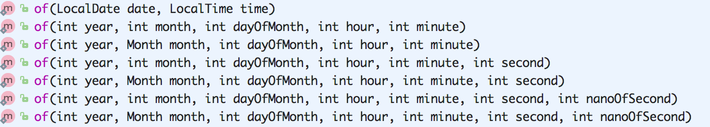
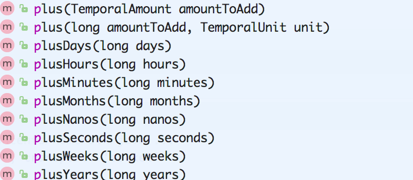
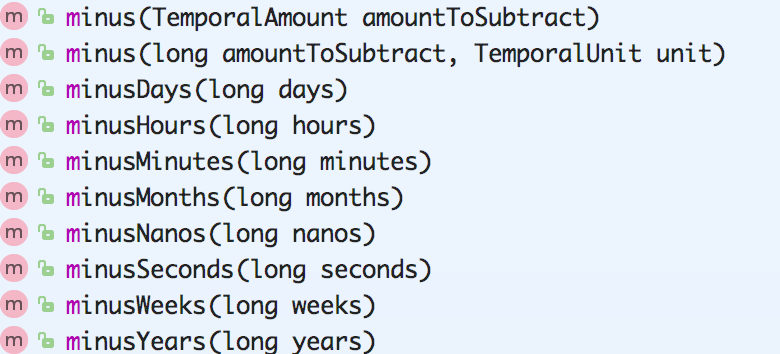
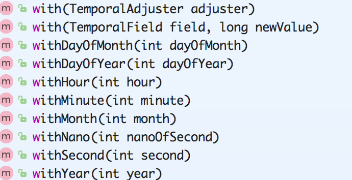
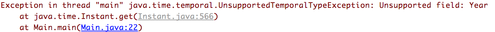
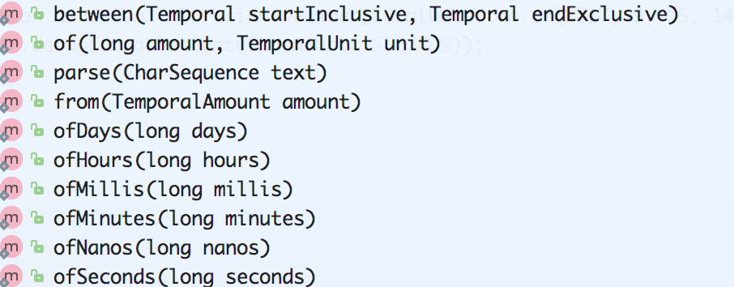
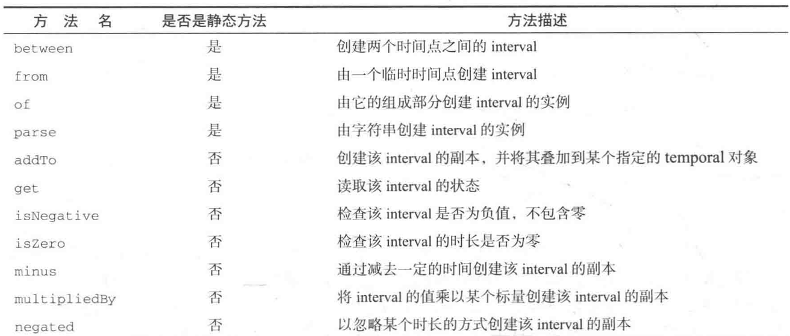
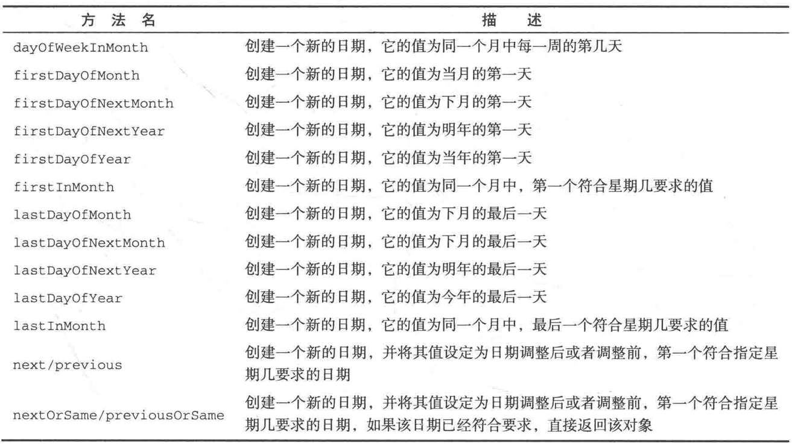
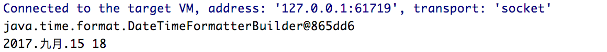

Java8 中提供了新的包 java.time 用于处理日期时间，虽然之前就有了 Date 和 Calendar 类，但是后两者的易用性太差。Java8 中的日期/时间 API 包含以下相应的包：

1. java.time 包：这是新的Java日期/时间API的基础包，所有的主要基础类都是这个包的一部分，如：LocalDate、LocalTime、LocalDateTime、Instant、Period、Duration 等等，所有这些类都是不可变的和线程安全的，在绝大多数情况下，这些类能够有效地处理一些公共的需求；
2. java.time.chrono 包：这个包为非 ISO 的日历系统定义了一些 API，我们可以扩展 AbstractChronology 类来创建自己的日历系统；
3. java.time.format 包：这个包包含能够格式化和解析日期时间对象的类，在绝大多数情况下，我们不应该直接使用它们，因为 java.time 包中相应的类已经提供了格式化和解析的方法；
4. java.time.temporal 包：这个包包含一些时态对象，我们可以用其找出关于日期/时间对象的某个特定日期或时间，比如说，可以找到某月的第一天或最后一天。你可以非常容易地认出这些方法，因为它们都具有 withXXX 的格式；
5. java.time.zone 包：这个包包含支持不同时区以及相关规则的类。

<!-- more -->

# LocalDate 和 LocalTime

LocalDate (LocalTime 的使用方法一样，不在重复列出使用示例) 实例是一个不可变和线程安全对象，他只提供了简单的日期，并且不包括时间信息和时区信息。

## LocalDate 的基础使用

```java
// 解析日期时间字符串构建 LocalDate
LocalDate date = LocalDate.parse("2017-09-15");
LocalDate date = LocalDate.of(2014, 9, 15);
LocalDate date = LocalDate.now();
logger.debug(date.getYear());
logger.debug(date.getMonth());
logger.debug(date.getDayOfMonth());
logger.debug(date.getMonthValue());
logger.debug(date.getDayOfYear());
logger.debug(date.getDayOfWeek());
```

输出的结果示例如下：


## LocalDateTime 的基础使用

LocalDateTime，是 LocalDate 和 LocalTime 的复合类，内部的实现由包含了 LocalDate 和 LocalTime 两个对象。

### 初始化



可以传入 LocalDate 和 LocalTime 对象或者传入相关日期时间字段来创建，具体使用见下实例：

```java
// 直接使用LocalDateTime创建
LocalDateTime localDateTime = LocalDateTime.of(2017, 9, 15, 14, 14, 14);
logger.debug(localDateTime.get(ChronoField.YEAR));
logger.debug(localDateTime.get(ChronoField.MONTH_OF_YEAR));
logger.debug(localDateTime.get(ChronoField.DAY_OF_MONTH));

// LocalDateTime转换成LocalDate和LocalTime
logger.debug(localDateTime.toLocalDate());
logger.debug(localDateTime.toLocalTime());

// LocalDate添加时间变成LocalDateTime
LocalDate localDate = LocalDate.parse("2017-09-15");
LocalDateTime newLocalDateTime = localDate.atTime(14, 14, 20);
logger.debug(newLocalDateTime.get(ChronoField.YEAR));
logger.debug(newLocalDateTime.get(ChronoField.HOUR_OF_DAY));

// LocalTime添加日期变成LocalDateTime，注意LocalTime的adDate只能传入一个LocalDate对象
LocalTime localTime = LocalTime.parse("16:14:22");
LocalDateTime newLocalDateTime1 = localTime.atDate(LocalDate.parse("2017-09-15"));
logger.debug(newLocalDateTime1.get(ChronoField.YEAR));
logger.debug(newLocalDateTime1.get(ChronoField.HOUR_OF_DAY));
```

### 日期操作

所有的加相关的计算方法都是以 plus 开头的，所有的减法计算都是 minus 开头，所有的修改和设置操作都是 with 开头，这一点和 Joda-DateTime 是很相似的，这里粗略的贴一些相关方法的截图，就不贴详细的代码了。







## 使用 TemporalField 获取值

TemporalField 是一个接口，它定义了如何访问 temperal 对象某个字段的值，ChronoFiled 枚举类实现了这一接口

```java
LocalDate date = LocalDate.now();
logger.debug(date.get(ChronoField.YEAR));
logger.debug(date.get(ChronoField.MONTH_OF_YEAR));
logger.debug(date.get(ChronoField.DAY_OF_MONTH));
logger.debug(date.get(ChronoField.DAY_OF_WEEK));
```

输出的结果示例如下：


# Instant、Duration 和 Period

## Instant

对于人使用年月日时分秒这样的表示形式很容易理解，但是对于计算机，需要对时间进行时间建模，因此 Java8 中设计了一个 Instant 用于时间建模，可以通过以下方式创建，创建的时间是以 Unix 元年的时间为基准 (1970-01-01 00:00:00)，以下时间均表示 1970-01-01 00:00:03。

```java
// 通过ofEpochSecond和ofEpochMilli来创建
Instant instant = Instant.ofEpochSecond(3);

// ofEpochSecond有一个重载方法，第二个参数纳秒，会使用这个参数进行调整，所以下面获取的对象都是同一个对对象（100万纳秒=1秒）
Instant.ofEpochMilli(3000);
Instant.ofEpochSecond(2, 1_000_000_000);
Instant.ofEpochSecond(3);
Instant.ofEpochSecond(4, -1_000_000_000);
```

创建了 Instat 对象后，例如下面的例子，Instant 对象表示的时间是 1970-01-01 00:00:03，使用 get 方法来获取年份并输出，使用 Instant 时出现 **UnsupportedTemporalTypeException 异常**：

```java
Instant instant = Instant.ofEpochSecond(3);
logger.debug(instant.get(ChronoField.YEAR));
```

出现异常：



因为 Instant 的设计初衷就是和是计算机使用的，它无法处理人类容易理解的单位，但是可以通过 Duration 和 Period 类间接来使用它，也经常作为中介来转换新时间类和 Date 类转换。

## Duration

Duration被用于对两个时间进行比较和计算，注意，注意，注意，他只能用于计算两个时间的秒和毫秒，计算的结果保存在 Duration 对象中，并且可以用于对结果进行二次处理，创建一个 Duration 的对象方法如下：



```java
Duration.between(Instant instant1, Instant instant2)

Duration duration = Duration.between(LocalDateTime.of(2017, 9, 15, 14, 14, 20), LocalDateTime.of(2017, 9, 15, 14, 14, 21));
logger.debug(duration.get(ChronoUnit.SECONDS));

// to方法获取结果较少，例如获取秒的方法就没有，对号使用get方法获取结果
logger.debug(duration.toMillis());
logger.debug(duration.plus(duration).get(ChronoUnit.SECONDS));
logger.debug(duration.minus(duration).get(ChronoUnit.SECONDS));

// 不能计算年月日等，通过get方法获取年月日会出现异常
Duration duration = Duration.between(LocalDateTime.of(2017, 9, 15, 14, 14, 20), LocalDateTime.of(2016, 9, 15, 14, 14, 21));
logger.debug(duration.toHours());
```

## Period

Period 用于计算两个时间的年月日等时间间隔，但是不能计算时间，使用方法类似 Duration，这里就不再贴出使用示例代码了。



# TemporalAdjuster

所有的时间类都有一些通用的操作方法，例如加操作都是 plus 开头，减操作都是 minus，修改操作都是 with 开头，但是如果需要进行一些复杂的时间操作，可以使用 TemporalAdjusters 类(实现了 TemporalAdjuster 接口)，例如将日期调整到下个星期日，下个工作日，下个月的最后一天，如果只是使用 plus，minus 和 with 操作方法，还是有一些复杂的，利用 TemporalAdjusters 类就可以轻松的完成这些复杂的操作，并且还可以实现自己 TemporalAdjuster (通过实现TemporalAdjuster 接口类)，的其常见的工厂方法如下图。



```java
// 时间调整到这个月的最后一天
LocalDateTime.now().with(TemporalAdjusters.lastDayOfMonth());

// 时间调整到下一个星期五的日期
LocalDateTime.now().with(TemporalAdjusters.nextOrSame(DayOfWeek.FRIDAY));
```

# DateTimeFormater 和 DateTimeFormatterBuilder

## DateTimeFormater

上面的时间处理类使用 parse 解析日期时间字符串时，对于默认的标准的时间日期字符串可以顺利解析，但是对于特殊的时间日期格式就会出现异常了，这个时候就需要使用时间日期格式化类来辅助处理，同时也可以格式化输出，DateTimeFormater 是用于替代之前的 DateFormater 类的，相比较后者，前者也是线程安全的。

```java
// 格式化输出
LocalDateTime localDateTime = LocalDateTime.now().with(TemporalAdjusters.nextOrSame(DayOfWeek.FRIDAY));
DateTimeFormatter dateTimeFormatter = DateTimeFormatter.ofPattern("yyyy/MM/dd HH-mm-ss");
logger.debug(localDateTime.format(dateTimeFormatter));

// 解析指定格式的时间日期字符串
DateTimeFormatter dateTimeFormatter = DateTimeFormatter.ofPattern("yyyy/MM/dd HH-mm-ss");
LocalDateTime localDateTime = LocalDateTime.parse("2017/09/15 16-14-20", dateTimeFormatter);
```

## DateTimeFormatterBuilder

如果需要更加精细的控制，可以使用 DateTimeFormatterBuilder 构建自己的格式器，以提供更加强大解析功能，例如区分大小写方法等。

```java
DateTimeFormatter mDateTimeFormatter;
DateTimeFormatterBuilder dateTimeFormatterBuilder = new DateTimeFormatterBuilder();
dateTimeFormatterBuilder
        .appendText(ChronoField.YEAR)
        .appendLiteral(".")
        .appendText(ChronoField.MONTH_OF_YEAR)
        .appendLiteral(".")
        .appendText(ChronoField.DAY_OF_MONTH)
        .appendLiteral(" ")
        .appendText(ChronoField.HOUR_OF_DAY);
mDateTimeFormatter = dateTimeFormatterBuilder.toFormatter();
LocalDateTime localDateTime = LocalDateTime.now();
logger.debug(localDateTime.format(mDateTimeFormatter));
```

输出的结果如下：



# Date 和 LocalDate、LocalDateTime 之间的转换

Date 类新增了 public static Date from(Instant instant) 和 public Instant toInstant() 两个方法，前者可以将 Instant 转成 Date 对象，后者可以将 Date 转成 Instant 对象，因此可以让 Instat 作为中介实现 Date 和 LocalDate 以及 LocalDateTime 之间的转换。

## Date 转 LocalDateTime、LocalDate 和 LocalTime

```java
Date date = new Date();
Instant instant = date.toInstant();
ZoneId zone = ZoneId.systemDefault();
LocalDateTime localDateTime = LocalDateTime.ofInstant(instant);
LocalDate localDate = LocalDateTime.toLocalDate();
LocalTime localTime = LocalDateTime.toLocalTime();
```

## LocalDate、LocalTime、LocalDateTime 转 Date

```java
ZoneId zone = ZoneId.systemDefault();

// LocalDateTime转Date
Instant instant = localDateTime.atZone(zone).toInstant();
Date date = Date.from(instant);

// LocalDate转Date
Instant instant = localDate.atStartOfDay().atZone(zone).toInstant();
Date date = Date.from(instant);

// LocalTime转Date
LocalTime localTime = LocalTime.now();
LocalDate localDate = LocalDate.now();
LocalDateTime localDateTime = LocalDateTime.of(localDate, localTime);
ZoneId zone = ZoneId.systemDefault();
Instant instant = localDateTime.atZone(zone).toInstant();
Date date = Date.from(instant);
```