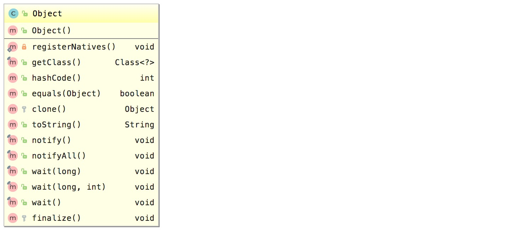

Java 中的 Object 类是所有类的父类，它里面包含了以下 12 个方法。



<!-- more -->

# Object 类的源码

```java
public class Object {

    private static native void registerNatives();
    static {
        registerNatives();
    }

    public final native Class<?> getClass();

    public native int hashCode();

    public boolean equals(Object obj) {
        return (this == obj);
    }

    protected native Object clone() throws CloneNotSupportedException;

    public String toString() {
        return getClass().getName() + "@" + Integer.toHexString(hashCode());
    }

    public final native void notify();

    public final native void notifyAll();

    public final native void wait(long timeout) throws InterruptedException;

    public final void wait(long timeout, int nanos) throws InterruptedException {
        if (timeout < 0) {
            throw new IllegalArgumentException("timeout value is negative");
        }
        if (nanos < 0 || nanos > 999999) {
            throw new IllegalArgumentException(
                                "nanosecond timeout value out of range");
        }
        if (nanos > 0) {
            timeout++;
        }
        wait(timeout);
    }

    public final void wait() throws InterruptedException {
        wait(0);
    }

    protected void finalize() throws Throwable { }
}
```

# Object 的方法

## getClass 方法

```java
public final native Class<?> getClass();
```

getClass 方法是一个 final 方法，不允许重写，他返回**当前运行时对象的 Class 对象类型**，同时他也是一个 native 方法。

## notify、notifyAll 方法

```java
public final native void notify();
public final native void notifyAll();
```

这两个方法都是 final 方法，不允许重写，用于通知唤醒一个处于等待状态的线程，调用这些方法必须是在同步代码中调用，详细见多线程之等待通知机制笔记。

## wait 方法

```java
public final void wait() throws InterruptedException {
    wait(0);
}

public final native void wait(long timeout) throws InterruptedException;

public final void wait(long timeout, int nanos) throws InterruptedException {
    if (timeout < 0) {
        throw new IllegalArgumentException("timeout value is negative");
    }
    if (nanos < 0 || nanos > 999999) {
        throw new IllegalArgumentException("nanosecond timeout value out of range");
    }
    if (nanos > 0) {
        timeout++;
    }
    wait(timeout);
}
```

这三个 wait 方法也是 fianl 方法，不允许重写，调用后可以让当前线程处于等待状态，wait(long timeout) 可以让线程在等待指定时间后继续运行，调用这些方法必须在同步代码中调用，详细见多线程之等待通知机制笔记。

## hashCode 方法

```java
public native int hashCode();
```

该方法返回对象的哈希码，主要使用在哈希表中，一般对不同的对象，hashCode 方法的实现都是不同的，这个可以自己实现。

1. 对于同一个没有任何值变化的对象，每次 hashCode 方法都会返回的整数值都是相同的；
2. 如果对象使用 equals 方法进行比较并且相同，那么这两个对象的 hashCode 方法的值也必须相等；
3. 如果对象使用 equals 方法进行比较并且不相同，那么两个对象的 hashCode 方法的值是可以相等的，但是，不相等的对象的 hashCode 值不同的话可以提高哈希表的性能。

## equals 方法

```java
public boolean equals(Object obj) {
    return (this == obj);
}
```

比较两个对象是否相等，Object类的默认实现，即比较2个对象的内存地址是否相等。、

## clone 方法

```java
protected native Object clone() throws CloneNotSupportedException;
```

Object 类的 clone 方法是一个 protected 的 native 方法，这个方法创建并返回当前对象的一份拷贝，需要对这个方法进行重写才能使用，否则调用会出现 CloneNotSupportedException 异常。

## toString 方法

```java
public String toString() {
    return getClass().getName() + "@" + Integer.toHexString(hashCode());
}
```

Object 的默认实现，输出类的名字 @ 实例的哈希码的16进制。

## finalize 方法

```java
protected void finalize() throws Throwable {}
```

finalize 方法是一个 protected 方法，Object 类的默认实现是不进行任何操作，需要自己去实现，该方法的作用是实例被垃圾回收器回收的时候触发的操作。