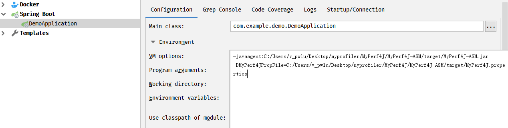
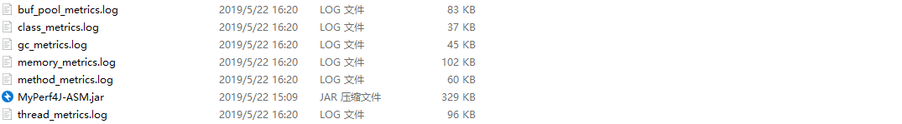

# 添加启动参数

使用 MyPerf4j 需要在为 JVM 添加启动参数, 格式如下:

```text
-javaagent:/your/path/to/MyPerf4J-ASM.jar
-DMyPerf4JPropFile=/your/path/to/MyPerf4J.properties
```

测试时是在 windows 的 IDEA 上本地进行调试的, 如下图添加 JVM 启动参数:



<!-- more -->

# 修改配置文件

测试用使用的配置文件如下, 详细的配置见[官方 WIKI 文档](https://github.com/LinShunKang/MyPerf4J/wiki/%E9%85%8D%E7%BD%AE)

```ini
# 应用名称
AppName=demo

# MetricsProcessor类型，0:以标准格式化结构输出到stdout.log 1:以标准格式化结构输出到磁盘  2:以InfluxDB LineProtocol格式输出到磁盘
MetricsProcessorType=1

# 配置各个Metrics日志的文件路径，可不配置
MethodMetricsFile=C:/Users/v_pwlu/Desktop/myprofiler/MyPerf4J/MyPerf4J-ASM/target/method_metrics.log
ClassMetricsFile=C:/Users/v_pwlu/Desktop/myprofiler/MyPerf4J/MyPerf4J-ASM/target/class_metrics.log
GCMetricsFile=C:/Users/v_pwlu/Desktop/myprofiler/MyPerf4J/MyPerf4J-ASM/target/gc_metrics.log
MemMetricsFile=C:/Users/v_pwlu/Desktop/myprofiler/MyPerf4J/MyPerf4J-ASM/target/memory_metrics.log
BufPoolMetricsFile=C:/Users/v_pwlu/Desktop/myprofiler/MyPerf4J/MyPerf4J-ASM/target/buf_pool_metrics.log
ThreadMetricsFile=C:/Users/v_pwlu/Desktop/myprofiler/MyPerf4J/MyPerf4J-ASM/target/thread_metrics.log

# 配置Record模式，可配置为accurate/rough
RecorderMode=accurate
   
# 配置时间片，单位为ms，最小1s，最大600s
MilliTimeSlice=10000
   
# 需要监控的package，可配置多个，用英文';'分隔
#IncludePackages=your.package.to.monitor;cn.perf4j.demo;cn.perf4j.demo1.[p1,p2,p3];cn.*.demo.*
IncludePackages=com.example.demo

# 是否展示方法参数类型
ShowMethodParams=true
```

# 启动项目进行测试

测试类如下:

```java
@Slf4j
@RestController
public class TestController {

    @GetMapping(value = "/api/test")
    public String test() {
        log.info("/api/test");
        testMoniter();
        return "test success";
    }

    private void testMoniter() {
        try {
            Thread.sleep(1000);
        } catch (InterruptedException e) {
            e.printStackTrace();
        }
        log.info("test moniter");
    }
}
```

启动项目, 看到如下日志, 表示加载 MyPerf4j 成功了

```text
2019-05-22 16:20:25.014 [MyPerf4J] INFO Thanks sincerely for using MyPerf4J.
2019-05-22 16:20:25.068 [MyPerf4J] INFO profilingParamFile is empty, so use same profiling params to all methods.
2019-05-22 16:20:25.106 [MyPerf4J] INFO 
    __  ___      ____            ______ __      __
   /  |/  /_  __/ __ \___  _____/ __/ // /     / /
  / /|_/ / / / / /_/ / _ \/ ___/ /_/ // /___  / / 
 / /  / / /_/ / ____/  __/ /  / __/__  __/ /_/ /  
/_/  /_/\__, /_/    \___/_/  /_/    /_/  \____/   
       /____/                                     

2019-05-22 16:20:25.106 [MyPerf4J] INFO AbstractBootstrap doInitial() SUCCESS!!!
```

如果 MetricsProcessorType = 0, 那么监控的日志会直接输出在控制台, 方便在本地 DEBUG 时, 线上使用通常设置为 1, 持久化到文件中, 或者设置 2, 方便之后接入到 InfluxDB 中

```text
MyPerf4J JVM Class Metrics [2019-05-22 16:20:20, 2019-05-22 16:20:30]
Total         Loaded  Unloaded
6522            6521         1

MyPerf4J JVM GC Metrics [2019-05-22 16:20:20, 2019-05-22 16:20:30]
Name            Count     Time
PS Scavenge         5       34
PS MarkSweep        1       25

MyPerf4J JVM Memory Metrics [2019-05-22 16:20:20, 2019-05-22 16:20:30]
NonHeapInit                NonHeapUsed   NonHeapCommitted         NonHeapMax           HeapInit           HeapUsed      HeapCommitted            HeapMax
2555904                       44272544           46465024                 -1          268435456           43943880          234356736         3791650816

MyPerf4J JVM BufferPool Metrics [2019-05-22 16:20:20, 2019-05-22 16:20:30]
Name                             Count         MemoryUsed     MemoryCapacity
direct                               1               8192               8192
mapped                               0                  0                  0

MyPerf4J JVM Thread Metrics [2019-05-22 16:20:20, 2019-05-22 16:20:30]
TotalStarted          Active          Peak        Daemon           New      Runnable       Blocked       Waiting  TimedWaiting    Terminated
38                        28            29            24             0            11             0            13             4             0

MyPerf4J Method Metrics [2019-05-22 16:20:20, 2019-05-22 16:20:30]
Method[0]         Type      RPS  Avg(ms)  Min(ms)  Max(ms)   StdDev     Count     TP50     TP90     TP95     TP99    TP999   TP9999  TP99999    TP100
```

# 日志文件中的内容

当  MetricsProcessorType = 1 时, 会在指定日志的目录下生成如下 6 个文件



buf_pool_metrics.log 输出了当前缓存直接申请的内存申请和使用情况, 包括总计申请直接内存的数量和使用的大小, 日志格式如下:

```text
MyPerf4J JVM BufferPool Metrics [2019-05-22 16:31:10, 2019-05-22 16:31:20]
Name                             Count         MemoryUsed     MemoryCapacity
direct                              11              90112              90112
mapped                               0                  0                  0
```

class_metrics.log 输出了当前类加载的数量信息, 日志格式如下:

```text
MyPerf4J JVM Class Metrics [2019-05-22 16:31:10, 2019-05-22 16:31:20]
Total         Loaded  Unloaded
6740            6739         1
```

memory_metrics.log 输出了当前堆和栈的使用情况, 如初始堆区空间大小, 非堆区空间大小, 堆区当前使用空间和最大堆区空间大小等信息, 输出日志如下:

```text
MyPerf4J JVM Memory Metrics [2019-05-22 16:31:10, 2019-05-22 16:31:20]
NonHeapInit                NonHeapUsed   NonHeapCommitted         NonHeapMax           HeapInit           HeapUsed      HeapCommitted            HeapMax
2555904                       46240672           48693248                 -1          268435456           66427376          234356736         3791650816
```

thread_metrics.log 输出了当前线程总数量, 处于 active 线程数量, 守护线程数量, 处于等待状态线程数量等信息, 输出的日志如下:

```text
MyPerf4J JVM Thread Metrics [2019-05-22 16:31:10, 2019-05-22 16:31:20]
TotalStarted          Active          Peak        Daemon           New      Runnable       Blocked       Waiting  TimedWaiting    Terminated
39                        27            29            22             0             9             0            14             4             0
```

method_metrics.log 输出当前时间段内 (和设置的采集时间有关), 方法调用的情况, 如调用次数, 平均调用花费时间, 方法调用最大花费时间, 方法调用最小花费时间, 还有 TP50 等统计信息, 如果摸某个方法调用花费的时间比较长, 通常也是需要优化的地方, 日志的输出格式如下:

```text
MyPerf4J Method Metrics [2019-05-22 16:31:10, 2019-05-22 16:31:20]
Method[1]                     Type      RPS  Avg(ms)  Min(ms)  Max(ms)   StdDev     Count     TP50     TP90     TP95     TP99    TP999   TP9999  TP99999    TP100
TestController.test()      General        0  1000.57     1000     1001     0.27         7     1001     1001     1001     1001     1001     1001     1001     1001
```

# 参考资料

* [MyPerf4j](https://github.com/LinShunKang/MyPerf4J)
* [整合 MyPerf4J 做 Java 性能监控和统计工具](https://www.cnblogs.com/mmzs/p/10615317.html)
* [JVM 性能调优实战之 : 使用阿里开源工具 TProfiler 在海量业务代码中精确定位性能代码](https://blog.csdn.net/defonds/article/details/52605670)
* [JavaAgent](https://liuzhengyang.github.io/2017/03/15/javaagent/)
