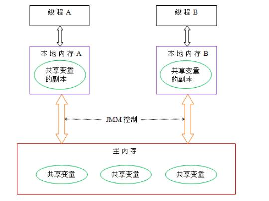
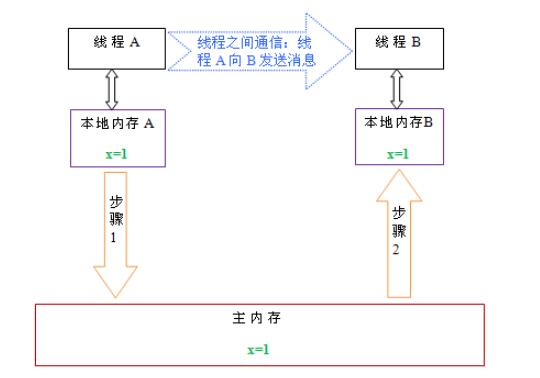

JMM 的英文全称是 Java Memory Model，翻译成中文是 Java 内存模型 (也叫**共享内存模型**)，Java 内存模型定义了多线程之间共享变量的可见性以及如何在需要的时候对共享变量进行同步，通俗点讲 JMM 就是是用来来实现多线程之间的信息交换和数据同步的。

# Java 内存模型

在 JMM 的定义中，线程之间的共享变量存储在主内存中，每个线程都有一个私有的本地内存，本地内存中存储了该线程读写共享变量的副本。这个本地内存在 JMM 的定义中是一个抽象的概念，可能是只缓存，写缓冲区等等。以正常的计算机执行程序为例，计算机在执行程序时，需要对数据进行读写，程序运行过程中的临时数据是存放在主存（物理内存）当中的，但是由于 CPU 执行速度很快，从内存读取数据和向内存写入数据的过程跟 CPU 执行指令的速度比起来要慢的多，如果任何时候对数据的操作都要通过和内存的交互来进行，会大大降低指令执行的速度，因此在 CPU 里面就有了高速缓存，以便快速的读写数据，最后再同步到主内存中，这样就可以提高效率。当一个线程读取数据时，先从主内存中复制一份数据到高速缓存中，之后线程对数据的读写都是使用的缓存中的数据，也因此出现了多线程之间数据同步的问题。

线程 A 和线程 B 数据的同步数据的抽象模型图如下：

<!-- more -->

最开始线程 A 从主存中将需要读写的数据复制到工作内存中，线程 A 在操作了数据后载同步到主内存中，然后线程 B 再从主存中读取数据。

# Java 并发编程的三个特征

Java 内存模型是围绕着并发编程中原子性、可见性、有序性这三个特征来建立的。

原子性：一个操作不能被打断，要么全部执行完毕，要么不执行，类似于事务操作。要注意的是基本类型数据的访问大都是原子操作，long 和 double 类型的变量是 64 位，但是在32 位 JVM 中，32 位的 JVM 会将 64 位数据的读写操作分为 2 次 32 位的读写操作来进行，这就导致了 long、double 类型的变量在 32 位虚拟机中是非原子操作，数据有可能会被破坏，也就意味着多个线程在并发访问的时候是线程非安全的。

可见性：一个线程对共享变量做了修改之后，其他的线程立即能够看到。Java内存模型提供了关键字volatile关键字来实现对可见性的支持，另外也可以通过synchronized和Lock来保证可见性。

有序性：对于单个线程的代码而言，代码的执行应该是是从前往后的，依次执行。