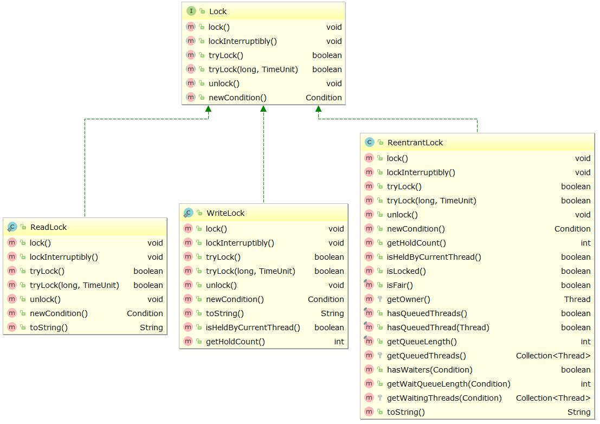
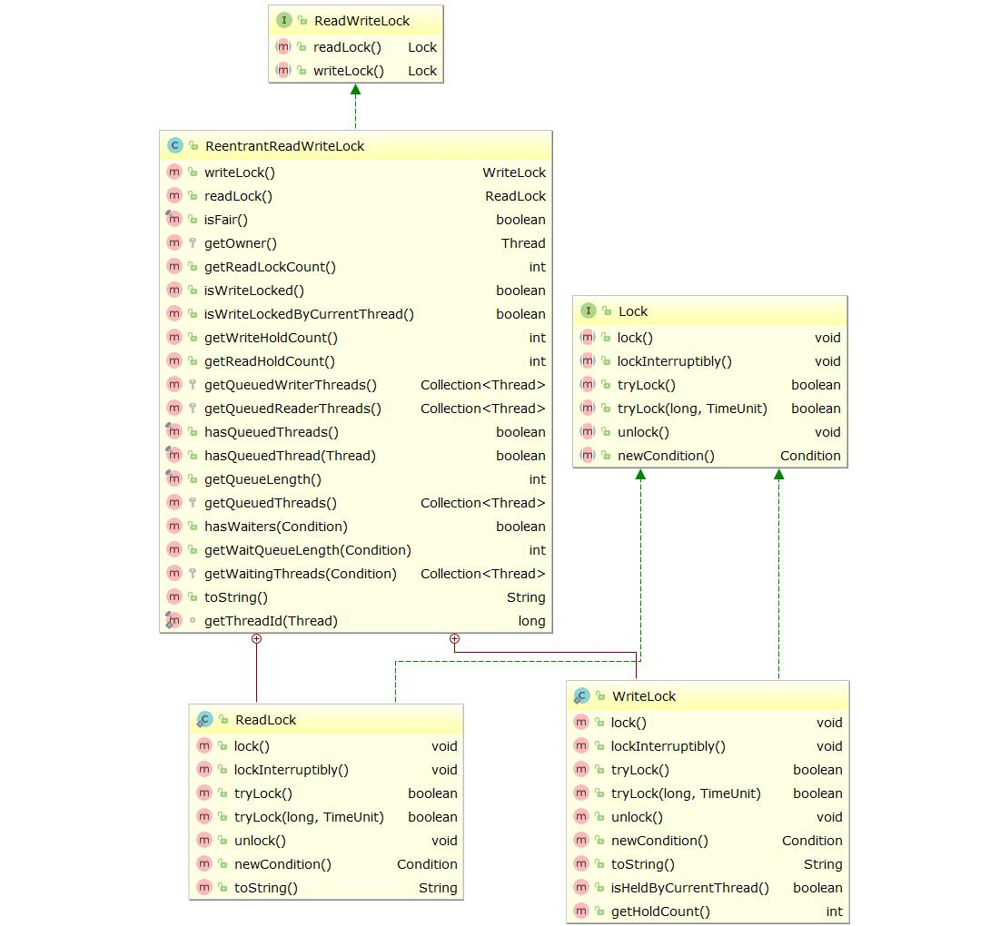

synchronized 可以解决多线程资源同步的问题，但是 synchronized 的性能是比较低效的，例如在一个线程获取到锁后，如果这线程阻塞了 (如IO操作)，由于使用 synchronized 获取到锁并发生阻塞的线程是不能够响应中断，所以其他线程就会一直等待下去，为此就需要有一种机制能够解决这种线程同步中无限等待的问题，使用 Lock 就可以解决类似的问题。

注：这里说的性能差是相对于 Lock 的比较，但是在 JDK 1.6 后，synchronize进行了很多优化，有适应自旋，锁消除，锁粗化，轻量级锁，偏向锁等等，使得 synchronize 的性能并不比 Lock 差。

# Lock 和 synchronized 的区别

1. synchronized 是 Java 语言内置的关键字，Lock 是一个类，通过这个类可以实现同步访问，一个是 JVM 层面的，一个是 JDK 层面的;
2. synchronized 可以加在方法上，也可以加在代码块中，Lock 只能在在代码块中;
3. synchronized 不需要手动释放锁，会自动释放对锁的占用，而 Lock 则必须要手动释放锁，如果没有主动释放锁，会出现死锁现象;
4. synchronized 在同步的时候不能获取锁的状态，Lock 可以;
5. synchronized 的锁可重入、但是不可中断，使用的是非公平锁，Lock 可重入且可判断，公平锁和非公平锁都可以使用。

<!-- more -->

# Lock 类

Lock 类是 JDK 1.5 提供的一个类，位于 java.util.concurrent.locks.Lock 包下，是一个接口，里面的方法如下：

```java
public interface Lock {
    // 获取锁，如果不能获取锁则一直等待锁
    void lock();

    // 如果当前线程没有标记中断标志位，则获取锁，如果当前线程中断标志位已经被标记则出现 InterruptedException 异常
    void lockInterruptibly() throws InterruptedException;

    // 尝试获取锁，获取锁成功立即返回 true，失败立即返回 false，如果没有获取锁和 lock() 方法一样也会一直等待
    boolean tryLock();

    // 尝试获取锁，在指定时间内获取锁成功立即返回 true，在等待指定的时间后拿不到锁就返回 false，该方法可以响应中断
    boolean tryLock(long time, TimeUnit unit) throws InterruptedException;

    // 释放锁，使用 Lock 获取的锁必须主动释放，一般来说需要放在 try-catch-finaly 中的 finaly 代码块中执行，
    // 以避免出现异常导致锁没有被释放，防止死锁的发生
    void unlock();

    // wait()/notify() 机制进行通知时是由 JVM 随机选择线程的，使用 Condition 可以实现选择性的通知线程
    // 使用方法见 ReentrantLock 类 newCondition 方法的介绍
    Condition newCondition();
}
```

# ReentrantLock 类

ReentrantLoc 是 Lock 的直接子类，其继承关系的 UML 图如下：



ReentrantLock 类是 Lock 的子类，除了实现了 Lock 类中的方法外，还有以下方法。

## newCondition() 方法和 Condition 类

前面有提到 Condition 类可以实现选择性的通知线程，Condition 类的主要方法是 await 方法和 signal 方法，分别对应 wait 方法和 notify 方法，Condition 的实例可以通过 Lock 的 newCondition 方法获取到，每一次调用都会返回一个新的实例，同一个实例的 signal 方法可以发送通知唤醒其他线程里面使用同一个实例调用 await 方法使线程进入等待状态的线程。

Condition 类的源码和各个方法的定义如下：

```java
public interface Condition {
    // 对应 wait() 方法
    void await() throws InterruptedException;

    // 对应 wait(long time, TimeUnit unit) 方法
    boolean await(long time, TimeUnit unit) throws InterruptedException;

    void awaitUninterruptibly();

    long awaitNanos(long nanosTimeout) throws InterruptedException;

    boolean awaitUntil(Date deadline) throws InterruptedException;

    // 对应 notify() 方法
    void signal();

    // 对应 notifyAll() 方法
    void signalAll();
}
```

Condition 类配合 Lock 实现等待/通知的简单例子：

```java
public class ConditionService {
    private ReentrantLock lock = new ReentrantLock();
    private Condition condition = lock.newCondition();
    private int index;
    private ThreadLocal<Integer> localIndex = new ThreadLocal<>();

    public void produce() {
        try {
            lock.lock();
            index ++;
            localIndex.set(index);
            System.out.println("线程" + index + "开始等待");
            condition.await();
            System.out.println("线程" + localIndex.get() + "继续运行");
        } catch (InterruptedException e) {
            e.printStackTrace();
        } finally {
            lock.unlock();
        }
    }

    public void consume() {
        try {
            lock.lock();
            System.out.println("通知线程继续运行");
            condition.signal();
        } finally {
            lock.unlock();
        }
    }
}
```

```java
public class ProducerThread extends Thread {
    private ConditionService service;

    public ProducerThread(ConditionService service) {
        this.service = service;
    }

    @Override
    public void run() {
        super.run();
        service.produce();
    }
}
```

```java
public class ConsumerThread extends Thread {
    private ConditionService service;

    public ConsumerThread(ConditionService service) {
        this.service = service;
    }

    @Override
    public void run() {
        super.run();
        service.consume();
    }
}
```

```java
public class Main {
    public static void main(String[] args) {
        ConditionService service = new ConditionService();
        for (int i = 0; i < 5; i++) {
            ProducerThread producerThread = new ProducerThread(service);
            producerThread.start();
        }

        try {
            Thread.sleep(3000);
        } catch (InterruptedException e) {
            e.printStackTrace();
        }

        for (int i = 0; i < 4; i++) {
            ConsumerThread consumerThread = new ConsumerThread(service);
            consumerThread.start();
        }
        System.out.println("主线程结束");
    }
}
```

运行 main 方法，输出结果如下：

```text
线程1开始等待
线程2开始等待
线程3开始等待
线程4开始等待
线程5开始等待
主线程结束
通知线程继续运行
线程1继续运行
通知线程继续运行
通知线程继续运行
通知线程继续运行
线程2继续运行
线程3继续运行
线程4继续运行
```

这里我故意让发送通知的线程少一个，这样就一直有一个线程处于等待状态，我是在 IDE 里面调试的，可以在输出里窗口面看见主线程是已经结束了的，但是有一个子线程一直处于等待状态，致使这个调试过程也一直处于未调试完成的状态。

## getHoldCount() 方法

getHoldCount 方法可以获取当前线程保持锁定的个数，在 unlock() 之前调用 lock() 的次数。

```java
public class ThreadA extends Thread {
    private ReentrantLock lock;

    public ThreadA(ReentrantLock lock) {
        this.lock = lock;
    }

    @Override
    public void run() {
        super.run();
        methodA();
    }

    private void methodA() {
        try {
            lock.lock();
            System.out.println("methodA::getHoldCount = " + lock.getHoldCount());
            // 调用方法 methodB
            methodB();
        } finally {
            lock.unlock();
        }
    }

    private void methodB() {
        try {
            lock.lock();
            System.out.println("methodB::getHoldCount = " + lock.getHoldCount());
        } finally {
            lock.unlock();
        }
    }
}

public class Main {
    public static void main(String[] args) {
        ReentrantLock lock = new ReentrantLock();
        ThreadA threadA = new ThreadA(lock);
        threadA.start();
    }
}
```

输出的结果如下所示：

```text
methodA::getHoldCount = 1
methodB::getHoldCount = 2
```

## getQueueLength() 方法

getQueueLength 方法可以获取当前正在等待这个锁的线程数的 **估计数量**，注意数估计数量，跟踪源码 getQueueLength 方法终会调用 AbstractQueuedSynchronizer 类里面的 getQueueLength 方法，源码如下所示：

```java
/**
 * Returns an estimate of the number of threads waiting to
 * acquire.  The value is only an estimate because the number of
 * threads may change dynamically while this method traverses
 * internal data structures.  This method is designed for use in
 * monitoring system state, not for synchronization
 * control.
 *
 * @return the estimated number of threads waiting to acquire
 */
public final int getQueueLength() {
    int n = 0;
    for (Node p = tail; p != null; p = p.prev) {
        if (p.thread != null)
            ++n;
    }
    return n;
}
```

这个方法的注释也写得很明白了，该值只能是一个估计值，因为在此方法遍历内部数据结构时，线程的数量可能发生大的变化。该方法是为用来监视系统状态而设计的，不是为同步控制设计的。

## getWaitQueueLength(Condition condition)

返回这个 condition 对象在线程里面调用了 await() 方法的次数。

## hasQueuedThread(Thread thread)

查询指定的线程时候在等待此锁。

## hasQueuedThreads()

查询是否有任意的线程在等待此锁。

## hasWaiters(Condition condition)

查询是否有任意线程调用了 condition.await() 方法并处于等待状态的。

## isFair() 方法

返回这个 Lock 是否是公平锁。

## isHeldByCurrentThread() 方法

查询当前线程是否持有锁。

## isLocked()

查询这把锁是否被任意的线程持有。

# ReentrantReadWriteLock 类

首先要注意的是这个类并不是 Lock 的子类，其 UML 继承图如下：



部分源码如下，可以看出它里面有定义两个内部静态类 ReadLock 和 WriteLock，而这两个类是实现了 Lock 接口的 

```java
public class ReentrantReadWriteLock implements ReadWriteLock, java.io.Serializable {
    private static final long serialVersionUID = -6992448646407690164L;
    /** Inner class providing readlock */
    private final ReentrantReadWriteLock.ReadLock readerLock;
    /** Inner class providing writelock */
    private final ReentrantReadWriteLock.WriteLock writerLock;
    // ...
}
```

ReentrantReadWriteLock 正如字面上的意思，它具有读写两把锁，两把锁的获取方式如下：

```java
ReentrantReadWriteLock lock = new ReentrantReadWriteLock();
// 获取读锁
ReadLock readLock = lock.readLock();
// 获取写锁
WeiteLock writeLock = lock.writeLock();

readLock.lock();
writeLock.lock();
```

**我们要了解的是读锁是一把共享锁，写锁是排他锁，即在没有线程获取到写锁之前，进行读操作的线程都可以获取读锁，在有线程获取写锁后，其他线程既不能获取到读锁，也不能获取到写锁。** 其他的方法的使用和 ReentrantLock 类是一样的，这里就不再重复介绍了。

# 公平锁和非公平锁

锁 Lock 分公平锁和非公平锁，使用公平锁时线程按照他们发出请求锁的顺序获取锁，使用非公平锁时在获取锁时是随机的。公平锁需要额外的维护一个队列，所以公平锁的性能要低于非公平锁。创建一个公平锁和非公平锁的代码如下：

```java
// 默认情况下 ReentrantLock 和 ReentrantReadWriteLock 都是创建的非公平锁
ReentrantLock lock = new ReentrantLock();
ReentrantReadWriteLock readWriteLock = new ReentrantReadWriteLock();

// ReentrantLock(bool isFair) 和 ReentrantReadWriteLock(isFair) 构造方法可以传递一个 boolean 类型的参数
// true 表示创建一个公平锁，false 表示创建一个非公平锁
ReentrantLock lock = new ReentrantLock(true);
ReentrantReadWriteLock readWriteLock = new ReentrantReadWriteLock(true);
```