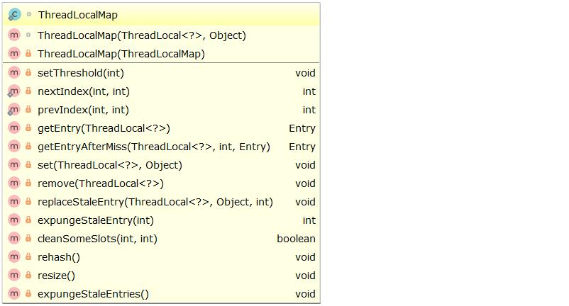

ThreadLocal 用来提供线程内部的局部变量的，并非是用于解决数据共享的，数据共享海兽需要使用关键字 synchronsize，上一篇笔记了解了 ThreadLocal 的基础使用，这篇笔记继续了解 ThreadLocal 的实现原理。

# ThreadLocal 主要方法

ThreadLocal 对外提供的方法只有四个：

| 方法 | 用途 |
| --- | --- |
| public void set(T value) | 设置当前线程的线程局部变量的值 |
| public T get() | 返回当前线程所对应的线程局部变量 |
| public void remove() | 将当前线程局部变量的值删除，该方法是JDK 5.0新增的方法，可以加快内存回收的速度 (因为在线程结束的时候，对应该线程的局部变量是自动被垃圾机制自动回收的) |
| protected Object initialValue() | 返回该线程局部变量的初始值，是一个延迟调用方法，在线程第1次调用get()或set(Object)时才执行，并且仅执行1次 |

<!-- more  -->

# ThreadLocal 实现原理

## set 方法

先来看看 ThradLocal 的 set 方法，如下：

```java
public void set(T value) {
    Thread t = Thread.currentThread();
    // 获取当前线程维护的 ThreadLocalMap 对象
    ThreadLocalMap map = getMap(t);
    if (map != null)
        // 以 ThreadLocal 对象作为 ThreadLocalMap 的 key 保存数据
        map.set(this, value);
    else
        // 如果 ThreadLocalMap 不存在就创建一个
        createMap(t, value);
}

// getMap 方法
// 返回线程的 threadLocals 对象，这是由 Thread 维护的一个 ThreadLocalMap 对象
ThreadLocalMap getMap(Thread t) {
    return t.threadLocals;
}

// Thread 为每一个线程都维护了一个 ThreadLocalMap 对象，在 Thread 里面的定义如下
/* ThreadLocal values pertaining to this thread. This map is maintained by the ThreadLocal class. */
ThreadLocal.ThreadLocalMap threadLocals = null;
```

## ThreadLocalMap

ThreadLocalMap 是 ThreadLocal 里面的内部静态类，具体这个类里面怎么实现的这里不去深究，主要看一看构造方法和 set 方法，ThreadLocalMap 类里面相关的方法如下图所示：



从 ThreadLocalMap 构造方法和 set 方法可以看出 ThreadLocalMap 作为数据结构存值时是以 ThreadLocal 对象作为 key 的。

```java
ThreadLocalMap(ThreadLocal<?> firstKey, Object firstValue) {
    // 具体实现
}

private void set(ThreadLocal<?> key, Object value) {
    // 具体实现
}
```

## get 方法

在了解了 set 方法和 ThreadLocalMap，以及 Thread 为每一个线程维护了一个 ThreadLocalMap 对象后，在去看 get 方法就很容易理解了。

```java
public T get() {
    Thread t = Thread.currentThread();
    // 获取当前线程维护的 ThreadLocalMap 对象
    ThreadLocalMap map = getMap(t);
    if (map != null) {
        // 获取 ThreadLocalMap 里面的 key 为当前 ThreadLocal 对象的值
        ThreadLocalMap.Entry e = map.getEntry(this);
        if (e != null) {
            @SuppressWarnings("unchecked")
            T result = (T) e.value;
            return result;
        }
    }

    // map == null，将值设置为初始值
    return setInitialValue();
}

// setInitialValue 方法的源码
private T setInitialValue() {
    // 获取初始值，如果没有重写 initialValue 方法，默认返回的是 null
    T value = initialValue();
    Thread t = Thread.currentThread();
    ThreadLocalMap map = getMap(t);
    if (map != null)
        map.set(this, value);
    else
        createMap(t, value);
    return value;
}

// initialValue 方法，可以根据需要重写这个方法
protected T initialValue() {
    return null;
}
```

# ThreadLocalMap 的总结

1. ThreadLocal 并不是为了解决线程同步问题的，仅为了线程能够拥有自己的私有变量;
2. Thread 里面为所有的线程维护了一个 ThreadLocalMap 的对象，这个对象的生命周期是和 Thread 一样的，如果没有手动及时的删除对应的 key 就会导致内存泄露，因此需要主动嗲用 remove 方法删除对应的 key。现在的 IDE 也很智能，都会提示你主动调用 remove 方法去删除这个 key。