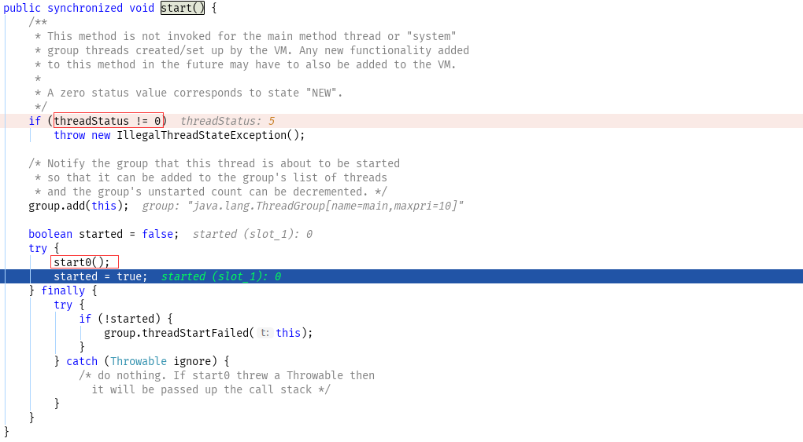

# 什么是进程、线程

进程：操作系统上一次程序的运行，例如 Windows 上的 QQ.exe 程序
线程：在进程中独立运行的子任务，例如 QQ 程序里面运行的文件下载，音频等子任务，这些任务大多是在后台异步运行

# 多线程的优点

使用多线程可以在同一时间内运行更多的任务，最大限度的利用 CPU 资源处理更多的任务。

# Java 实现多线程

- 继承 Thread 类，Thread 实现了 Runnable 接口，缺点是不能多继承
- 实现 Runnable 接口

<!-- more -->

# 多次调用 start 方法

Thread 多次调用 start 方法，会出现 java.lang.IllegalThreadStateException 异常，查看和调试 start 方法的源码如下图所示



调试下源代码，Thread 类里面有一个 threadStatus 变量，当调用 start 时会首先判断这个值是否等于 0，如果等于 0，说明这个线程还未启动。在源码中可以看到，如果一个线程 start，调用的是原生的方法 start0，调用这个方法后会赋予 threadStatus 一个不为 0 的值，因此再次调用 start 方法时就会出现 IllegalThreadStateException 异常了。

# start 方法和 run 方法

Thread 既可以调用 start 方法开始线程任务，调用 run 方法也可以执行这一段要执行的任务，区别是，调用 start 方法是一个异步的线程，具有以不执行的效果，调用 run 方法则是一个同步的方法，直接由 main 线程执行了。

# currentThread 方法

currentThread 是 Thread 的一个方法，他返回**当前代码段是在哪一个线程执行的这个线程信息**，和线程里面的 this 不同，线程里面的 this 是直接表示的是线程本身，看下面的例子，他的输出结果改如何分析。

```java
// 创建 TestStartThread 线程
public class TestStartThread extends Thread {
    public TestStartThread() {
        System.out.println("TestStartThread=" + this.getName());
        System.out.println("TestStartThread=" + Thread.currentThread().getName());
    }

    @Override
    public void run() {
        super.run();
        System.out.println("run=" + this.getName());
        System.out.println("run=" + Thread.currentThread().getName());
    }
}

// 创建 TestStartThread 线程并执行
public class ThreadMain {
    public static void main(String[] args) {
        TestStartThread testStartThread = new TestStartThread();
        testStartThread.setName("Thread-A");
        testStartThread.start();
    }
}
```

分析一下输出结果是怎样的：

首先第一步，TestStartThread testStartThread = new TestStartThread() 可以知道 TestStartThread() 方法是在主线程中执行的的，所以 Thread.curretThread() 获取到的是主线程的信息，所以 Thread.currentThread().getName() 的值是 main，而 this 指的是这个子线程本身，所以 this.getName() 获取到的是这个子线程的名字 Thread-0，为什么是 Thread-0 呢？我们看下源码就知道了，使用不带线程名称参数的构造方法时，使用 Thread- 字符串和 threadInitNumber的值拼接，然后 threadInitNumber 会加 1，所以线程名称为 Thread-0

``` java
private static int threadInitNumber;
private static synchronized int nextThreadNum() {
    return threadInitNumber++;
}

// 地按个参数就是线程的名称
public Thread() {
    init(null, null, "Thread-" + nextThreadNum(), 0);
}
```

每创建一个线程 threadInitNumber 就会加 1，再看看另外两个构造方法

```java
public Thread(String name) {
    init(null, null, name, 0);
}

public Thread(ThreadGroup group, String name) {
    init(group, null, name, 0);
}
```

可以看到，当调用构造方法传入了线程名称时就不会再去调用 nextThreadNum() 方法了，这个时候就不会用之前的方法去生成线程名称了。

接着调用了 testStartThread.setName("Thread-A"); 此时子线程有了一个名字了，叫 Thread-A，这个时候由于 run 方法是在子线程里面执行的一段代码，所以 Thread.currentThread() 获取的是子线程本身，所以输出的时 Thread-A，由于 this 也是子线程的本身，所以 this.getName() 输出的也是 Thread-A。

输出的结果如下：

```text
TestStartThread=Thread-0
TestStartThread=main
run=Thread-A
run=Thread-A
```

来看另外一个例子，看过源码的话，应该可看见，Thread 的构造方法可以传递一个 Runnable 对象，由于 Thread 继承 Runnable 的，所以也可以传递一个 Thread 对象进去，将上面的 main 方法更改为如下

```java
public class ThreadMain {
    public static void main(String[] args) {
        TestStartThread testStartThread = new TestStartThread();
        Thread thread = new Thread(testStartThread);
        thread.setName("Thread-A");
        thread.start();
    }
}
```

首先第一步，TestStartThread testStartThread = new TestStartThread() 可以知道 TestStartThread() 方法是在主线程中执行的的，所以 Thread.curretThread() 获取到的是主线程的信息，所以 Thread.currentThread().getName() 的值是 main，而 this 指的是这个子线程本身，所以 this.getName() 获取到的是这个子线程的名字 Thread-0，这个是和上面的例子是一样的。

然后看看第二步，先了解下 Thread(Runnable target) 中的 target 在 run 方法中的使用，在 target 不为 null 时，target 的 run 方法在线程 Thread 里面执行，调用的是 TestStartThread 类的 run 方法，是一个同步的调用，跟第一步在 main 线程里面调用 TestStartThread 的构造方法类似， 所以 Thread.currentThread() 获取到的线程为 Thread，而不是 target 线程，所以 Thread.currentThread().getName() 输出的是 Thread-A，而 target 里面的 this 表示线程的本身，当让只的是 target 线程了，所以 this.getName() 的值为 Thread-0，这里打个 debug 调试一下可以更加的清楚这段代码的执行过程了

```java
@Override
public void run() {
    if (target != null) {
        // 调用了 TestStartThread 类的 run 方法，是一个同步的调用
        target.run();
    }
}
```

输出的结果如下：

```text
TestStartThread=Thread-0
TestStartThread=main
run=Thread-0
run=Thread-A
```

# isAlive 方法

isAlive 方法用于判断当前的线程是否处于活动的状态，调用这个方法要弄清楚的还是 Thread.currentThread() 和 this 的区别，弄清楚获取到的是哪一个线程，调用的是哪一个线程的 isAlive 方法。

# sleep 方法

sleep 方法可以让线程在指定的毫秒数时间休眠后继续执行，要注意的是这个线程指的是 this 返回的线程而不是 Thread.currentThread() 返回的线程。

# getId 方法

getId 方法可以获取线程的唯一 id

# 如何停止线程

- 等待 run 方法完成
- 调用 stop 方法
- 使用 interrupt 方法
- 抛出异常终止线程