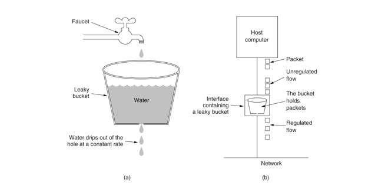
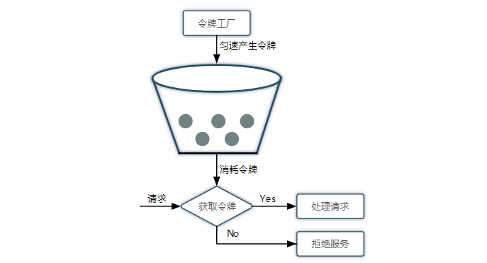

高并发的业务场景情况下, 通常都会使用缓存, 熔断机制, 服务降级和服务限流等技术手段保障服务的稳定性和可用性

# 限流作用

牺牲部分 QPS 保证整体系统的可用性, 避免产生服务雪崩效应

# 举例说明

假设单机最大 QPS 为 1000, 五台服务器经过负载均衡最大 QPS 可达到 5000, 假设日常平均 QPS 为 4500 左右, 突然有一台服务器上的系统崩溃不能提供服务, 那么这 4500 QPS 就会被负载到剩余的四台服务器上, 平均 QPS 为 1125, 已经超过单机的 1000, 这样势必会造成其他所有的服务崩溃, 导致所有的服务不可用, 如果有限流机制, 超过服务器单机最大 QPS 后, 将其他的请求直接拒绝掉, 在第一台服务器的服务崩溃后, 其他的服务器上的服务仍能够处理 4000 QPS，只是会有 500 QPS 的损失, 但是确可以保证服务是可用的, 也不会出现服务雪崩效应

<!-- more -->

# 限流算法

常见的限流算法如下:

* 计数器
* 漏桶算法
* 令牌桶算法

## 计数器

计数器算法的实现思路是, 从第一个请求进来开始计数, 在接下来的一段时间 (通常是 1s) 内, 每来一个请求计数器就加 1, 如果计数器的值超过设置的阈值, 就直接拒绝请求, 当然对这个计数器的累加和比较是需要加锁操作的, 但是这样会影响部分性能, 我们可以使用原子类来实现, 性能更高, 具体点可以通过 AtomicLong.incrementAndGet() 方法来让计数器加 1 并获取最终的值来和阈值比较, 具体代码的实现示例如下:

```java
private AtomicInteger atiomic = new AtomicInteger();
private long lastRecordDateTime;

// 该接口 1s 不能超过 10 次请求
@GetMapping("/atomic/limit/test")
public String limitTest() {
    long requestDateTime = DateTime.now().getMillis();
    if (requestDateTime - lastRecordDateTime > 1000) {
        lastRecordDateTime = requestDateTime;
        atiomic.set(1);
        return "请求成功";
    } else {
        // 计数器加 1 后和阈值比较, 如果超过阈值直接拒绝请求
        int limitCount = 10;
        if (atiomic.incrementAndGet() > limitCount) {
            return "请求失败";
        } else {
            return "请求成功";
        }
    }
}
```

计数器算法的实现很简单, 但是弊端也比较明显, 假如要求是每 10s 的 QPS 是 1000, 结果流量突增, 在第 1s 的时候就已经到达了阈值, 导致剩下的 9s 内的请求全部被丢弃了, 除了造成资源的浪费外, 也容易遇到恶意请求, 此外, 上面的方法也只是适合单机使用, 对于集群的情况下, 可以使用 Redis 来实现分布式限流, 使用 Redis 的 incr 指令实现, incr 指令是一个原子操作, 可以让值加 1, 并且返回最终的值

## 漏桶算法

漏桶算法基本实现思路是当任意请求来临时, 将请求放入到一个固定容量的桶中, 同时从桶中以恒定的速率取出放在桶中的请求进行处理, 在这一过程中如果桶被塞满, 这个时候就拒绝请求, 类似生活中的漏斗, 水 (请求) 倒入漏斗, 然后从下端小口慢慢匀速的流出 (处理请求), 当水倒入漏斗的速率大于下端小口流出水的速率时, 一定时间后就会有水从上方益处 (拒绝请求), 如下图所示:



漏桶算法也是有一个弊端的, 无法应对短时间的突发流量, 短时间内大部分请求会立即塞满桶, 如果处理速率跟不上, 大量的请求就会被丢弃掉

## 令牌桶算法

令牌桶是对漏桶算法的一种改进, 算法的基本实现思路是, 有一个固定容量的桶, 按照固定的速率往桶中添加令牌, 当桶满时, 不再往里面添加令牌, 每一个请求都要先从桶中获取一个令牌后才能进行处理, 如果获取不到令牌 (说明桶中没有令牌了, 生成令牌的速率跟不上), 就拒绝请求, 因为桶中在没有一段时间没有请求的时候可以存储一定的令牌数量, 并且可以根据情况调整令牌生成速度, 所以和漏桶算法相比它能够允许一定程度的突发流量, 也因为这种特性, 经常在实际的项目中使用



下面是一种简单的实现方式, 使用原子类 AtomicLong 作为令牌桶, 启动一个定时任务线程池启动线程任务生成令牌数量作为令牌生成器, 实现类如下:

```java
public class MRateLimiter {
    private AtomicInteger bucket = new AtomicInteger();
    // corePoolSize = 1
    private static ScheduledExecutorService executorService = new ScheduledThreadPoolExecutor(1);

    public MRateLimiter(int limit) {
        // 定时任务每秒生成一个令牌
        executorService.scheduleWithFixedDelay(() -> {
            if (bucket.intValue() < limit) {
                bucket.incrementAndGet();
            }
        }, 0, 1, TimeUnit.SECONDS);
    }

    // 获取令牌并指定等待时间
    public boolean tryAcquire(long time) {
        int currentBucketSize = bucket.intValue();
        long startTime = DateTime.now().getMillis();
        while (!(currentBucketSize > 0
                && bucket.compareAndSet(currentBucketSize, currentBucketSize - 1))) {
            if (DateTime.now().getMillis() - startTime > time) {
                return false;
            }
            currentBucketSize = bucket.intValue();
        }
        return true;
    }
}
```

也可以使用 Guava 提供的 RateLimiter, 开箱即用, 代码就不贴了, 之前有写过一篇相关的学习笔记, 参考 [Java-Guava工具类之使用RateLimiter进行限流](http://antsnote.club/2019/05/21/Java-Guava%E5%B7%A5%E5%85%B7%E7%B1%BB%E4%B9%8B%E4%BD%BF%E7%94%A8RateLimiter%E8%BF%9B%E8%A1%8C%E9%99%90%E6%B5%81/)