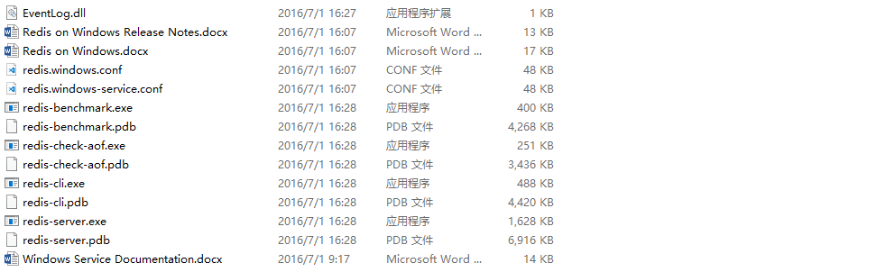

Redis 天然支持 Linux 系统, 不支持 Windwos 系统, 因此微软团队在 GitHub 上开发了一个 Redis Win64 的版本, [下载地址](https://github.com/MicrosoftArchive/redis/releases)

# 安装

下载后, 解压即安装, 解压后文件目录如下图所示



<!-- more -->

主要用到的文件如下

* redis-cli.exe        客户端
* redis-server.exe     服务器
* redis.windows.conf   配置文件

# 运行 Redis

双击 redis-server.exe 就可以运行 Redis 了, 但是直接运行并没有使用配置文件, 我们可以在启动的时候来指定配置文件, `WIM + R`, 输入 `cmd`, 然后切换到 Reids 解压目录下, 执行如下指令:

```text
redis-server.exe redis.windows.conf
```

为了能让外网访问 Redis, 我修改了一些配置项

```ini
# 更改 bind 127.0.0.1 为 bind 0.0.0.0
bind 0.0.0.0

# 更改 protected-mode yes 为 protected-mode no
protected-mode no

# 放开 requirepass foobared 注释, 更改为自己的登陆密码
requirepass yourpassword
```

此外我将端口号也更改为了 6380

```ini
# 更改 port 6379 为 port 6380
port 6380
```

# 开机启动

为了方便, 可以添加为一个服务, 在开机的时候旧启动

```text
# 创建服务, 默认名字为 Redis
redis-server --service-install redis.windows.conf --loglevel notice --service-name RedisMaster

# 接着启动服务
redis-server --service-start

# 如果想停止服务, 执行这条命令
redis-server --service-stop

# 如果想删除服务, 执行这条命令
redis-server --service-uninstall
```

或者在控制台中输入 `services.msc` 指令, 打开 windows 的服务管理窗口, 就可以在里面找到名为 RedisMaster 的服务了, 在这里可以对服务进行管理, 如启动, 停止等