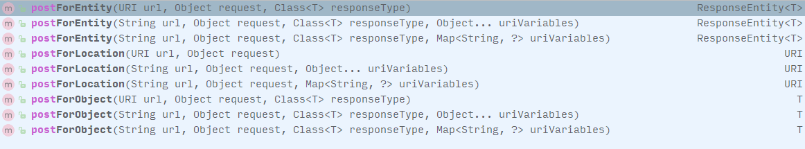

# RestTemplate 注入失败

```java
@Slf4j
@Component
public class RestTemplateServiceImpl {
    private final RestTemplate restTemplate;

    @Autowired
    public RestTemplateServiceImpl(RestTemplate restTemplate) {
        this.restTemplate = restTemplate;
    }

    private void getRestTemplete() {
        String url = "http://localhost:8001/grpc/demo/1/test";
        ResponseEntity<String> responseEntity = restTemplate.getForEntity(url, String.class);
        String body = responseEntity.getBody();
        log.warn("body = {}", body);
    }
}
```

<!-- more -->

使用的时候：

```text
***************************
APPLICATION FAILED TO START
***************************

Description:
Parameter 0 of constructor in com.grpc.client.service.web.RestTemplateServiceImpl required a bean of type 'org.springframework.web.client.RestTemplate' that could not be found.

Action:
Consider defining a bean of type 'org.springframework.web.client.RestTemplate' in your configuration.
```

解决方法：

`https://blog.csdn.net/u014745069/article/details/78801405`

```java
@Configuration
public class RestTemplateConfig {

    @Bean
    public RestTemplate restTemplate(ClientHttpRequestFactory factory) {
        return new RestTemplate(factory);
    }

    @Bean
    public ClientHttpRequestFactory simpleClientHttpRequestFactory() {
        SimpleClientHttpRequestFactory factory = new SimpleClientHttpRequestFactory();
        factory.setReadTimeout(5000);
        factory.setConnectTimeout(15000);
        return factory;
    }
}
```

# GET 请求

主要使用 getForEntity 和 getForObject，下面的例子主要使用的是 getForEntity 方法，getForObject 是对 getForEntity 的进一步封装，只返回响应体的内容，其他的诸如 HttpStatus、Headers 数据都返回。

## 无参数调用

服务端定义接口：

```java
@RequestMapping(value = "/grpc/demo/1/test", method = RequestMethod.GET)
public Map<String, Object> grpcTest() {
    Map<String, Object> map = new HashMap<>();
    map.put("code", 10000);
    map.put("message", "success");
    return map;
}
```

客户端调用接口：

```java
public void restTemplateGetRequest() {
    String url = "http://localhost:8001/grpc/demo/1/test";
    ResponseEntity<TestEntity> responseEntity = restTemplate.getForEntity(url, TestEntity.class);
    if (responseEntity.getStatusCode() == HttpStatus.OK) {
        TestEntity body = responseEntity.getBody();
        log.info("body = {}", body);
    } else {
        log.error("HttpStatus = {}", responseEntity.getStatusCode());
    }
    log.warn("body = {}", body);
}

@Data
class TestEntity {
    int code;
    String message;
}
```

或者直接转换成 JSONObject 类型和 String 类型：

```java
// JSONObject 类型
ResponseEntity<JSONObject> responseEntity = restTemplate.getForEntity(url, JSONObject.class);
JSONObject body = responseEntity.getBody();

// String 类型
ResponseEntity<String> responseEntity = restTemplate.getForEntity(url, String.class);
String body = responseEntity.getBody();
```

## 带参数调用

三种形式的传参，其中占位符的方式可以套用于 Rest 风格的请求上。

```java
// 直接拼接成字符串
String url = "http://localhost:8001/grpc/demo/1/test?value=value1&value=value2";
ResponseEntity<TestEntity> responseEntity = restTemplate.getForEntity(url, TestEntity.class);

// 占位符，多参数可以使用 map 来代替
String url = "http://localhost:8001/grpc/demo/1/test?value={1}&value={2}";
ResponseEntity<TestEntity> responseEntity = restTemplate.getForEntity(url, TestEntity.class, "value1", "value2");

// 使用 URI
String url = "http://localhost:8001/grpc/demo/1/test?value={1}&value={2}";
UriComponents uriComponents = UriComponentsBuilder.fromUriString(url).build().expand("value1", "value2").encode();
ResponseEntity<TestEntity> responseEntity = restTemplate.getForEntity(uriComponents.toUri(), TestEntity.class);
```

# POST 请求

POST 请求主要的方法如下图所示：



里面的参数主要有两个参数需要说一下，Object request 和 Object... uriVariables，request 参数一般接收 HttpEntity 类型的数据，HttpEntity是对HTTP请求的封装，包含两部分，header与body，header用于设置请求头，而body则用于设置请求体，uriVariables 则用于格式化 Http 地址。

## 提交表单参数 (APPLICATION_FORM_URLENCODED)

服务端接口，接收表单参数：

```java
@RequestMapping(value = "/grpc/demo/2/test", method = RequestMethod.POST)
public Map<String, Object> postTest(String param1, String param2) {
    log.warn("param1 = {}, param2 = {}", param1, param2);
    Map<String, Object> map = new HashMap<>();
    map.put("code", 10000);
    map.put("message", "success");
    return map;
}
```

客户端调用，注意使用表单方式提交参数的时候 HttpEntity 的请求参数别使用 Map 和 HashMap 来封装，且不能为 MultiValueMap<String, Object> 类型，否则报 400 Bad request 错误：

```java
public void restTemplatePostRequest() {
    String url = "http://localhost:8001/grpc/demo/2/test";

    // 设置为表单提交
    HttpHeaders httpHeaders = new HttpHeaders();
    httpHeaders.setContentType(MediaType.APPLICATION_FORM_URLENCODED);

    //  封装参数，不要替换为 Map 与 HashMap，否则参数无法传递，这里有踩过坑
    MultiValueMap<String, String> params= new LinkedMultiValueMap<>();
    params.add("param1", "value1");
    params.add("param2", "value2");

    // 构造 HttpEntity 请求参数
    HttpEntity<MultiValueMap<String, String>> httpEntity = new HttpEntity<>(params, httpHeaders);

    // 发起请求
    ResponseEntity<TestEntity> responseEntity = restTemplate.postForEntity(url, httpEntity, TestEntity.class);
    TestEntity body = responseEntity.getBody();
    log.info("body = {}", body);
}
```

## 提交 JSON 格式参数 (APPLICATION_JSON_UTF8)

服务端定义接口：

```java
@RequestMapping(value = "/grpc/demo/3/test", method = RequestMethod.POST)
public Map<String, Object> postTest3(@RequestBody RequestInfo requestInfo) {
    log.warn("requestInfo = {}", requestInfo);
    Map<String, Object> map = new HashMap<>();
    map.put("code", 10000);
    map.put("message", "success");
    return map;
}

@Data
public class RequestItem {
    private String username;
    private String password;
}

@Data
public class RequestInfo {
    private String id;
    private RequestItem item;
}
```

客户端调用接口，构造 HttpEntity 的时候必需是 JSON 字符串：

```java
public void restTemplatePostRequest() throws JsonProcessingException {
    String url = "http://localhost:8001/grpc/demo/3/test";

    // 设置为 JSON 提交
    HttpHeaders httpHeaders = new HttpHeaders();
    httpHeaders.setContentType(MediaType.APPLICATION_JSON_UTF8);

    // 可以使用 HashMap
    Map<String, Object> params= new HashMap<>();
    params.put("id", "1000");
    params.put("item", JSONObject.parse("{\"username\":\"lpw\", \"password\":\"123456\"}"));
    log.warn(JSONObject.toJSONString(params));

    // 构造 HttpEntity 请求参数, JSON 方式提交只能使用 JSON 字符串
    HttpEntity<String> httpEntity = new HttpEntity<>(JSONObject.toJSONString(params), httpHeaders);

    // 发起请求
    ResponseEntity<TestEntity> responseEntity = restTemplate.postForEntity(url, httpEntity, TestEntity.class);
    TestEntity body = responseEntity.getBody();
    log.info("body = {}", body);
}
```

## 使用 uriVariables 格式化 URL

uriVariables 参数用于格式化 URL，可以套用于 REST 风格的请求。

```java
String url = "http://localhost:8001/grpc/demo/3/test/{id}/{phone}/";
ResponseEntity<TestEntity> responseEntity = restTemplate.postForEntity(url, httpEntity, TestEntity.class, "1", "15972390655");

String url = "http://localhost:8001/grpc/demo/3/test/{id}/{phone}/";
Map<String, String> uriVariables = new HashMap<>();
uriVariables.put("id", "1");
uriVariables.put("phone", "159782390655");
ResponseEntity<TestEntity> responseEntity = restTemplate.postForEntity(url, httpEntity, TestEntity.class, "1", "15972390655");
```

## 参考资料

* 书籍 《Spring 实战》
* [RestTemplate 中几种常见的请求方式](https://blog.csdn.net/u012702547/article/details/77917939)
* [RestTemplate post 请求传递参数遇到的坑](https://blog.csdn.net/LDY1016/article/details/80002126)
* [RestTemplate 提交表单数据的三种方法](https://blog.csdn.net/yiifaa/article/details/77939282)
* [RestTemplate 自动依赖注入时 bean could not be found 问题的理解和解决方案](https://blog.csdn.net/u014745069/article/details/78801405)
