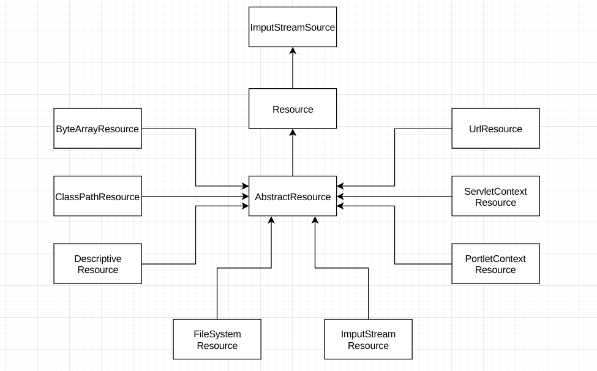

# Ioc 的概念

控制反转，程序编程的一种设计思想，和依赖注入 ( DI ) 是同一个概念，主要用于程序解耦。

# Ioc 的类型

从注入方式上看，分为三种类型，构造类型注入、属性注入和接口注入 ( 不推荐，需要再额外添加一个接口 )。

# Spring IoC 容器

Sprig IoC 容器主要是完成程序解耦合的功能，帮助完成类的初始化和依赖关系的装配，让开发者从这些工作中脱离出来，专注于业务逻辑开发。举一个简单的例子，假设有一个剧组拍摄一部三国演义的电影，拍摄任务需要导演，演员和相关工作人员一起完成。让我们使用程序模拟这个拍摄任务，首先创建导演、演员和工作人员相关的类。

``` java
/**
 * 导演类
 */
@Data
@NoArgsConstructor
@AllArgsConstructor
public class Director {
    private String name;
}
```

<!-- more -->

``` java
/**
 * 演员类
 */
@Data
@NoArgsConstructor
@AllArgsConstructor
public class Actors {
    private String name;
}
```

``` java
/**
 * 工作人员类
 */
@Data
@NoArgsConstructor
@AllArgsConstructor
public class StaffMember {
    private String name;
}
```

此外还需要创建一个拍摄任务类，用于完成拍摄任务，完成这个任务需要导演、演员和工作人员相互配合。

``` java
@Data
@NoArgsConstructor
@AllArgsConstructor
public class MovieTask {
    private Director director;
    private Actors actors;
    private StaffMember staffMember;

    public void doTask() {
        System.out.println("导演: " + director.getName()
                + "、演员: " + actors.getName()
                + "和工作人员: " + staffMember.getName() +
                "一起完成了拍摄任务!");
    }
}
```

创建实例和注入依赖后，就可以开始拍摄任务完成电影的拍摄了。

``` java
public class Application {
    public static void main(String[] args) {
        // 需要手动创建相关实例
        Director director = new Director("张艺谋");
        Actors actors = new Actors("李连杰");
        StaffMember staffMember = new StaffMember("小卢");

        // MovieTask 类依赖于 Director、Actors 和 StaffMember
        // 这里使用构造方法的方式手动注入依赖
        MovieTask movieTask = new MovieTask(director, actors, staffMember);
        movieTask.doTask();
    }
}
```

可以看到，当调用 MoiveTask 的 doTask 方法开始完成拍摄任务的时，需要手动的创建相关的实例和注入依赖，虽然 MovieTask 不需要去关注导演、演员和工作人员的实例化工作，但是这些工作的代码只是从 MovieTask 里面提出来，仅仅是实现了解耦，并且在代码里面指定了导演、演员和工作人员由谁担任，这些角色都被硬编码在代码里面，假设之后有人需要翻拍成新三国，剧本不变，只是导演、演员和工作人员变化，就不得不去修改程序的源代码了。这个时候就需要Spring IoC 容器了，仅仅需要通过配置文件或者注解的方式，它可以帮助完成创建实例和依赖注入的工作，并且如果想要翻拍新三国的话，也不需要修改源代码了，仅仅需要修改配置文件或者 Beans 类修改导演、演员和工作人员就可以了，看看使用 Spring 如何完成上面的任务的。

首先添加 Spring 依赖，如下:

``` xml
<!-- Spring -->
<dependency>
    <groupId>org.springframework</groupId>
    <artifactId>spring-context</artifactId>
    <version>5.0.4.RELEASE</version>
</dependency>

<!-- 
添加 Spring 会自动依赖以下 jar 包
org.springframework:spring-aop:5.0.4.RELEASE.jar
org.springframework:spring-beans:5.0.4.RELEASE.jar
org.springframework:spring-context:5.0.4.RELEASE.jar
org.springframework:spring-core:5.0.4.RELEASE.jar
org.springframework:spring-expression:5.0.4.RELEASE.jar
org.springframework:spring-jcl:5.0.4.RELEASE.jar
-->
```

创建配置文件 ico_test_beans.xml，配置 Bean 和依赖关系，如下:

``` xml
<?xml version="1.0" encoding="UTF-8"?>
<beans xmlns="http://www.springframework.org/schema/beans"
       xmlns:xsi="http://www.w3.org/2001/XMLSchema-instance"
       xmlns:p="http://www.springframework.org/schema/p"
       xsi:schemaLocation="http://www.springframework.org/schema/beans
       http://www.springframework.org/schema/beans/spring-beans.xsd">

    <!-- 配置的方式初始化 bean -->
    <bean id="director" class="com.lupw.spring.ioc.test.Director"
          p:name="张艺谋"/>

    <bean id="actors" class="com.lupw.spring.ioc.test.Actors"
          p:name="李连杰"/>

    <bean id="staffMember" class="com.lupw.spring.ioc.test.StaffMember"
          p:name="小卢"/>

    <!-- 初始化 bean 和建立依赖关系 -->
    <bean id="movieTask" class="com.lupw.spring.ioc.test.MovieTask"
          p:director-ref="director"
          p:actors-ref="actors"
          p:staffMember-ref="staffMember"/>
</beans>
```

实例化 MovieTask 并调用 doTask 来完成拍摄任务，可以看到，实例化 MoiveTask 的时候并没有手动的创建导演、演员和工作人员的实例，也没有手动的去注入依赖关系，这些都在配置文件中已经配置好，由 Spring 容器自动完成了这些工作，代码如下:

``` java
public class Application {
    public static void main(String[] args) {
        ApplicationContext context
                = new ClassPathXmlApplicationContext("classpath:beans/ico_test_bean.xml");
        MovieTask movieTask = context.getBean("movieTask", MovieTask.class);
        movieTask.doTask();
    }
}
```

# Spring 容器底层依赖的技术

Spring 通过简单的配置文件可以完成 bean 的实例化和依赖注入，能完成这些功能主要依靠 Java 所提供的反射功能，为了之后能够可以更加深入理解 Spring，我么需要了解反射的相关姿势，除此之外，同时还需要了解 Spring 资源文件的访问功能。

## 反射

鉴于篇幅，懒得写了，就是那个意思。

## 资源访问

### Resource 接口和 Resource 接口的实现类

Spring 通过读取配置文件来获取 Bena 初始化配置和依赖关系，需要进行资源的访问才能获取这些信息，JDK 所提供的资源访问类 java.net.URL、File类等并不能很好的访问类路径和 WEB 容器上下文的资源文件，因此 Spring 设计了一个 Resource 接口，并提供了相关的实现类，以便于在各种场景下方便的访问资源问件，具体的实现类如下图所示:



先看看 Resource 接口的定义的方法:

``` java
public interface Resource extends InputStreamSource {
    // 资源是否存在
    boolean exists();

    //　资源是否可读
    default boolean isReadable() {
        return true;
    }

    // 资源是否已打开
    default boolean isOpen() {
        return false;
    }

    // 打开的资源是否是一个文件
    default boolean isFile() {
        return false;
    }

    // 如果资源文件可以被表示成一个 URL，则返回 URL
    URL getURL() throws IOException;

    URI getURI() throws IOException;

    // 如果资源文件是一个文件，则返回 File 对象
    File getFile() throws IOException;

    default ReadableByteChannel readableChannel() throws IOException {
        return Channels.newChannel(this.getInputStream());
    }

    long contentLength() throws IOException;

    long lastModified() throws IOException;

    // 在资源文件的相对路径上创建文件
    Resource createRelative(String var1) throws IOException;

    @Nullable
    String getFilename();

    String getDescription();
}
```

Resource 的各个实现类的主要功能见下表:

 类名 | 主要功能
 :--- | :---
 ByteArrayResource      | 用于加载和处理二进制数组表示的资源
 ClassPathResource      | 用于加载和处理类路径下的资源，资源以类路径的方式表示
 DescriptiveResource    | --
 FileSystemResource     | 用于加载和处理文件系统下的资源，资源以文件系统路径表示
 IputStreamResource     | 处理 InputStream 资源
 PortletContextResource | --
 ServletContextResource | 负责加载 WEB 应用根目录下的资源，允许以流和 URL 的方式加载资源，在 war 包解包的情况下允许以 File 的形式加载资源，还允许直接从 jar 包中访问资源
 UrlResource            | 封装了 java.net.URL，可以访问任意可以使用 URL 表示的资源，如文件系统的资源，HTTP 资源，FTP 资源等

我们常用的使用主要是 ClassPathResource、FileSystemResource 和 ServletContextResource 三个类，使用方法如下:

``` java
// FileSystemResource
Resource res = new FileSystemResource("/home/lupw/log/log.txt");
ImputStream is = res.getImputStream();

// ClassPathResource
Resource res = new ClassPathResource("classpath:mapper/CommomMapper.xml");
ImputStream is = res.getImputStream();

// ServletContextResource，可以在 jsp 中使用
Resource res = new ClassPathResource(application, "WEB-INF/classes/conf/log.txt");
ImputStream is = res.getImputStream();
```

### 资源地址表达式和资源加载器

Spring 加载不同类型的资源需要用到不同的 Resource 实现类，Spring 针对这种情况做了优化，通过资源地址的不同表达式就可以加载对应的资源，Spring 主要通过资源地址表达式的前缀来识别，支持的地址前缀如下表。

前缀 | 示例 | 对应资源的类型
---- | ---------- | ---------
classpath | classpath:CommonMapper.xml | 从类路径中加载资源，资源文件可以在文件系统中，也可以在 jar 或者 zip 包中
file | file:/home/lupw/log/log.txt | UrlResource 通过文件系统的路径加载资源，可以是相对或者绝对路径
http:// | http://www.lupw.com/beans.xml | UrlResource 从 WEB 服务器中加载资源
ftp:// | ftp://www.lupw.com/beans.xml | UrlResource 从 FTP 服务器中加载资源
没有前缀 | beans.xml | 根据 ApplicationContext 具体的实现类 (如ClassPathXmlApplicationContext) 采用对应类型的 Resource

上面的资源地址需要通过资源加载器才能加载到资源，Spring 定义了加载器的接口 ResourceLoader，它只有一个接口 getResource(String location)，并且只支持资源地址前缀的表达式，不支持 Ant 风格的资源地址表达式。ResourcePatternResolver 扩展了 ResourceLoader 接口，可以支持 Ant 风格的资源地址表达式，PathMatchingResourcePatternResolver 则是一个标准的实现类，继承关系如下图所示。


PathMatchingResourcePatternResolver 类的使用方法如下。

``` java
PathMatchingResourcePatternResolver resolver =new PathMatchingResourcePatternResolver();
// 加载所有类目录 (项目被拆分成多个子模块时) 下的 mapper 目录下所有 xml 文件资源
Resource resources[] = resolver.getResources("classpath*:mapper/*.xml");
for(Resource res : resources) {
    ImputStrem is = res.getInputStream();
}
```

### Ant 风格资源地址

Ant 风格的地址支持三种匹配符

1. ? 匹配文件中的一个字符, classpath:com/mapper/t*est.xml
2. \* 匹配文件中的任意字符, classpath:com/mapper/*.xml
3. \*\* 匹配多层路径, classpath:com/**/test.xml 匹配 com 目录下和其子孙目录下的所有 test.xml 文件

<div class="note default"><p> 有一个比较特殊的写法 classpath\*，在多模块应用中常用，例如某个项目中有三个模块，每个模块中类路径下都有一个配置文件，分别为 moudle1.xml，module2.xml，module3.xml，如果写成 classpath:module\*.xml 只会匹配到第一个配置文件，写成 classpath\*:module\*.xml 才能匹配到三个文件。</p></div>