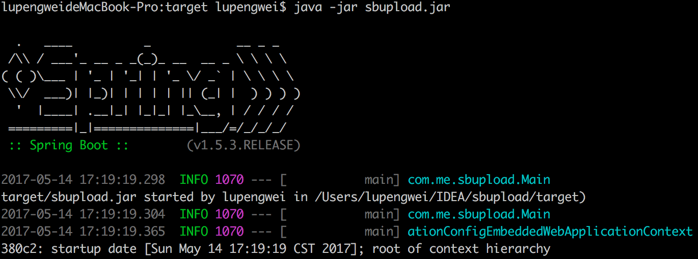

# 创建项目

## 创建一个maven项目

在pom.xml文件中添加依赖包，如下图所示：

```xml
<parent>
    <groupId>org.springframework.boot</groupId>
    <artifactId>spring-boot-starter-parent</artifactId>
    <version>1.5.3.RELEASE</version>
</parent>

<dependency>
    <groupId>org.springframework.boot</groupId>
    <artifactId>spring-boot-starter</artifactId>
</dependency>

<dependency>
    <groupId>org.springframework.boot</groupId>
    <artifactId>spring-boot-starter-web</artifactId>
</dependency>
```

<!-- more -->

## 创建一个Controller类，加上@Controller注解

```java
@Controller
public class CommonController {
    @RequestMapping(value = "/get/test/data", method = RequestMethod.POST)
    @ResponseBody
    public String getTestData(@RequestBody String params) {
        return "aaaaaaaa";
    }
}
```

## 创建Spring入口类

加上 @SpringBootApplication 和 @EnableAutoConfigruation 两个注解(网上有的文章只添加了 EnableAutoConfigruation，项目能启动但是访问时出现错误页面)，如下图所示：

```java
@SpringBootApplication
@EnableAutoConfiguration
public class Main {
    public static void main(String[] args) throws Exception {
        SpringApplication springApplication = new SpringApplication(Main.class);
        springApplication.run(args);
    }
}
```

## 运行mian方法，启动web项目

使用 `http://localhost:8080/get/test/data` 就可以访问到这个接口的数据;
添加配置文件，更改端口号，配置数据源等信息，在类路径下添加 application.properties 文件，内容如下图所示：

```ini
# 数据库配置
spring.datasource.type=com.alibaba.druid.pool.DruidDataSource
spring.datasource.url=jdbc:mysql:xxx/xxx/xxx
spring.datasource.username=xxxx
spring.datasource.password=xxxx
spring.datasource.driver-class-name=com.mysql.jdbc.Driver

# 端口号、地址(默认即可)和上下文路径
server.port=8084
# server.address=127.0.0.1
server.context-path=/
```

配置数据源的时候，其中 spring.datasource.driver-class-name 需要项目依赖不同数据的驱动包，否则IDEA环境会报错，这里使用的是 Mysql，因此在 pom.xml 中添加 Mysql 的驱动包，如下图所示：

```xml
<!-- mysql驱动包 -->
<dependency>
    <groupId>mysql</groupId>
    <artifactId>mysql-connector-java</artifactId>
    <version>5.1.29</version>
</dependency>
```

使用 SpringMVC 的 JavaWeb 项目，需要在服务器中部署 Tomcat，然后将项目生成 war 文件部署到 Tomcat 容器中运行，SpringBoot 自带内嵌的 Tomca t容器，不需要再部署 Tomcat，因此使用 SpringBoot 的项目时，将项目放在服务器上直接运行 main 方法就可以了。Spring 也提供了一个插件，可以将项目的 war 文件打包成 jar 包，直接运行这个 jar 包就可以运行项目，需要在项目中加入插件，如下如所示：

```xml
<plugins>
    <!-- 打包成 jar 包需要用到这个插件，生成的 jar 包一般大于 10M，因为包含了 WEB 服务器在里面，jar -tvf app.jar 可以查看 jar 包中的文件 -->
    <plugin>
        <groupId>org.springframework.boot</groupId>
        <artifactId>spring-boot-maven-plugin</artifactId>
        <configuration>
            <executable>true</executable>
        </configuration>
    </plugin>

    <plugin>
        <groupId>org.apache.maven.plugins</groupId>
        <artifactId>maven-compiler-plugin</artifactId>
        <configuration>
            <source>1.8</source>
            <target>1.8</target>
        </configuration>
    </plugin>
</plugins>
```

同时将 pom.xml 中的 \<packaging\> 的值由 war 改为 jar，然后点开 IDEA 右侧的 Maven Projects 选项卡，依次执行 Lifecycle 中的 clean，complie和 package 指令，然后就在 targer 下看见生成的 jar 包了，使用 java -jar xxx.jar 就可以启动的项目了，如下图所示：



# jar包的方式部署项目

已经了解到 SpringBoot 项目可以打包成 jar 包的形势部署上去，直接调用 java -jar 指令就可以执行，下面试调用这个指令启动项目时的不同情形。这里也可稍微了解下 & 符号和 nohub 指令。

## java -jar app.jar

特点：当前ssh窗口被锁定，可按CTRL + C打断程序运行，或直接关闭窗口，程序退出

## java -jar app.jar &

&代表在后台运行。
特点：当前ssh窗口不被锁定，但是当窗口关闭时，程序中止运行

## nohup java -jar app.jar &

语法：nohup Command [ Arg ... ] [　& ]
描述：nohup 命令运行由 Command 参数和任何相关的 Arg 参数指定的命令，忽略所有挂断（SIGHUP）信号。
在注销后使用 nohup 命令运行后台中的程序。
要运行后台中的 nohup 命令，添加 & （ 表示“and”的符号）到命令的尾部。
nohup java -jar app.jar &
nohup 意思是不挂断运行命令,当账户退出或终端关闭时,程序仍然运行

## nohup java -jar app.jar >output 2>&1 &

操作系统中有三个常用的流：
0：标准输入流 stdin
1：标准输出流 stdout
2：标准错误流 stderr
一般当我们用 >output，实际是 1>output 的省略用法；\< input ，实际是 0 \< input的省略用法;
带 & 的命令行，即使 terminal（终端）关闭，或者电脑死机程序依然运行（前提是你把程序递交到服务器上);
而 2>&1 是把标准错误（2）重定向到标准输出中（1），而标准输出又导入文件 output 里面，所以结果是标准错误和标准输出都导入文件 output 里面了。至于为什么需要将标准错误重定向到标准输出的原因，那就归结为 stderr 没有缓冲区，而 stdout 有。这就会导致 >output 2>output 文件 output 被两次打开，而 stdout 和 stder r将会竞争覆盖。这就是为什么有人会写成：nohup ./command.sh >output 2>output 出错的原因了。

## 带 JVM 参数的启动方式

nohup java -Xms1024m -Xmx1024m -Xmn512m -jar app.jar >output 2>&1 &

关于 JVM 参数：`https://yq.aliyun.com/articles/269858`
