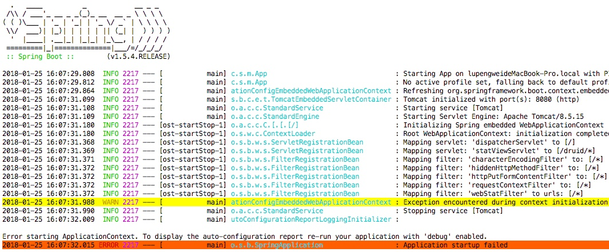
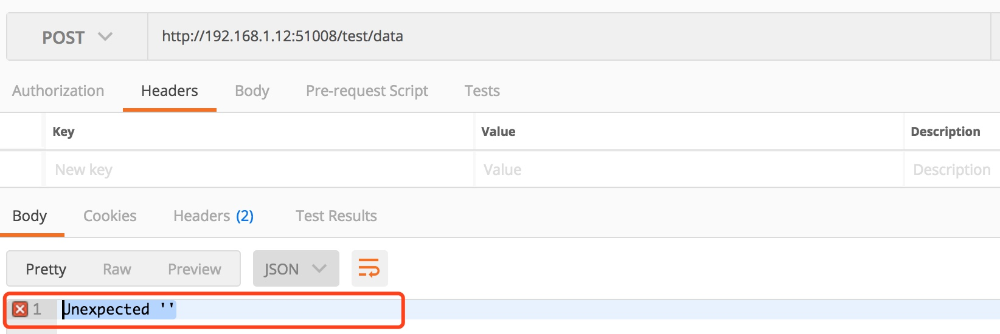

主要记载使用 SpringBoot 构建的项目时出现的一些问题和解决非方法。

# Your ApplicationContext is unlikely to start due to a @ComponentScan of the default package


首先 Application.java 文件不能直接放在main/java文件夹下，需要放入包中 (例如 main/java/com/lupw 下)。其次，会默认扫描所有包，需要加上注解 @ComponentScan("com.lupw") 对扫描的包进行限制。

解决方法的相关链接：
`https://stackoverflow.com/questions/35070455/springboot-beandefinitionstoreexception-failed-to-parse-configuration-class`

<!-- more -->

# Unable to start embedded container

org.springframework.context.ApplicationContextException: Unable to start embedded container; nested exception is org.springframework.context.ApplicationContextException: Unable to start EmbeddedWebApplicationContext due to missing EmbeddedServletContainerFactory bean.

出现错误原因：我在 Spring Boot 工程项目里面使用了拦截器，其中继承了 WebMvcConfigurerAdapter，但是提示找不到包，IDE 提示我需要导入依赖，于是我导入了 spring-webmvc 和 javax.servet.api 包，然后启动，出现了这个错误，这里应该导入的是  spring-boot-starter-web 依赖。

```xml
<!-- spring-boot-starter-web -->
<dependency>
    <groupId>org.springframework.boot</groupId>
    <artifactId>spring-boot-starter-web</artifactId>
    <exclusions>
        <exclusion>
            <groupId>org.springframework.boot</groupId>
            <artifactId>spring-boot-starter-logging</artifactId>
        </exclusion>
    </exclusions>
</dependency>
```

# 引入本地 jar 产生的问题

项目中需要使用第三方 jar 包，如何在 pom.xml 中添加这个 jar 包呢，方法如下：

```xml
<dependency>
    <groupId>com.alibaba</groupId>
    <artifactId>taobao</artifactId>
    <version>1.0</version>
    <scope>system</scope>
    <systemPath>/Users/lupengwei/IDEA/message/lib/taobao-sdk-java-auto_1455733249969-20160722.jar</systemPath>
</dependency>
```

这样就可以将第三方的 jar 通过 maven 依赖的方式添加到项目，但是当我们将项目打包成 jar 包的时候，会发现这些第三方的 jar 包并没有打包到项目的 jar 包里面去，需要在 pom.xml 的 build 节点下添加如下代码：

```xml
<!-- 本地调试请注释掉，打包成jar包的时候去掉注释 -->
<resources>
    <!-- 将lib目录下的jar包拷贝到BOOT-INF/lib/目录下 -->
    <resource>
        <directory>/Users/lupengwei/IDEA/message/lib/</directory>
        <targetPath>BOOT-INF/lib/</targetPath>
        <includes>
            <include>**/*.jar</include>
        </includes>
    </resource>

    <!-- 如果不加上这个配置，不然src/main/resource目录下的配置文件就不会打到jar包下去了 -->
    <resource>
        <directory>src/main/resources</directory>
        <targetPath>BOOT-INF/classes/</targetPath>
    </resource>
</resources>
```

但是在本地调试代码的时候需要将这段代码注释掉，否则启动项目的时候出现了如下错误：

同时提示：Error creating bean with name 'xxxxxx' defined in file 的错误。

# 接口访问请求出错返回：Unexpected ''，后台 debug 没有捕捉到请求

(1) 查看端口号，lsof -i:端口号，看看是否因为某些原因导致端口号被占用，如果占用，关闭这些端口号占用的进程，再启动项目即可。
