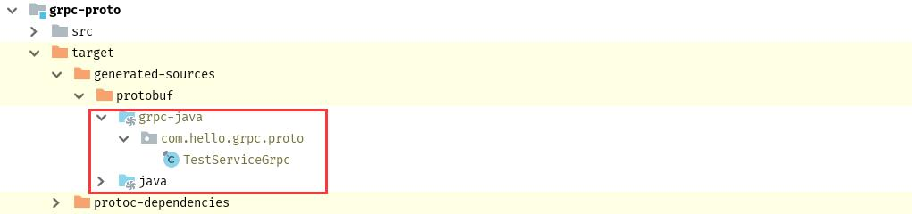

gRPC 是一 Google 开源的的 RPC 框架，主要面向移动应用开发并基于 HTTP/2 协议标准和 ProtoBuf 序列化协议来设计的，gRPC 需要配合 ProtoBuf 来使用，首先需要先写好 .proto 描述文件定义 RPC 接口，然后使用 protoc 编译工具编译 .proto 文件生成客户端和服务端所需要的接口代码，这篇笔记主要记录下在 SpringBoot 项目中如何使用 gRPC。gPRC 和 ProtoBuf 的一些参考资料如下：

* oschina 上翻译的 gRPC 官方文档：`http://doc.oschina.net/grpc?t=60134`
* gRPC 总结的学习笔记：`https://legacy.gitbook.com/book/skyao/learning-grpc/details`
* PtotoBuf 官方网址： `https://developers.google.com/protocol-buffers/`

<!-- more -->

# 创建项目

首先创建一个多模块项目，一个子模块 (grpc-proto) 专门用于编写 .proto 文件和生成客户端和服务端所需的接口代码，另外两个项目分别作为服务端 (grpc-server) 和客户端 (grpc-client) 项目，创建好的项目结构目录如下：


项目名为 grpc-hello，项目的 pom.xml 文件内容如下：

```xml
<!-- 注意 packaging 的值是 pom 而不是 jar -->
<groupId>com.lupw</groupId>
<artifactId>hello-grpc</artifactId>
<packaging>pom</packaging>
<version>1.0</version>

<!-- modules -->
<modules>
    <module>grpc-client</module>
    <module>grpc-server</module>
    <module>grpc-proto</module>
</modules>

<parent>
    <groupId>org.springframework.boot</groupId>
    <artifactId>spring-boot-starter-parent</artifactId>
    <version>1.5.1.RELEASE</version>
</parent>

<!-- properties -->
<properties>
    <project.build.sourceEncoding>UTF-8</project.build.sourceEncoding>
    <maven.compiler.source>1.7</maven.compiler.source>
    <maven.compiler.target>1.7</maven.compiler.target>
    <fastjson.version>1.2.32</fastjson.version>
</properties>

<dependencies>
    <!-- spring-boot-starter -->
    <dependency>
        <groupId>org.springframework.boot</groupId>
        <artifactId>spring-boot-starter</artifactId>
    </dependency>

    <!-- spring-boot-start-web -->
    <dependency>
        <groupId>org.springframework.boot</groupId>
        <artifactId>spring-boot-starter-web</artifactId>
    </dependency>

    <!-- junit -->
    <dependency>
        <groupId>junit</groupId>
        <artifactId>junit</artifactId>
        <version>${junit.version}</version>
        <scope>test</scope>
    </dependency>
</dependencies>

<!-- spring-boot-maven-plugin 用于将子项目打包 jar 包 -->
<build>
    <finalName>hello-grpc</finalName>
    <plugins>
        <plugin>
            <groupId>org.springframework.boot</groupId>
            <artifactId>spring-boot-maven-plugin</artifactId>
        </plugin>
    </plugins>
</build>
```

# 创建 .prpto 文件

在 grpc-prpto 子项目创建一个 test.proto 文件，项目结构图和 test.proto 文件的内容如下：


test.ptoto 文件内容如下：

```protobuf
syntax = "proto3";

option java_multiple_files = true;
option java_package = "com.hello.grpc.proto";
option java_outer_classname = "TestServiceProto";

// 定义的 RPC 接口
service TestService {
    // 可被调用的方法
    rpc test (Request) returns (Response){}
}

message Request {
    int32 id = 1;
}

message Response {
    int32 id = 1;
    string name = 2;
}
```

接下来要做的是根据 proto 文件生成 Java 接口，以供服务端和客户端使用，需要安装 protoc 后然后使用指令生成，但是对于 Java 官方提供一一种更好的方法来生成 Java 代码，使用插件的方式，我们要做的是需要在 pom.xml 文件中添加相关依赖即可，grpc-proto 子模块的 pom.xml 文件如下所示：

```xml
<artifactId>grpc-proto</artifactId>
<version>1.0</version>

<parent>
    <artifactId>hello-grpc</artifactId>
    <groupId>com.lupw</groupId>
    <version>1.0</version>
</parent>

<properties>
    <grpc.version>1.10.0</grpc.version>
    <protobuf.version>3.3.0</protobuf.version>
    <os.plugin.version>1.5.0.Final</os.plugin.version>
    <protobuf.maven.plugin.version>0.5.0</protobuf.maven.plugin.version>
</properties>

<dependencies>
    <dependency>
        <groupId>io.grpc</groupId>
        <artifactId>grpc-netty</artifactId>
        <version>${grpc.version}</version>
    </dependency>

    <dependency>
        <groupId>io.grpc</groupId>
        <artifactId>grpc-protobuf</artifactId>
        <version>${grpc.version}</version>
    </dependency>

    <dependency>
        <groupId>io.grpc</groupId>
        <artifactId>grpc-stub</artifactId>
        <version>${grpc.version}</version>
    </dependency>

    <dependency>
        <groupId>com.google.protobuf</groupId>
        <artifactId>protobuf-java</artifactId>
        <version>${protobuf.version}</version>
    </dependency>
</dependencies>

<build>
    <finalName>grpc-proto</finalName>
    <extensions>
        <extension>
            <groupId>kr.motd.maven</groupId>
            <artifactId>os-maven-plugin</artifactId>
            <version>${os.plugin.version}</version>
        </extension>
    </extensions>

    <plugins>
        <plugin>
            <groupId>org.xolstice.maven.plugins</groupId>
            <artifactId>protobuf-maven-plugin</artifactId>
            <version>${protobuf.maven.plugin.version}</version>
            <configuration>
                <protocArtifact>com.google.protobuf:protoc:${protobuf.version}:exe:${os.detected.classifier}</protocArtifact>
                <pluginId>grpc-java</pluginId>
                <pluginArtifact>io.grpc:protoc-gen-grpc-java:${grpc.version}:exe:${os.detected.classifier}</pluginArtifact>
            </configuration>
            <executions>
                <execution>
                    <goals>
                        <goal>compile</goal>
                        <goal>compile-custom</goal>
                    </goals>
                </execution>
            </executions>
        </plugin>
    </plugins>
</build>
```

添加了相关的依赖后，我们在 IDEA 的右边侧栏打开 Maven Project 选项卡，打开 grpc-proto 项目，展开 Plugins，在里面就可以找到 protobuf 的编译使用的插件，点击 compile 和 compile-custom 即可生成对应的 Java 文件，如下图所示：


生成的 Java 文件在 grpc-proto 项目的 target\generated-sources\protobuf 目录下，如下图所示：



# 实现服务端

使用 proto 文件生成的 Java 文件服务端和客户端都需要使用，通常我们需要将生成的 Java 文件复制到服务端项目和客户端项目文件中，由于项目使用了多个子项目，为了方便这里只需要直接让客户端项目和服务端项目依赖 grpc-proto 即可，就不需要复制了，只要在 target\generated-sources\protobuf 目录下生成了 Java 文件，在服务端和客户端项目中就可以直接使用生成的这些类了。同时项目作为服务端需要添加 gRPC 服务端的依赖，pom.xml 文件的内容如下：

```xml
<!-- 依赖 -->
<artifactId>grpc-server</artifactId>
<version>1.0</version>
<packaging>jar</packaging>

<parent>
    <artifactId>hello-grpc</artifactId>
    <groupId>com.lupw</groupId>
    <version>1.0</version>
</parent>

<properties>
    <spring.boot.grpc.server.version>1.4.0.RELEASE</spring.boot.grpc.server.version>
</properties>

<dependencies>
    <dependency>
        <groupId>net.devh</groupId>
        <artifactId>grpc-server-spring-boot-starter</artifactId>
        <version>${spring.boot.grpc.server.version}</version>
    </dependency>

    <!-- 依赖 grpc-proto 项目 -->
    <dependency>
        <groupId>com.lupw</groupId>
        <artifactId>grpc-proto</artifactId>
        <version>1.0</version>
    </dependency>
</dependencies>

<build>
    <finalName>grpc-server</finalName>
    <plugins>
        <plugin>
            <groupId>org.springframework.boot</groupId>
            <artifactId>spring-boot-maven-plugin</artifactId>
        </plugin>
    </plugins>
</build>
```

创建 TestServiceGrpcImpl.java 文件，实现 gRPC 的 test 方法，如下图所示：

```java
@GrpcService(TestServiceGrpc.class)
public class DeviceGrpcService extends TestServiceGrpc.TestServiceImplBase {

    // 实现 gRPC 的 test 方法
    @Override
    public void test(Request request, StreamObserver<Response> responseObserver) {
        int id = request.getId();
        responseObserver.onNext(Response.newBuilder().setId(id).setName("test").build());
        responseObserver.onCompleted();
    }
}
```

在 application.properties 中配置 gRPC 的服务和端口号，IP 一般直接使用默认的即可。

```ini
# 默认为 8080
server.port=8001

# 默认为 0.0.0.0
grpc.server.address=0.0.0.0
# 默认为 9090
grpc.server.port=7052
```

创建 Application 类，启动服务端，Application 的代码如下：

```java
@SpringBootApplication
public class Application {
    public static void main(String[] args) {
        SpringApplication.run(Application.class, args);
    }
}
```

# 实现客户端

客户端需要需要添加 gRPC 服务端的依赖，pom.xml 文件内容如下：

```xml
<artifactId>grpc-server</artifactId>
<version>1.0</version>
<packaging>jar</packaging>

<parent>
    <artifactId>hello-grpc</artifactId>
    <groupId>com.lupw</groupId>
    <version>1.0</version>
</parent>

<properties>
    <spring.boot.grpc.server.version>1.4.0.RELEASE</spring.boot.grpc.server.version>
</properties>

<!-- 依赖 grpc-proto 项目 -->
<dependencies>
    <dependency>
        <groupId>net.devh</groupId>
        <artifactId>grpc-server-spring-boot-starter</artifactId>
        <version>${spring.boot.grpc.server.version}</version>
    </dependency>

    <dependency>
        <groupId>com.lupw</groupId>
        <artifactId>grpc-proto</artifactId>
        <version>1.0</version>
    </dependency>
</dependencies>

<build>
    <finalName>grpc-server</finalName>
    <plugins>
        <plugin>
            <groupId>org.springframework.boot</groupId>
            <artifactId>spring-boot-maven-plugin</artifactId>
        </plugin>
    </plugins>
</build>
```

需要在 application.properties 文件中去配置客户端将会调用哪一个服务端的 RPC 方法，配置格式为 grpc.client.[rpc-name].xxx，配置如下：

```ini
# 默认为 8080
server.port=8002

# 服务端的 IP 地址，默认为 127.0.0.1，由于是在本机上测试，这里就使用默认的 IP，一般要和服务端所在服务器的 IP 一致
grpc.client.device-grpc-server.host[0]=127.0.0.1
# 默认为 9090，和对应服务端设置的端口号要一致
grpc.client.device-grpc-server.port[0]=7052
grpc.client.device-grpc-server.enableKeepAlive=true
grpc.client.device-grpc-server.keepAliveWithoutCalls=true
```

创建一个测试的 Java 类，调用服务端提供的 RPC 方法，如下：

```java
@Service
public class DeviceGrpcService {

    // 这里的名字和配置文件里的 grpc.client.[rpc-name].xxx 中的 rpc-name 是一致的
    @GrpcClient("device-grpc-server")
    private Channel serverChannel;

    public String insertDeviceFix() {
        TestServiceGrpc.TestServiceBlockingStub stub = TestServiceGrpc.newBlockingStub(serverChannel);
        Response response = stub.test(Request.newBuilder().setId(1).build());
        return "call success";
    }
}
```

再创建一个测试用的 Controller 类，创建一个接口，通过调用这个接口来调用 RPC 方法，内容如下：

```java
@RestController
public class CommonController {

    @Autowired
    private DeviceGrpcService deviceGrpcService;

    @RequestMapping(value = "/grpc/demo/2/test", method = RequestMethod.GET)
    public Map<String, Object> grpcTest() {
        Map<String, Object> map = new HashMap<>();
        map.put("code", 10000);
        map.put("msg", "success");
        String strReturn = deviceGrpcService.insertDeviceFix();
        System.out.print(strReturn);
        return map;
    }
}
```

# 测试调用

启动客户端项目，在 Postman 中使用 get 请求方法，调用 `http://localhost:8002/grpc/demo/2/test` 接口，并在控制台返回成功并输出 call success，成功调用了服务端提供的 RPC 方法，如下图所示：


