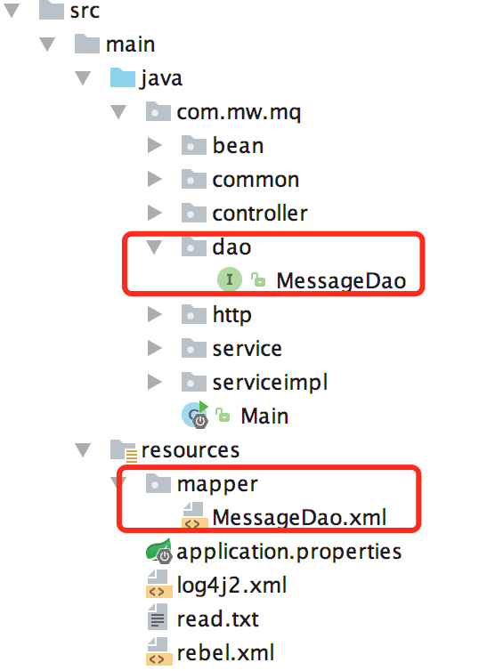

# 添加依赖

在 pom.xml 中添加如下依赖，使用 mybatis 有 xml 方式和使用注解方法式，这里使用配置 xml 文件的方法。

```xml
<!-- spring boot mybatis依赖 -->
<dependency>
    <groupId>org.mybatis.spring.boot</groupId>
    <artifactId>mybatis-spring-boot-starter</artifactId>
    <version>1.3.0</version>
</dependency>

<!-- mysql驱动包 -->
<dependency>
    <groupId>mysql</groupId>
    <artifactId>mysql-connector-java</artifactId>
    <version>5.1.29</version>
</dependency>
```

<!-- more -->

# application.prpperties中的配置

```sh
# mybatis配置，指定实体类的位置
mybatis.typeAliasesPackage=com.mw.mq.bean
# 指定SQL映射文件的位置
mybatis.mapperLocations=classpath:mapper/*.xml
```

# 使用方法

创建 dao 目录和在 resources 目录下创建 mapper 目录，用于存放数据库的接口类和写 SQL 的 XML 映射文件，目录文件如下图所示：



以 MessageDao 为例，代码如下：

```java
@Repository
public interface MessageDao {
    int insertNewMessage(JSONObject params);
    int insertNewConsumer(JSONObject params);
    int isConsumerExist(JSONObject params);
    List<JSONObject> getConsumerList(String address);
}
```

以 MessageDaoMapper.xml 为例，代码如下 (注意namespace和相应的dao接口一致)：

```xml
<?xml version="1.0" encoding="UTF-8"?>
<!DOCTYPE mapper PUBLIC "-//mybatis.org//DTD Mapper 3.0//EN" "http://mybatis.org/dtd/mybatis-3-mapper.dtd">

   <mapper namespace="com.mw.mq.dao.MessageDao">
       <insert id="insertNewMessage" parameterType="com.alibaba.fastjson.JSONObject">
           insert into mq_db.message_record
           (uuid, url, params, method, topic, topic_tag, topic_key, mq_code, mq_type, mq_msg, mq_master, msg_from)
           values
           (#{uuid}, #{url}, #{params}, #{method}, #{topic}, #{topic_tag}, #{topic_key}, #{mq_code}, #{mq_type}, #{mq_msg}, #{mq_master}, #{msg_from});
       </insert>

       <!-- 其他SQL -->
   </mapper>
```

在 Application 入口类上添加 @MapperScan 注解，自动扫描，代码如下：

```java
@SpringBootApplication
@EnableAutoConfiguration
@MapperScan("com.mw.mq.dao")
public class Main {
    private static Logger logger = LogManager.getLogger(Main.class.getName());

    public static void main(String[] args) throws Exception {
        SpringApplication springApplication = new SpringApplication(Main.class);
        springApplication.addListeners(new ApplicationStarted());
        springApplication.addListeners(new ApplicationStoped());
        springApplication.addListeners(new ApplicationClosed());
        springApplication.run(args);
    }
    // 其他代码
}
```