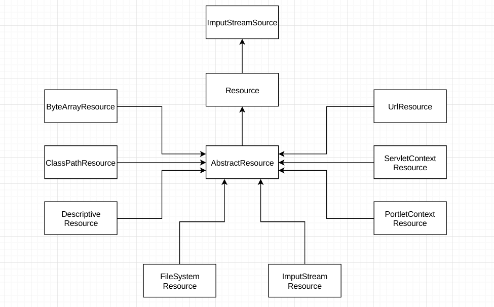

# Ioc 的概念

控制反转，程序编程的一种设计思想，和依赖注入 ( DI ) 是同一个概念，主要用于程序解耦。IoC 的控制反转，控制的是什么，反转的又是什么呢?

# Ioc 的类型

从注入方式上看，分为三种类型，构造类型注入、属性注入和接口注入 ( 不推荐，需要再额外添加一个接口 )。
<!-- more -->

# Spring IoC 容器

Sprig IoC 容器主要是完成程序解耦合的功能，帮助完成类的初始化和依赖关系的装配，让开发者从这些工作中脱离出来，专注于业务逻辑开发。举一个简单的例子，假设有一个剧组拍摄一部三国演义的电影，拍摄任务需要导演，演员和相关工作人员一起完成，首先创建导演、演员和工作人员相关的类。

``` java
/**
 * 导演类，仅为了简单模拟
 */
@Data
@NoArgsConstructor
@AllArgsConstructor
public class Director {
    private String name;
}
```

``` java
/**
 * 演员类，仅为了简单模拟
 */
@Data
@NoArgsConstructor
@AllArgsConstructor
public class Actors {
    private String name;
}
```

``` java
/**
 * 工作人员类，仅为了简单模拟
 */
@Data
@NoArgsConstructor
@AllArgsConstructor
public class StaffMember {
    private String name;
}
```

此外还需要创建一个拍摄任务类，用于完成拍摄任务，完成这个任务需要导演、演员和工作人员相互配合。

``` java
@Data
@NoArgsConstructor
@AllArgsConstructor
public class MovieTask {
    private Director director;
    private Actors actors;
    private StaffMember staffMember;

    public void doTask() {
        System.out.println("导演: " + director.getName()
                + "、演员: " + actors.getName()
                + "和工作人员: " + staffMember.getName() +
                "一起完成了拍摄任务!");
    }
}
```

创建实例和注入依赖后，就可以开始拍摄任务完成电影的拍摄了。

``` java
public class Application {
    public static void main(String[] args) {
        // 需要手动创建相关实例
        Director director = new Director("张艺谋");
        Actors actors = new Actors("李连杰");
        StaffMember staffMember = new StaffMember("小卢");

        // MovieTask 类依赖于 Director、Actors 和 StaffMember
        // 这里使用构造方法的方式手动注入依赖
        MovieTask movieTask = new MovieTask(director, actors, staffMember);
        movieTask.doTask();
    }
}
```

可以看到，当调用 MoiveTask 的 doTask 方法开始完成拍摄任务的时，需要手动的创建相关的实例和注入依赖，虽然 MovieTask 不需要去关注导演、演员和工作人员的实例化工作，但是这些工作的代码只是从 MovieTask 里面提出来，仅仅是实现了解耦，并且在代码里面指定了导演、演员和工作人员由谁担任，这些角色都被硬编码在代码里面，假设之后有人需要翻拍成新三国，剧本不变，只是导演、演员和工作人员变化，就不得不去修改程序的源代码了。这个时候就需要Spring IoC 容器了，仅仅需要通过配置文件或者注解分方式，它可以帮助完成创建实例和依赖注入的工作，并且如果想要翻拍新三国的话，也不需要修改源代码了，仅仅需要修改配置文件或者 Beans 类修改导演、演员和工作人员 (初始化时的值) 就可以了。看看使用 Spring 如何完成上面的任务的。

首先添加 Spring 依赖，如下:

``` xml
<!-- Spring -->
<dependency>
    <groupId>org.springframework</groupId>
    <artifactId>spring-context</artifactId>
    <version>5.0.4.RELEASE</version>
</dependency>

<!-- 
添加 Spring 会自动依赖以下 jar 包
org.springframework:spring-aop:5.0.4.RELEASE.jar
org.springframework:spring-beans:5.0.4.RELEASE.jar
org.springframework:spring-context:5.0.4.RELEASE.jar
org.springframework:spring-core:5.0.4.RELEASE.jar
org.springframework:spring-expression:5.0.4.RELEASE.jar
org.springframework:spring-jcl:5.0.4.RELEASE.jar
-->
```

创建配置文件 ico_test_beans.xml，配置 Bean 和依赖关系，如下:

``` xml
<?xml version="1.0" encoding="UTF-8"?>
<beans xmlns="http://www.springframework.org/schema/beans"
       xmlns:xsi="http://www.w3.org/2001/XMLSchema-instance"
       xmlns:p="http://www.springframework.org/schema/p"
       xsi:schemaLocation="http://www.springframework.org/schema/beans
       http://www.springframework.org/schema/beans/spring-beans.xsd">

    <!-- 配置的方式初始化 bean -->
    <bean id="director" class="com.lupw.spring.ioc.test.Director"
          p:name="张艺谋"/>

    <bean id="actors" class="com.lupw.spring.ioc.test.Actors"
          p:name="李连杰"/>

    <bean id="staffMember" class="com.lupw.spring.ioc.test.StaffMember"
          p:name="小卢"/>

    <!-- 初始化 bean 和建立依赖关系 -->
    <bean id="movieTask" class="com.lupw.spring.ioc.test.MovieTask"
          p:director-ref="director"
          p:actors-ref="actors"
          p:staffMember-ref="staffMember"/>
</beans>
```

实例化 MovieTask 并调用 doTask 来完成拍摄任务，可以看到，实例化 MoiveTask 的时候并没有手动的创建导演、演员和工作人员的实例，也没有手动的去注入依赖关系，这些都在配置文件中已经配置好，由 Spring 容器自动完成了这些工作，代码如下:

``` java
public class Application {
    public static void main(String[] args) {
        ApplicationContext context
                = new ClassPathXmlApplicationContext("classpath:beans/ico_test_bean.xml");
        MovieTask movieTask = context.getBean("movieTask", MovieTask.class);
        movieTask.doTask();
    }
}
```

# Spring 容器底层依赖的技术

Spring 通过简单的配置文件可以完成 bean 的实例化和依赖注入，能完成这些功能主要依靠 Java 所提供的反射功能，除此之外，同时依赖 Java 资源文件的访问功能。

## 反射

鉴于篇幅，见文章:

## 资源访问

Spring 通过读取配置文件来获取 Bena 初始化配置和依赖关系，需要进行资源的访问才能获取这些信息，JDK 所提供的资源访问类 java.net.URL、File类等并不能很好的访问类路径和 WEB 容器上下文的资源文件，因此 Spring 设计了一个 Resource 接口，并提供了相关的实现类，以便于在各种场景下方便的访问资源问件，具体的实现类如下图所示:

